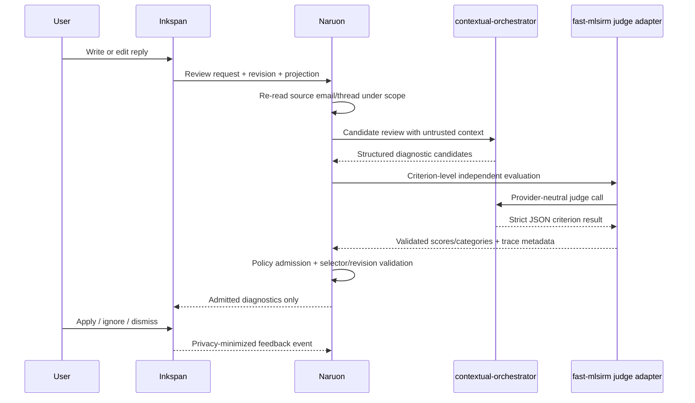

# ADR 0004: Inkspan-backed, LLM-native email writing guidance

Status: Proposed

## Context

Naruon currently supports one-shot reply drafting, but it does not provide a Grammarly-like authoring loop in which the user writes directly, sees passage-level guidance, understands each proposed change, and individually applies or ignores suggestions. The required guidance spans spelling, grammar, spacing, punctuation, clarity, concision, discourse structure, workplace pragmatics, audience appropriateness, technical precision, actionability, and preservation of the user's intended request.

These are contextual language judgments. A phrase can be appropriate in a quotation and inappropriate as a direct rebuke; the same pragmatic problem can be expressed with unrelated words; identical prose can reasonably be interpreted differently when the source thread, recipient roles, or requested outcome changes. A keyword list, regular expression, sender-domain table, fixed “aggressive phrase” dictionary, or positional repair rule cannot establish those meanings.

ContextualWisdomLab/inkspan already owns the modular WYSIWYG editor, revision evidence, revision-scoped W3C text-position evidence, guarded document mutation, safe serialization, and host-owned model-assistance boundary. ContextualWisdomLab/fast-mlsirm now provides a provider-neutral `ContextualOrchestratorJudge`, strict criterion-level JSON parsing, explicit polytomous categories, runtime-derived acceptance, an IRT response-row bridge, and a deliberate prohibition on keyword or positional repair. Naruon should compose these capabilities rather than recreating an editor or inventing a lexical classifier.

## Alternatives considered

- **Keep the current textarea and add a single “rewrite professionally” button.** Rejected because whole-document replacement hides individual reasons, weakens author control, and cannot safely bind delayed output to the reviewed revision.
- **Add a keyword/regex tone and grammar checker in Naruon.** Rejected because lexical triggers are not evidence of intent, pragmatics, grammaticality, or technical correctness and would fail across paraphrases, quotations, languages, and recipient context.
- **Let Inkspan call an LLM and own email semantics.** Rejected because Inkspan must remain provider-neutral and reusable; email thread context, tenant policy, provider credentials, retention, and semantic judgment belong to Naruon and its orchestration services.
- **Use one LLM response as both candidate generator and unquestioned authority.** Rejected because LLM judges are fallible measuring instruments with position, verbosity, self-preference, artifact, multilingual, and drift risks.
- **Naruon owns email context and review orchestration; Inkspan owns the revision-safe editor surface; fast-mlsirm owns judge calibration and criterion-response contracts.** Selected because it separates product semantics, deterministic document integrity, model routing, and measurement validation.

## Decision

Naruon will implement email writing guidance as an LLM-native, context-grounded review workflow rendered through Inkspan's generic writing-diagnostic contract.

### Semantic judgment

All claims that prose is misspelled, ungrammatical, unclear, verbose, poorly structured, pragmatically inappropriate, technically imprecise, insufficiently actionable, or likely to alter the author's intended request must originate from an LLM review workflow. Naruon production code must not manufacture those judgments from keywords, regexes, phrase dictionaries, sender domains, recipient counts, language names, or word positions.

Deterministic code remains mandatory for non-semantic integrity:

- request authentication and tenant/workspace scope;
- source-email and thread re-read under server authority;
- JSON/schema, type, enum, length, count, duplicate, and resource-bound validation;
- prompt-data delimiting and prompt-injection resistance;
- document revision, projection, Unicode code-point, grapheme, and selector validation;
- stale-result, overlap, and conflict rejection;
- provider allowlisting, credential lookup, timeouts, retries, circuit breaking, and audit metadata;
- safe rendering and ordinary editor transaction/undo behavior.

These deterministic checks may reject malformed or stale model output. They may not replace a failed model decision with a lexical heuristic.

### Model workflow

The online workflow has distinct roles:

1. **Context builder** re-reads the selected source email, thread, subject, sender, recipients, reply purpose, and user-authored draft under the current authorization scope.
2. **Candidate reviewer** produces bounded passage-level diagnostic proposals and whole-document guidance from that context.
3. **Independent criterion judge** evaluates each candidate against an explicit rubric through contextual-orchestrator. The preferred adapter is fast-mlsirm's `ContextualOrchestratorJudge` after an immutable, hash-locked compatible release is available.
4. **Deterministic result validator** admits only exact-schema, revision-bound, selector-valid diagnostics.
5. **Optional adjudication** uses an independent model or deeper contextual-orchestrator conduct workflow when calibrated uncertainty or cross-model disagreement is high.
6. **Inkspan** displays admitted proposals and applies only explicit user-approved replacements under the current revision.

The model workflow must be capable of abstaining. Provider failure, malformed output, insufficient context, judge disagreement, or calibration-policy rejection returns no admitted diagnostic for that claim. Naruon continues to provide editing and sending; it does not fall back to keyword matching.

### fast-mlsirm role

fast-mlsirm is the judge measurement and calibration layer, not the editor, mail client, or source of email context.

It is used to:

- define criterion-level dichotomous or polytomous response contracts;
- validate judge response matrices;
- fit and compare item difficulty, discrimination, rater/model effects, and latent writing-quality dimensions where supported;
- detect differential item functioning across language, recipient-role, organizational-context, thread-depth, and other prespecified groups;
- measure calibration, reliability, prompt/model test-retest behavior, and drift;
- publish a versioned judge-admission policy consumed by Naruon.

Live email review must not block on model fitting. Runtime review consumes an already-published policy version; fitting, simulation, DIF, ablation, and drift analysis run offline or nearline. A future fast-mlsirm service may expose policy artifacts, but it does not receive authority to send or mutate email.

### contextual-orchestrator role

Every semantic model call routes through contextual-orchestrator or a contract-compatible provider-neutral port. The orchestrator decides provider/model routing, single-model versus multi-agent computation, workflow depth, role-specific reasoning effort, tracing, failure policy, and cost evidence. Naruon does not use keyword routing to select a model or decide a semantic category.

Operational routing may depend on explicit user mode, document size, configured compute policy, provider availability, calibrated model disagreement, or structured uncertainty. These are routing controls, not lexical classifiers.

### User authority

Writing diagnostics are advisory. The user can inspect, apply, ignore, dismiss, or request another explanation. Remaining suggestions do not block editing or sending by default. Naruon may expose an enterprise policy surface later, but such a policy must be explicit, separately authorized, and cannot be inferred from a diagnostic confidence or priority label.

A suggestion never silently weakens a deadline, changes a requested deliverable, alters responsibility, removes a material fact, or converts a firm request into a noncommittal statement. Intent, fact, request-strength, deadline, actor, and actionability preservation are explicit judge criteria.

## Rubric contract

The first review policy will use independently scored observable criteria such as:

- `issue_support`: the cited span actually supports the claimed issue;
- `span_fidelity`: the selector targets the smallest sufficient passage;
- `replacement_correctness`: the proposed wording resolves the identified issue;
- `intent_preservation`: the proposal preserves the author's intended outcome;
- `fact_preservation`: names, quantities, dates, technical claims, and commitments are not invented or removed;
- `request_strength_preservation`: firmness and accountability are not softened without explicit author direction;
- `audience_pragmatics`: wording fits the recipient, copied audience, hierarchy, and thread context;
- `technical_precision`: terminology, metrics, and causal claims remain technically defensible;
- `actionability`: responsible actor, requested artifact, timing, and response channel are clear where the source intent requires them;
- `explanation_quality`: the explanation is specific, evidence-based, and useful to the author.

Category anchors are ordered and versioned. Overall acceptance is derived from criterion evidence and a published policy, not from a hidden word list or a model's free-form “accepted” token alone.

## Data flow

## Consequences

Naruon gains contextual, passage-level writing assistance that can generalize across wording and language instead of being tied to a brittle phrase list. The architecture introduces a deeper model-evaluation pipeline and therefore requires versioned rubrics, calibration evidence, provider operation, and degraded-mode behavior. Inkspan remains reusable and deterministic; fast-mlsirm remains a separable psychometric/evaluation component.

No semantic result is guaranteed merely because an LLM returned valid JSON. Admission means the result passed the current model, rubric, calibration, and structural policy; it remains an advisory proposal.

## Failure and recovery

- **Candidate model unavailable:** return a review-unavailable status; preserve editing and sending.
- **Malformed or oversized candidate output:** reject; do not repair by keyword or nearest-text search.
- **Judge unavailable or malformed:** abstain or retry through contextual-orchestrator policy; never accept the candidate solely because generation succeeded.
- **Judge disagreement or low calibrated confidence:** withhold, mark for deeper adjudication, or request human review according to the published policy.
- **Document changed while reviewing:** return stale diagnostics and require a fresh review; never mutate newer content.
- **Selector no longer identifies the reviewed text:** reject that diagnostic.
- **Replacement violates Inkspan safety/schema policy:** reject without mutation.
- **fast-mlsirm calibration service unavailable:** continue using the last signed, non-expired approved policy if tenant policy permits; otherwise disable semantic review rather than inventing a fallback.

## Security and privacy impact

Email bodies, drafts, participants, and organizational context may contain PII and confidential business content. Naruon will not mask away names, roles, dates, or relationships when doing so would destroy the requested pragmatic and actionability analysis. Instead it will apply compensating controls:

- tenant-approved providers and contractual no-training/no-secondary-use terms;
- encrypted transport and encrypted credential storage;
- server-authoritative tenant/workspace authorization;
- prompt/data separation and untrusted-content treatment;
- no raw email body, draft, replacement, prompt, or model output in ordinary logs or product telemetry;
- short-lived or zero-retention review sessions by default;
- explicit provider, region, model, rubric, policy, and prompt provenance;
- bounded payloads and abuse protection;
- audit events containing opaque identifiers and policy outcomes rather than source text;
- synthetic or carefully de-identified benchmark corpora for persistent evaluation artifacts.

Raw model output is not returned to the browser by default. fast-mlsirm's judge records used in persistent calibration datasets must follow separate approved data-classification and retention policy.

## Accessibility

Naruon will use Inkspan's diagnostic surface rather than a hover-only overlay. Users must be able to discover the number of suggestions, navigate among them, hear category and explanation, apply or ignore them, and return focus predictably to the edited range. Color is never the only signal. Review arrival does not steal focus.

## Compatibility and migration

The existing draft endpoint may remain for one-shot generation during migration, but the reply composer will move from the plain textarea to the first released Inkspan version that contains the accepted writing-diagnostic contract. Naruon must consume an immutable released package with its lockfile and package-verification evidence; it will not depend on an unreleased mutable branch in production.

The first implementation is additive and does not require a database migration if review sessions remain ephemeral. Any later persistent tables must use two-or-more-word `snake_case` names such as `email_review_session`, `writing_diagnostic_record`, `diagnostic_feedback_event`, and `judge_policy_artifact`.

Rollback disables the review endpoint and diagnostic props while retaining the Inkspan editor and existing mail-send path. No canonical email content migration is required.

## Verification and acceptance evidence

Implementation cannot be accepted without:

- semantic contrast tests in which the same keywords occur with different meanings;
- paraphrase tests in which the same issue appears without shared trigger words;
- quotation, code, proper-name, and technical-term false-positive tests;
- identical drafts evaluated under materially different authorized thread/recipient contexts;
- Korean, English, mixed-language, CJK, emoji, combining-mark, and hostile-Unicode cases;
- gold human span/category/replacement data with inter-rater evidence;
- span precision/recall, category macro-F1, accepted-suggestion precision, intent/fact/request-strength preservation, Brier score, calibration error, and unsupported-claim rate;
- fast-mlsirm criterion response-matrix validation, category-count ablation, item/rater behavior, DIF, and drift studies where sample size supports them;
- independent-model or role ablations for candidate reviewer, judge, and adjudicator;
- prompt-injection, malformed JSON, duplicate keys, oversized payload, stale revision, overlap, and provider failure tests;
- no-keyword-fallback source and contract tests;
- Python 3.14, frontend, security, coverage, container, package-lock, and exact-head repository gates;
- production statement/branch coverage and public docstring/JSDoc requirements defined by the repository;
- current authoritative APA 7th doctoring and cross-repository traceability.

Tests may use `NVIDIA_NIM_API_KEY` for scheduled live-model evaluation. They must not use `COPILOT_GITHUB_TOKEN` for model calls.

## Research and standards traceability

The accompanying doctoring record covers LLM-as-a-Judge reliability, bias, multilingual evaluation, psychometric calibration, human-centered writing support, W3C selector semantics, NIST AI 600-1, ISO/IEC 23894, and ISO/IEC 42001. This ADR does not claim that any model or language profile is validated before those studies pass.

## Rollback or supersession

Rollback removes or disables semantic review while preserving the editor, mail data, and send path. Supersession requires a new ADR if Naruon is proposed to use keyword-based semantic classification, allow unjudged model output to mutate drafts, move email semantics into Inkspan, put fast-mlsirm fitting in the synchronous critical path, mask context needed for valid interpretation, or make suggestions an implicit send gate.