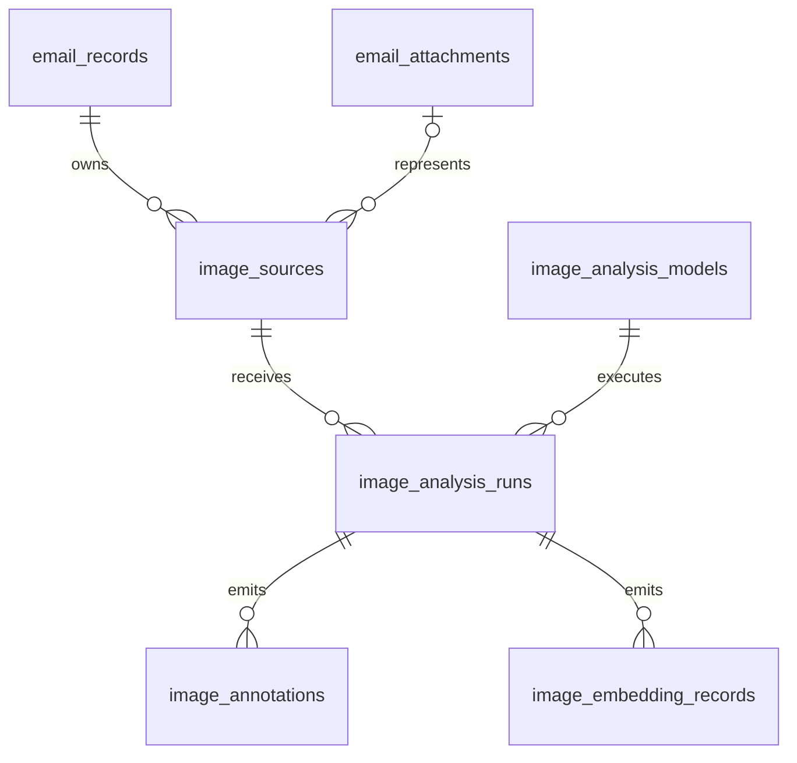

# ADR-0009: Safe metadata parsing for image attachments

**Status:** Accepted (Naruon-local attachment parsing policy)
**Date:** 2026-08-19
**Decision owner:** Naruon maintainers
**Scope:** Email attachment ingestion and the content graph. This ADR does not
authorize external image upload, OCR, object detection, or provider mutation.
**Figma File ID:** N/A — backend attachment metadata parsing; no visual surface.

## Context

The local mailbox-backup audit on 2026-08-19 parsed 2,539 EML messages and
found 2,056 attachments. 1,878 attachments had no parser coverage; the largest
families were PNG (1,438), JPEG (162), GIF (5), and BMP (1). Treating those
attachments as silently empty makes image-bearing mail invisible to search and
the content graph.

## Decision

1. Naruon registers an `image_metadata` parser for PNG, JPEG, GIF, and BMP,
   including when a generic MIME type has an unambiguous image signature.
2. The parser reads only bounded, format-specific headers and emits safe text
   containing the detected format, width, height, and animation flag. It does
   not decode pixels, retain raw image bytes, read EXIF text, or call a remote
   model.
3. Valid image metadata is stored as `parse_status=parsed` with
   `parse_content_type=text/plain`, so the existing embedding and content-graph
   paths can index the metadata without a new table or migration.
4. Invalid image payloads fail closed as `image_metadata_parse_failed`; raw
   bytes are not retained in that path. Large image payloads are not rejected
   solely for size because the parser inspects only bounded headers and does
   not decode pixels. JPEG header scanning is bounded to 4 MiB, while
   `IMAGE_METADATA_SCAN_PREFIX_BYTES` is only a 1 MiB prefix used to detect
   animation markers; neither is an attachment-size limit. The signed email
   import transport accepts source files up to 64 MiB as a request resource
   guard, independently of parser classification.
5. OCR, captioning, and object detection remain a separate deferred capability.
   They may be added only behind an explicitly configured local vision sidecar
   with source provenance, bounded payloads, and a non-success state while the
   sidecar is unavailable.

## Deferred inline-image evidence contract

The next image capability must also cover HTML body fragments such as
`data:image/png;base64,...`; an image embedded in the body is not necessarily a
MIME attachment. Its logical relational contract is fixed here before a
migration or parser implementation is added:

- `image_sources` stores only immutable source identity and location:
  `image_source_uid`, scoped email/attachment references, `source_kind`,
  `source_locator_type`, `source_locator_value`, `source_ordinal`, normalized
  media type, byte count, digest, and bounded dimensions. An HTML data URI uses
  an `html_dom_path` locator; a MIME part uses a `mime_part_path` locator. The
  locator is the bridge back to the image's original position.
- `image_analysis_models` is the normalized model registry: model reference,
  provider boundary, model version, modality, and local-only policy. Runs do
  not duplicate model identity fields.
- `image_analysis_runs` records one OCR, object-label, caption, safety-label,
  or image-embedding attempt, including status, input digest, timestamps, and a
  safe error code. Unavailable, pending, and failed runs are never presented as
  successful evidence.
- `image_annotations` stores one atomic OCR span, object label, caption, or
  safety label per row, with confidence and optional normalized bounding-box
  coordinates. `image_embedding_records` stores one embedding per image/model
  run and its dimension. Neither table stores a second copy of source ownership
  or location.

This separation is third-normal-form by construction: source location belongs
to the source, model identity belongs to the model registry, execution facts
belong to a run, and observations belong to the run. Raw base64 is not a search
field; it remains behind the existing scoped source-retention policy, while
the digest and locator make derived evidence auditable. The implementation must
reject malformed data URIs, bound decoded bytes before any vision call, and
keep the same signed organization/workspace scope as email attachments.

## Alternatives rejected

### Send image bytes to a hosted vision API during import

Rejected because customer mailbox backups are confidential and import must not
turn a parser gap into an implicit external data transfer.

### Add Pillow or a full computer-vision runtime to the backend

Rejected for this slice. Header metadata needs only the Python standard library;
large native dependencies would increase image size and security surface before
there is a local OCR/vision execution contract.

### Keep image attachments as unsupported binary

Rejected because it leaves the dominant real-data attachment family absent from
search and the content graph despite enough safe evidence for useful metadata.

## Consequences

- Image attachments become searchable by format and dimensions, and their
  metadata receives the normal attachment embedding/content-graph path.
- The Data parser manifest reports the new parser and its supported extensions.
- Metadata is not a substitute for OCR or image understanding. The explicit
  pending/failure boundary remains visible until a local vision sidecar exists.
- No database migration is needed; existing unsupported rows require a future
  replay job if operators want to backfill them.

## References (APA 7th)

International Telecommunication Union. (1992). *Information technology—Digital
compression and coding of continuous-tone still images—Requirements and
guidelines (Recommendation ITU-T T.81).* <https://www.itu.int/rec/T-REC-T.81>

This recommendation defines JPEG marker segments and SOF dimensions, which
supports the parser's bounded header-only width/height extraction.

Microsoft. (2022). *Bitmap storage.* Microsoft Learn.
<https://learn.microsoft.com/en-us/windows/win32/gdi/bitmap-storage>

This reference defines DIB header layouts and dimensions, supporting the
parser's signature-plus-header BMP metadata boundary.

World Wide Web Consortium. (2025). *Portable Network Graphics (PNG)
specification (Third Edition).* <https://www.w3.org/TR/png-3/>

The PNG specification defines the signature and IHDR dimensions used for
header-only PNG metadata; the parser does not decode pixel data.

CompuServe Incorporated. (1990). *Graphics Interchange Format version 89a.*
<https://giflib.sourceforge.net/gifstandard/GIF89a.html>

GIF89a defines the signature and logical screen descriptor used for GIF
dimensions; the parser reports only bounded metadata and a marker-based
animation hint.

WHATWG. (n.d.). *Data URLs*. In *HTML Living Standard*. Retrieved August 21,
2026, from
<https://html.spec.whatwg.org/multipage/urls-and-fetching.html#data-urls>

Huang, Y., Lv, T., Cui, L., Lu, Y., & Wei, F. (2022). LayoutLMv3:
Pre-training for document AI with unified text and image masking. *Proceedings
of the 30th ACM International Conference on Multimedia*, 4321–4330.
<https://doi.org/10.1145/3503161.3548112>

The HTML standard is the authority for recognizing data URLs and their media
payload boundary. Huang et al. (2022) supports preserving aligned text/image
layout evidence rather than flattening an embedded image into unrelated body
text; it does not authorize sending confidential mailbox bytes to a hosted
model.
