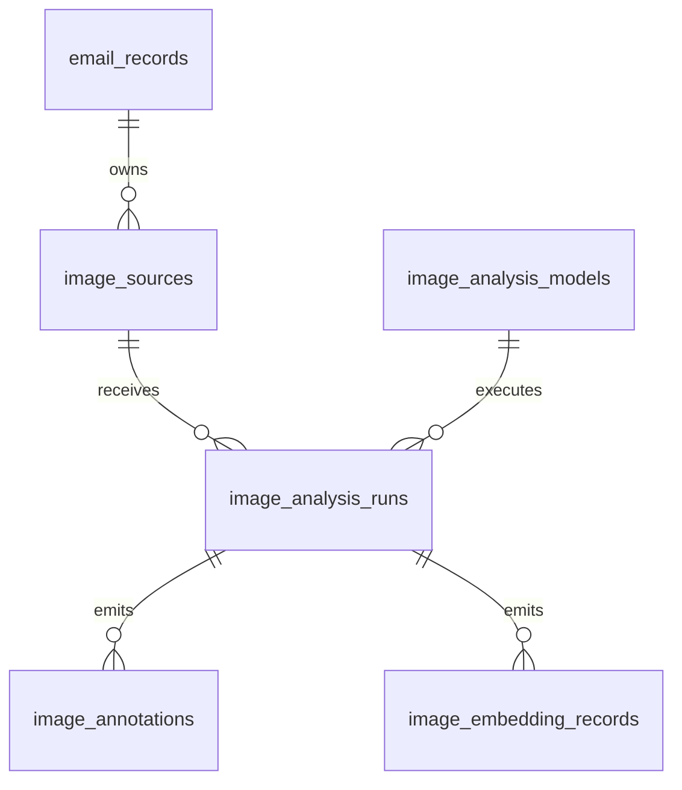

# ADR-0019: Inline image source evidence

**Status:** Accepted (Naruon-local ingestion contract)
**Date:** 2026-08-21
**Decision owner:** Naruon maintainers
**Scope:** HTML email import, content-graph search, and source metadata
**Figma File ID:** N/A — backend inline-image ingestion; no visual surface.

## Context

An HTML email can carry an image in an `img[src]` data URL even when the
message has no MIME attachment. Stripping the HTML for safe display therefore
removes a separately searchable business artifact unless its original DOM
location and bounded evidence are preserved first.

## Decision

1. During EML parsing, inspect every non-attachment `text/html` part for
   `data:` values on `img[src]`. Image media types receive bounded signature
   metadata; non-image data URLs remain explicit unsupported evidence and are
   never passed through as embedding input.
2. Store only a normalized `image_sources` row: MIME type, source DOM path,
   ordinal, byte count, SHA-256 digest, bounded format/dimensions/animation
   facts, and an explicit parse status. The persisted media type is capped at
   the `image_sources.media_type` column width. A DOM path up to 1,024
   characters is retained; a deeper path is represented by its bounded prefix
   and a stable SHA-256 suffix so the source row remains within its column
   without collapsing distinct locations. Raw base64 and decoded pixels are
   never persisted or sent to a provider.
3. Add the bounded metadata to the email's selected embedding input after
   redacting the original data URL, and emit a separate `inline_image`
   content-graph source with a bounded ordinal label. The bounded DOM locator
   remains source evidence rather than a database display label. This makes
   image evidence retrievable without uploading raw base64 or pretending that
   metadata is OCR, object detection, or captioning.
4. Reject malformed, unsupported, non-base64, and over-budget data URLs with
   deterministic states. A malformed image cannot become a successful search
   result.
5. OCR, object labels, captions, safety labels, and image embeddings remain
   deferred analysis-run evidence. A future local vision sidecar must create
   model/run/annotation/embedding rows keyed by the immutable source UID and
   must preserve the same tenant scope; hosted vision calls are not implicit.

## Relational boundary

`image_sources` owns source identity and location. Future `image_analysis_models`
will own model identity; `image_analysis_runs` will own execution status;
`image_annotations` and `image_embedding_records` will own observations. This
keeps source location, model identity, execution facts, and derived evidence
in third normal form rather than duplicating them in a JSON blob.

## Verification and next action

- Run `python3 -m pytest -q backend/tests/test_inline_image_service.py
  backend/tests/test_inline_image_import_wiring.py` to verify DOM location,
  digest, metadata, deep-path bounds, non-image data-URI redaction, failure
  states, and content-graph wiring.
- Run `alembic upgrade head` before enabling the import path in a deployed
  environment; the `0018_inline_image_sources` migration is additive.
- When OCR or object search is needed, add a local sidecar connector and
  analysis-run migration first. Do not reinterpret `metadata_ready` as
  semantic image understanding.

## References (APA 7th)

WHATWG. (n.d.). *Data URLs*. In *HTML Living Standard*. Retrieved August 21,
2026, from https://html.spec.whatwg.org/multipage/urls-and-fetching.html#data-urls

World Wide Web Consortium. (2025). *Portable Network Graphics (PNG)
specification (Third Edition).* https://www.w3.org/TR/png-3/

International Telecommunication Union. (1992). *Information technology—Digital
compression and coding of continuous-tone still images—Requirements and
guidelines (Recommendation ITU-T T.81).* https://www.itu.int/rec/T-REC-T.81

Huang, Y., Lv, T., Cui, L., Lu, Y., & Wei, F. (2022). LayoutLMv3:
Pre-training for document AI with unified text and image masking. *Proceedings
of the 30th ACM International Conference on Multimedia*, 4321–4330.
https://doi.org/10.1145/3503161.3548112
