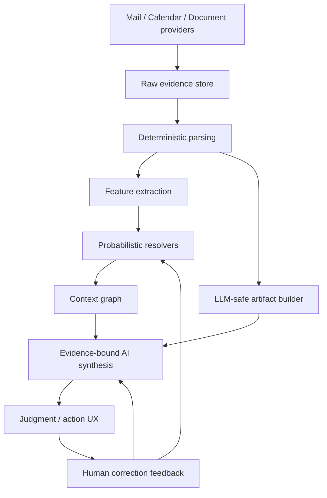

# Evidence Pipeline Architecture

This architecture defines how Naruon turns raw email and document evidence into user-verifiable synthesis, judgment, and execution.

## Layered architecture



## Deterministic parsing layer

This layer reads standard structure and enforces security boundaries. It does not make ambiguous business judgments.

Responsibilities:

- RFC5322 header extraction;
- MIME body and attachment parsing;
- `multipart/related` package reconstruction;
- `cid:` reference resolution;
- file magic and media type detection;
- bounded HWPX XML-package admission and deferred-recognition status;
- sandboxed HWP/PDF/Office conversion worker contracts (implementation is
  capability-gated and must not be implied by parser admission);
- remote image, macro, OLE, archive, and unknown-binary policy enforcement.

## Feature extraction layer

This layer creates evidence features for resolvers and AI synthesis.

| Feature family | Examples |
| --- | --- |
| Identity | message id, raw MIME hash, body hash, simhash, attachment manifest hash |
| Semantic | paragraph embedding, body embedding, document section embedding |
| Visual | perceptual hash, OCR text, image class, layout markers |
| Thread | quote overlap, reply header chain, participant overlap, temporal distance |
| Document | section id, paragraph id, table id, page image id, parse confidence |
| Security | owner scope, permission, data classification, quarantine state |

## Probabilistic resolver layer

The resolver layer handles ambiguity. Resolvers return confidence, evidence, and a review requirement flag.

Required resolvers:

- canonical email resolver;
- duplicate candidate resolver;
- thread graph resolver;
- related context resolver;
- person/project/entity linker;
- document relation scorer.

## Context graph

Naruon uses a graph because a business decision usually connects multiple messages, people, files, and events.

Required node families:

- `email_message`;
- `email_thread`;
- `document`;
- `document_section`;
- `media_asset`;
- `person_identity`;
- `calendar_event`;
- `action_item`;
- `project_record`;
- `decision_point`.

Required edge families:

- `same_message_candidate`;
- `thread_reply`;
- `semantic_related`;
- `mentions_person`;
- `attached_document`;
- `derived_action`;
- `calendar_candidate`;
- `project_context`;
- `manual_override`.

## LLM-safe artifacts

AI calls must use normalized artifacts instead of raw arbitrary input.

```text
llm_artifact
- artifact_id
- source_type
- source_id
- artifact_type
- normalized_mime
- content_ref
- token_estimate
- page_number
- bounding_box
- confidence
- redaction_policy
- created_at
```

Artifact types:

- `plain_text`;
- `html_visible_text`;
- `document_section_text` (worker-produced only);
- `table_json`;
- `normalized_image`;
- `pdf_page_image`;
- `ocr_text`;
- `metadata_json`.

## AI synthesis layer

AI synthesis consumes selected graph context and LLM-safe artifacts.

Outputs:

- context synthesis;
- judgment points;
- action items;
- calendar candidates;
- risk notes;
- relationship context;
- draft replies;
- source citations;
- confidence and uncertainty notes.

No output is complete unless it can answer:

1. What source evidence supports it?
2. How confident is Naruon?
3. What should the user do next?
4. What side effect will happen if the user confirms?

## Human correction feedback

User corrections are first-class data, not UI-only edits.

Examples:

- mark duplicate candidate as distinct;
- merge/split thread;
- reject related document;
- edit generated action item;
- reject calendar candidate;
- correct extracted person/project;
- mark AI output as unsupported.

Each correction creates durable feedback evidence and may become resolver/evaluation data.

## Side-effect policy

Actions that change provider state require explicit confirmation and audit logging.

| Action | Confirmation | Audit |
| --- | --- | --- |
| Send email | Required | Required |
| Reflect calendar event | Required | Required |
| Create task | Required or batch-confirmed | Required |
| External share | Required | Required |
| Security policy update | Required | Required |
| Delete/quarantine file | Required | Required |
| Run parser/embedding job | Not destructive, but logged | Required |

## Operational states

Every parser, resolver, AI run, and provider writeback must expose states usable by the UI:

```text
queued
running
partial
success
review_required
warning
failed
quarantined
cancelled
```

## Enterprise boundaries

- PII masking is not the default control because it can break work context.
- Use least-privilege access, encryption, scoped audit, field-level display policy, retention, and DLP-style external sharing gates instead.
- Keep provider credentials and model payloads out of ordinary logs.
- Store prompt/model/artifact versions for reproducible investigation.
