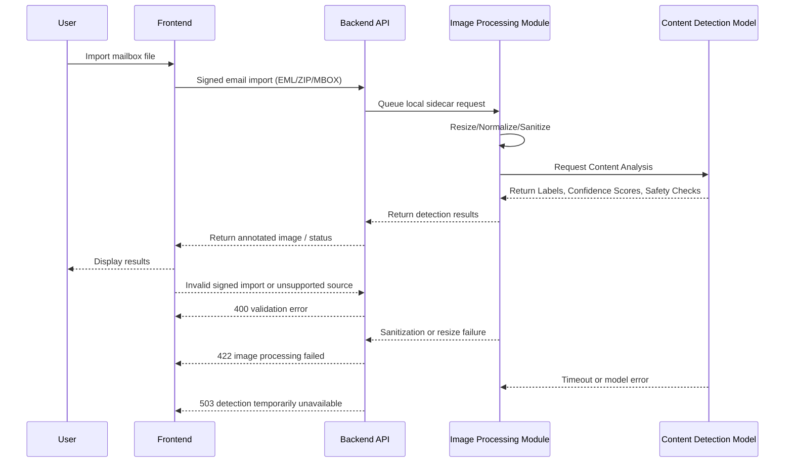
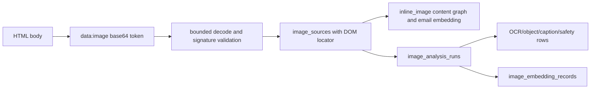

# Image-Content Detection Flow

This document records Naruon's current email-attachment image boundary and the
future local vision-sidecar flow. A standalone `/api/images` endpoint and
hosted image detector are not implemented by Naruon.

## Future local vision flow (not currently implemented)

## Processing Steps

1. **Current ingestion:** Signed email imports accept `.eml`, `.zip`, and `.mbox` sources. Image attachments are classified locally from their MIME value, extension, and unambiguous signature.
2. **Current metadata path:** The `image_metadata` parser reads bounded headers and indexes format, dimensions, and animation metadata. It does not decode pixels or retain image bytes.
3. **Future sidecar boundary:** A separately configured local vision sidecar may later receive a bounded, source-authorized payload. It must report unavailable, pending, or failure states instead of claiming detection success.
4. **Future classification:** OCR, captioning, object detection, and safety labels require their own source-backed contract, tests, and ADR amendment.

## Inline `data:image` source implementation and analysis contract

HTML body images are a separate source kind from MIME attachments. The current
bounded parser identifies each `data:image/<format>;base64,...` token in DOM
order, validates the media signature after decoding, and retains its original
`html_dom_path` plus ordinal. The source bytes remain scoped and bounded; the
search layer indexes only derived metadata and explicitly versioned evidence.

The normalized tables are `image_sources`, `image_analysis_models`,
`image_analysis_runs`, `image_annotations`, and `image_embedding_records`.
`image_sources` owns the scoped email/attachment reference, source locator,
ordinal, media type, byte count, digest, and dimensions. A body image uses
`source_locator_type=html_dom_path`; an attached image uses
`source_locator_type=mime_part_path`. A run references one model registry row
and one source, while annotations and embeddings reference only the run. This
keeps ownership and original position available without copying it into every
OCR span, object label, caption, safety label, or embedding row.

No hosted vision call is implied. The current source slice is header-only and
does not create analysis runs. A future local sidecar must receive a bounded,
scope-authorized payload and report `pending`, `unavailable`, or `failed` until
it has source-backed output.

## Current Naruon implementation boundary

Email ingestion now runs the bounded `image_metadata` parser for PNG, JPEG,
GIF, and BMP attachments. It reads only format headers and adds the detected
format, dimensions, and animation flag to the existing attachment content
graph and embedding path. It does not decode pixels or send image bytes to a
hosted model. HTML `data:image` sources now use the same header facts, retain a
DOM locator and digest in `image_sources`, and add a separate `inline_image`
content-graph source. OCR, captioning, and object detection remain deferred
until a configured local vision sidecar can provide source-backed results.

The decision and failure states are fixed in [ADR-0009](../adr/0009-image-attachment-metadata-parser.md).

## Current structured attachment boundary

Email ingestion also runs the bounded `office_text` and `archive_manifest`
parsers for DOCX, XLSX, PPTX, HWPX, and ZIP attachments. Office parsing reads
selected XML members for searchable text; ZIP parsing reads member names and
declared sizes without extraction. Both paths use payload/member limits and
fail closed on malformed input. Macros, external relationships, formula
evaluation, rendering, OCR, and archive execution remain out of scope under
[ADR-0010](../adr/0010-bounded-office-archive-text-parsing.md).

Nested `.eml`/`message/rfc822`, MP3, and legacy `.doc` attachments have a
separate bounded metadata boundary under
[ADR-0011](../adr/0011-safe-nested-media-legacy-metadata.md): one-level email
headers, MP3 signature metadata, and OLE container metadata only. Generic and
otherwise unrecognized binary MIME attachments use the safe `binary_metadata`
parser under
[ADR-0012](../adr/0012-generic-binary-metadata.md), which records only the
normalized media type and exact byte count for generic and otherwise
unrecognized binary MIME values, including payloads larger than 20 MiB.
The 1 MiB image prefix is an animation-marker scan window, not an attachment
size limit.

## Failure Modes and Recovery

* **Current parser validation:** Invalid image signatures return `image_metadata_parse_failed`; raw image bytes are not retained in the parse result.
* **Current import transport:** The signed email import has a documented 64 MiB source transport guard. The image parser's 1 MiB animation-marker prefix and 4 MiB JPEG header scan are not attachment-size limits.
* **Future local sidecar:** Treat sanitization, decoding, resize, or model failures as non-success states. Keep the source item queued or explicitly failed with provenance rather than claiming a completed detection.
* **Monitoring:** When the sidecar exists, emit structured processing, retry, and failure counters so operators can distinguish invalid input from detector capacity or model health issues.

## Future local vision-sidecar choices & limitations

Naruon does not currently invoke a vision model for email attachments. Any
future model must run behind a configured local sidecar so confidential image
bytes do not leave the controlled boundary implicitly.

*   **Models:** No model is selected by the current attachment parser. A future sidecar decision must identify the model, execution boundary, and provenance contract.
*   **Why Open Source:**
    *   Data Privacy: User email attachments and images never leave the controlled network environment unless explicitly permitted.
    *   Customization: We can fine-tune or swap models based on specific detection needs (e.g., document OCR vs. general object detection).
*   **Limitations:**
    *   **Resource Intensive:** Running large vision models requires significant GPU/CPU resources, which might limit throughput on smaller deployments.
    *   **Hallucination/Accuracy:** While powerful, open-source models may sometimes hallucinate details or struggle with highly complex visual scenes or tiny text compared to massive proprietary APIs.
    *   **Latency:** Processing time might be longer than managed cloud APIs.

## Verification and Testing

Current CI tests the implemented header parser with synthetic PNG, JPEG, GIF,
and BMP payloads, malformed inputs, generic-MIME signature fallback, and large
payload regressions. Vision-sidecar behavior is not claimed until that
component and its source-backed test corpus exist.

The inline-image slice tests DOM-order preservation, malformed and over-budget
base64 rejection, source digest stability, EML MIME-part provenance, and that
raw base64 is excluded from searchable evidence. A future sidecar slice must
add cross-workspace authorization and prove that OCR/object labels retain the
source locator.

## References (APA 7th)

WHATWG. (n.d.). *Data URLs*. In *HTML Living Standard*. Retrieved August 21,
2026, from
<https://html.spec.whatwg.org/multipage/urls-and-fetching.html#data-urls>

Huang, Y., Lv, T., Cui, L., Lu, Y., & Wei, F. (2022). LayoutLMv3:
Pre-training for document AI with unified text and image masking. *Proceedings
of the 30th ACM International Conference on Multimedia*, 4321–4330.
<https://doi.org/10.1145/3503161.3548112>
