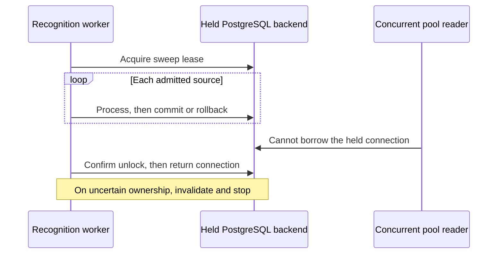

# Bounded attachment parse-source contract

## Customer outcome

An email attachment between 20 MiB and 64 MiB is not rejected by a hidden
parser-only limit in the proposed ingestion change. This is not yet a released
capability. Recognition can still reject the source above the verified provider
limit; the complete admitted bytes must survive that rejection. The Data workspace reports
unsupported formats explicitly, so the next action is to add a reviewed parser
or use the original provider file rather than treating metadata as extracted
content.

## Contract

`MAX_ATTACHMENT_PARSE_SOURCE_BYTES` is a proposed 64 MiB Naruon retention
budget, matching the authenticated email-import ceiling. The parser is
fail-closed:

- supported text formats are parsed inline within the existing character bound;
- validated PDF bytes may be retained only for bounded deferred NewsDOM recognition;
- unsupported binary formats return `unsupported_content_type`,
  `unsupported_binary`, and empty content;
- oversized Naruon source bytes return `parse_size_limit_exceeded` and empty content;
- the NewsDOM client independently enforces the verified protected-source
  20 MiB guard, and the attachment worker persists
  `provider_payload_size_exceeded` when that boundary rejects a retained PDF.
  This source guard is not evidence of a released or deployed capacity.

This separation preserves provenance without claiming that a source retained by
Naruon was accepted by an external provider. An open owner PR is evidence of a
candidate contract only; provider-size parity becomes consumable only after an
immutable NewsDOM release is verified and pinned. ADR-0021 owns the separate
direct PDF-DOM upload proposal and the same immutable-release prerequisite.

The quality surface exposes parser key and status, not raw attachment bytes,
message IDs, attachment IDs, credentials, or customer payloads.

## Evidence and next action

- `backend/tests/test_attachment_parser.py` covers the Naruon 64 MiB retention
  boundary and metadata-only unsupported binaries.
- `backend/tests/test_newsdom_client.py` covers provider-size preflight before
  network I/O.
- `backend/tests/test_newsdom_worker.py` covers persistent provider-size failure
  evidence instead of silent pending state.
- `backend/tests/test_email_import_service.py` retains import-transport coverage.
- [ADR-0021](../adr/0021-bounded-pdf-dom-upload-contract.md) remains Proposed and
  blocked on the immutable owner release/pin; this document does not upgrade it.

If a customer needs a currently unsupported format, add a dedicated parser
proposal with sandbox, dependency, provenance, and exact-head regression
evidence before changing the registry. If provider transport is raised, verify
the immutable owner release first, then bump the Naruon released-contract
boundary and rerun exact-head integration evidence.

## 2026-09-05 owner-stack repair

The repair starts at #1469
`ed4bebeddf05ce1da0c76aca77448deef6254fbb` and normally merges #1427
`cb08b1c3ea2aba8844fc29ef703c34368cc55e47`. It inherits the existing dependency,
forward migration, complete-text search storage, and PDF admission proposals.
No migration is stamped around a failure, no legacy table is fabricated, and
no index or constraint is removed to make the source fit.

Concurrent remote merge `05c6fb2460ee69c3ce7dccd66b2b2ec0e2c66658` and
follow-up `facadfb1ce535c5d124e2a463a844942a7704ba5` independently restacked
the same original attachment delta on #1427 and restored the prerequisite
CHANGELOG. Preserve both commits by normal integration. Their admission versus
provider distinction, Proposed ADR-0023/0021 dependency, pre-network size guard,
and prerequisite release notes remain; the full-payload/database/rollback tests
and historical proposal snapshot supplement that intent. Statements calling a
source-only 20 MiB guard deployed or released are corrected using the explicit
provider receipt below, not retained as runtime claims.

### Failure, cause, correction

| Observation | Cause and correction | Evidence boundary |
|---|---|---|
| Fresh #1469 migration failed in `0001_initial_control_plane.py` with `relation "emails" does not exist` | Inherit the existing database-owner repair through #1427, including forward read-state and search-storage revisions; do not duplicate a local schema workaround | The pre-merge migration log is RED before any attachment test runs |
| Actual 20 MiB + 1 byte document rejection logged a warning; attachment sibling already handled it as expected admission | `process_pending_document` lacked the `NewsdomPayloadTooLargeError` branch. Add the specific failure/INFO branch before general request errors, retaining bytes | Reproduced 1 failed / 62 passed; corrected 63 passed in the strict unit suite |
| A first-item database failure stopped the actual attachment and document sweeps with `MissingGreenlet` | Rollback expired all prefetched ORM objects; reading an ID in error logging and reading later items attempted implicit async I/O. Cache primitive IDs before transactions and reload only remaining pending items after rollback | Two real-PDF PostgreSQL cases failed on checkpoint `8664cf7`; the corrected real-DB/worker suite passed 29 tests |
| New real-PDF test setup errored on `LocalPath.write_bytes` | Convert the existing pytest cache path to stdlib `Path` | Harness error, not a product RED or passing DB test |
| New real-PDF test referenced a nonexistent validation function | Use the actual `validate_newsdom_base_url_details_async` boundary, matching the existing client and unit tests | Harness error; test must subsequently reach real persistence and worker execution |

### Provider authority

Git refs rechecked at 2026-09-05 09:33 UTC:

- NewsDOM protected-source `develop` is
  `e06b1f3fb10903569124af011da213951e6e2473`; its `/parse` guard is 20 MiB.
- Proposed NewsDOM #665 head is
  `14eb886a91702074b4a0ae1b2fc21f84cec88d37`. A PR ref proves source identity,
  not merge state, deployment, or availability.
- Latest release metadata still names immutable `v0.2.0`; its tag resolves to
  `c26f3db7e9176b6e698b4e686aeda79b15a010b9`. The earlier source audit found
  unbounded `file.read()` there, not an immutable bounded 64 MiB API contract.

The Naruon guard stays 20 MiB. NewsDOM must provide its protected merge,
immutable bounded release, and compatibility evidence before Naruon pins and
adopts a larger contract. No deployed capacity is inferred from these refs.
Earlier API quota failures were unknown evidence, not an empty PR set. The
completed REST inventory at 2026-09-05 09:40:34–09:41:58 UTC covered all 161 open
PRs, 162 changed-file pages, and 161 non-truncated head trees. Initial/final
head/base snapshots matched, with zero API errors or file caps. ADR-0023 was
unused; 0005 and 0006 each named multiple unrelated proposals. Recheck changed
heads and newly opened PRs before publishing; the snapshot is not an ID lock.
The 10:00:25–10:00:31 UTC incremental recheck found all 160 other PR head/base
pairs unchanged. Only #1469 moved to `facadfb1`; its ADR-0023 is the same proposal,
not a new unrelated identity collision. Its complete tree and changed-file list
were inspected, and the ending open-PR snapshot again matched the starting one.

### Real corpus and reproducibility

`backend/tests/test_attachment_source_postgres.py` reuses the existing isolated
`fresh_database_url` migration harness. It downloads only the fixed NASA HTTPS
URL with redirects and environment proxy inheritance disabled, bounds the read,
and checks length and SHA-256 before caching or using the book. A changed,
truncated, oversized, or unavailable corpus fails instead of silently replacing
it with synthetic content. Existing cached bytes are revalidated on every run.

- Source: NASA, *Earth at Night* (2019),
  <https://www.nasa.gov/wp-content/uploads/2019/11/earth_at_night_508.pdf>.
- Original length: **40,758,835 bytes**, PDF 1.7, **200 pages**, not encrypted.
- SHA-256: `8e622ca8f6d1ba0cf809549bddfee69e6754c3a3480d151c1fb54baf49b09be0`.
- The acknowledgments, printed p. xiv, state that the material is public domain
  and free to use. The book stays in the ignored pytest cache, not the Git tree.
- Neither truncation, repetition, compression changes, page removal, nor fake
  recognized output is used. Test-scope record identifiers are isolated technical
  identifiers, not customer identities.

Run from `backend` against an isolated PostgreSQL/pgvector test service with
ephemeral test credentials in `DATABASE_URL` and `AUTH_SESSION_HMAC_SECRET`:

```sh
uv sync --locked
uv run --frozen python scripts/migrate_db.py
uv run --frozen python scripts/migrate_db.py
uv run --frozen python -m pytest -q -W error -ra --tb=short \
  tests/test_attachment_source_postgres.py \
  tests/test_attachment_parser.py tests/test_newsdom_client.py \
  tests/test_newsdom_worker.py tests/test_email_import_service.py \
  tests/test_email_parser.py
```

Both attachment and workspace-document cases commit the original source, load
it in a new session, keep it pending without a provider, then commit the actual
client's pre-network size rejection. Fresh sessions compare every decoded byte,
status, and record identity. A flushed destructive content change is rolled
back, and another session must see the original source and failed status.
The migrated GIN attachment search index remains valid during the real writes.
This verifies retention, not successful PDF recognition, signed browser upload,
cross-tenant authorization, provider-network behavior, or a latency target.

### Actual worker rollback regression

An independent read-only review identified a gap in the manual rollback check:
it did not run the worker's exception handler. The existing one-item mock sweep
test also had no SQLAlchemy expiration behavior. With two persisted real-PDF
records, the first transaction is intentionally aborted by `SELECT 1 / 0` and
the actual `NewsdomRecognitionWorker._sweep()` must continue to the second item.
Both attachment and document variants failed with `MissingGreenlet` against
checkpoint `8664cf7fdaa60c81e34f056f0031fd12fd92adb2`: **2 failed in 41.98 s**.
This is a new product RED, separate from the earlier fixture setup errors.

SQLAlchemy rollback expires loaded objects even with `expire_on_commit=False`;
ordinary attribute access can therefore require forbidden implicit I/O under
AsyncSession. Both sweep methods now capture primitive IDs before processing.
After a rollback, each remaining cached ID is queried explicitly with the
existing pending-status filter and attachment email eager loading. Deleted or
no-longer-pending items are skipped. The failed item is not retried within that
sweep. That initial correction kept the cursor at the prefetched batch tail;
the later disconnect repair below advances it only after an item finishes.
Normal successful batches incur no new queries. Requerying the whole queue or changing the global
session configuration was rejected: either broadens a bounded sweep or leaves
rollback expiration unresolved (SQLAlchemy Authors, n.d.-a, n.d.-b).

After the fix, the two real-DB cases and the existing worker suite passed
**29 tests, 0 failures, 0 errors, 0 skips in 52.83 s** with `-W error`. Each case
asserts one captured, intentional database-fault log, no `MissingGreenlet`, two
processor attempts, first-source pending status, second-source actual size
rejection, and complete bytes/identity in fresh sessions. The controlled fault
is not clean provider execution or a hidden warning waiver. PostgreSQL/network
cleanup completed. The broader exact-head rerun is recorded in the PR receipt;
the older 276-test receipt below did not cover this worker error path.

- RED JUnit SHA-256: `58f37fb95be510995b3cf4df6a5158d3c4e3cca5a0e4e68ca0daa801a8f0677e`.
- GREEN JUnit SHA-256: `13cca9c4fac9f9053719fde2d3578f7c52d63cd68ff3068a87d82bfd44756874`.

Exact 20 MiB, 20 MiB + 1 byte, 64 MiB, and 64 MiB + 1 byte payloads are separately
exercised by the parser/client/worker **unit** tests. They use deterministic
synthetic bytes and are not presented as structurally valid real-PDF evidence.

### Physical-connection lease regression

The new real PostgreSQL test failed twice against runtime head
`1b757d5aa25c469157f8f03301964eb3061ed0fe`: **2 failed in 16.31 s**.
After the real worker committed its pending attachment, its recorded backend and
an unrelated pooled reader's backend were both `79`; the rollback case recorded
`149` for both. An independent replica could not acquire the lease after either
sweep completed. These PIDs identify ephemeral test backends only, not stable
runtime identities. The full NASA PDF, normal migration chain, and search
indexes were retained. RED JUnit SHA-256:
`ce3f52eebe36323639ed80ad7e5517428f2f58efa527300b14b5e94af2ef927b`.

SQLAlchemy returns an engine-bound session's connection to its pool when its
transaction ends. PostgreSQL session advisory locks instead remain with their
backend until explicit release or session termination; acquisition on that same
backend is reentrant. The prior unlock ignored its false response on another
backend (SQLAlchemy Authors, n.d.-c; PostgreSQL Global Development Group, n.d.).
Keeping the Python session object therefore did not preserve lease ownership.

The repair uses `engine.connect()` around the complete worker cycle and passes
that connection to the existing `AsyncSessionLocal(bind=connection)`. Per-item
commit and healthy rollback stay intact. A SQLAlchemy `DBAPIError` marked
`connection_invalidated` escapes either per-item handler and stops the cycle.
After successful phases, rollback clears the final read transaction before an
explicitly confirmed unlock. An error or cancellation during acquisition, work,
or release invalidates the held connection before session close, including
cancellation while acquisition may have succeeded.
No new dependency, pool setting, service, retry loop, or model time limit is added.

Independent review then exposed two defects in the first connection repair.
Advancing a cursor to the prefetched batch tail before processing could skip
unattempted records after disconnect; a continuously growing queue might never
revisit them. Both cursors now advance only after completed work or a healthy
item rollback. Second, an outer error handler ran only after SQLAlchemy's
shielded session close, whose rollback could wait on an unresponsive backend.
The handler now invalidates inside the session context, before that close starts.
Four attachment/document resume cases and one real-PG cancellation case with a
controlled close gate failed before these changes: **5 failed in 12.06 s**.
The close gate tests ordering; it does not claim a real network black-hole test.
After correction the same cases passed **5 tests in 11.01 s**. RED/GREEN JUnit
SHA-256 values are respectively
`928fd980b386358a22aa79f392336d199f401fd14b52c86f2e36d32e64c13e73` and
`098492308dc900cdb86f28cee3dfe43c53963f9baa70839c378837a0517655f0`.



The first corrected run passed **43 tests in 43.92 s**, including the two real
contention cases and existing worker/retention tests. This intermediate result
predates the extended lifecycle suite; final exact-head evidence belongs in the
PR receipt. Additional checks exercise a one-slot pool with the real corpus,
completed work, cancellation after actual acquisition, processing cancellation,
termination of the test-owned backend, and an actual failed unlock transaction.
They verify fresh-replica acquisition, connection replacement only after failure,
and unchanged source bytes/status. Unit tests also require explicit true unlock
responses and prohibit either source handler from continuing after disconnect.

An initial unit harness revision expected the new bind keyword too early and
failed in setup; it is not the product RED. After correcting that harness while
leaving runtime unchanged, **12 tests failed** on missing invalidation, ignored
unlock confirmation, or continued processing after disconnect. Corrected unit
RED JUnit SHA-256:
`bfc4fe4e2ade14ae9df144a92629c459fb83f65edfb09534c464dbfda75f5797`.

Read-only sibling tracing found the same engine-bound lock pattern in reply SLA
scheduling and email import. Import owner [#1317](https://github.com/ContextualWisdomLab/naruon/pull/1317)
at `1b422f15e6e5f56be679f691c8ff925c9a420fb1` already proposes a separate
connection and NUL-safe owner key; scheduler [#1486](https://github.com/ContextualWisdomLab/naruon/pull/1486)
at `b32954dbf6066bc0d953887e8ca06820588f2c5f` changes workspace iteration but
retains the old lease lifetime. This is a repair dependency, not permission to
copy or overwrite those owners. Their actual contention and cancellation paths
still need independent RED/GREEN evidence; this worker result does not prove
either sibling fixed. No exactly-once provider-call or throughput claim follows.

### Earlier combined local execution receipt

On 2026-09-05 the merged working tree passed **276 tests, 0 failures, 0 errors,
0 skips**, in **98.81 seconds**, with `-W error`. This combines the six files in
the command above with the inherited owner suite:

```text
tests/test_email_read_state_migration_postgres.py
tests/test_alembic_migrations.py
tests/test_bootstrap_db.py
tests/test_data_api.py
tests/test_legacy_document_scope_postgres.py
tests/test_workspace_document_migration.py
tests/test_container_dependency_pin_contract.py
tests/test_search.py
tests/test_search_postgres.py
tests/test_search_answer.py
tests/test_hybrid_retrieval_fusion.py
```

Fresh and repeated migrations reached `0020_search_trigram_storage` on isolated
PostgreSQL 16.15 / pgvector. The service retained read-only root, explicit tmpfs,
256 MiB shared memory, loopback-only port publication, and no-new-privileges.
Both container and test network were removed after the terminal-success run.
The two real-PDF cases took 34.864 s (attachment) and 15.693 s (document),
including their migration/transaction work; these are not endpoint latency
measurements. The corpus was not made smaller and the indexes remained enabled.
The JUnit artifact SHA-256 is
`19bc54cec6bdc308b816fe2814b1999a64e9a0d2a7e47b8707d1b74210800c2e`.
Source-file Ruff and staged/unstaged whitespace checks also passed. This receipt
is local integration evidence, not hosted Checks, approval, merge, or deployment.

### Preserved ADR lineage and remaining work

ADR-0021 is inherited from the PDF-upload owner. The attachment branch's entire
earlier ADR-0005 proposal is preserved in
[the historical snapshot](pdf_dom_proposal_history.md); moving that snapshot out
of the numbered ADR directory removes a duplicate identity without losing its
deferral rationale. The attachment proposal formerly numbered 0006 becomes
ADR-0023, **Proposed**, subject to a complete current open-PR identity check before
push. Neither rename makes a decision Accepted or a PR merged.

Keep #1469 Draft until its owner stack, current-head reviews/Checks, released
provider pin, and real capacity evidence are complete. Still required: actual
64 MiB PDF/provider recognition, realistic concurrent memory/storage/index and
latency measurements, tenant quotas, document-specific actionable error detail,
and a governed retry after provider upgrade. Full byte preservation alone does
not satisfy p95 ≤ 20 ms. The existing Python service is not a reason to choose
Python for a new hot path; profile and implement any required runtime change in
the canonical owner with contract-preserving Rust priority.

## Research traceability

The bounded transport and fail-closed error contract are aligned with HTTP
representation semantics (Fielding et al., 2022) and secure development
verification practices (Souppaya et al., 2022). See
[`ADR-0023`](../adr/0023-bounded-attachment-parse-source-contract.md).

Josefsson, S. (2006). *The Base16, Base32, and Base64 data encodings* (RFC 4648).
Internet Engineering Task Force. https://www.rfc-editor.org/rfc/rfc4648.html

National Aeronautics and Space Administration. (2019). *Earth at night*.
https://www.nasa.gov/ebooks/earth-at-night/

Encode OSS. (n.d.). *QuickStart: Streaming responses*. HTTPX.
https://www.python-httpx.org/quickstart/#streaming-responses

SQLAlchemy Authors. (n.d.-a). *Asynchronous I/O (asyncio): Preventing implicit IO
when using AsyncSession*. SQLAlchemy 2.0 documentation.
https://docs.sqlalchemy.org/en/20/orm/extensions/asyncio.html#preventing-implicit-io-when-using-asyncsession

SQLAlchemy Authors. (n.d.-b). *Session basics: Rolling back*. SQLAlchemy 2.0 documentation.
https://docs.sqlalchemy.org/en/20/orm/session_basics.html#rolling-back

SQLAlchemy Authors. (n.d.-c). *Session basics: Committing*. SQLAlchemy 2.0 documentation.
https://docs.sqlalchemy.org/en/20/orm/session_basics.html#committing

PostgreSQL Global Development Group. (n.d.). *Explicit locking: Advisory locks*.
PostgreSQL 16 documentation.
https://www.postgresql.org/docs/16/explicit-locking.html#ADVISORY-LOCKS

The lease repair again encountered Context7's quota limit and used the official
documents above plus the pinned SQLAlchemy 2.0.51 runtime and real PostgreSQL
regression. The installed `adr-author` package lacked its required
`adr-identity.instructions.md`; the existing MADR-shaped Proposed ADR was amended
without allocating an ID, generating tracking state, or claiming acceptance.

Context7 quota was exhausted and DeepWiki had no repository wiki during the
initial repair. Official HTTPX/RFC/NASA sources and exact Git refs were used
instead. The later rollback review also checked SQLAlchemy's official 2.0
documentation; the project pins SQLAlchemy 2.0.51. Documentation supports the
causal explanation but does not substitute for the real database regression.
Context7 became available during the continuation and returned the same
SQLAlchemy rollback/explicit-loading contract; no private source was submitted.
