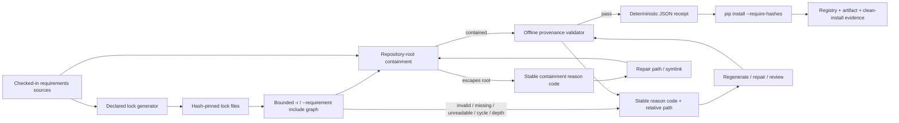

# Python lock provenance receipt

## Status boundary

**Protected `develop` shipped truth (before PR #1369):** naruon installs its active Python lock files with pip hash-checking mode, but protected `develop` does not first attest that each repository-controlled lock declaration still agrees with its declared generator/source contract.

**Active PR #1369:** adds an offline, deterministic declaration receipt before backend dependency installation. The receipt covers repository-controlled exact pins, SHA-256 hash syntax/presence, recognized generator command binding, declared `uv pip compile` output/source paths (including conventional `requirements.in` inputs and multiple declared source files), PEP 508-style extras on manual `pip download` pins, agreement between exact direct source pins and the generated lock, and repository-root containment before any candidate lock/source payload is read. Valid pip `-r` and `--requirement` directives are resolved recursively relative to the including file, represented as nested receipts, and bounded against malformed, missing, unreadable, escaping, cyclic, or excessively deep include graphs.

The same active supply-chain lane now also contains the companion PyPI release-hash validator documented in `python-lock-registry-provenance.md`. That network-derived evidence is separate from this offline receipt and is diff-scoped in Application CI so unrelated product changes do not depend on live PyPI availability. Platform-specific artifact selection/hash matching and a clean `pip install --require-hashes` rehearsal remain issue #1229 follow-on work.

## Customer and operator decision

A passing offline receipt means that the checked-in Python lock declarations are internally consistent with the repository evidence this validator can verify without network access. It does **not** prove that a package index currently serves the expected distributions, that a distribution is available for the target platform, that a remote artifact's bytes match the checked-in hash, or that a clean installation succeeds.

A failing receipt is actionable and fail-closed. The operator should read the stable reason code and affected relative path, regenerate or repair the affected lock from its declared source/generator, review the resulting dependency delta, and rerun Application CI. Do not bypass the receipt or remove hash-checking mode to make a dependency update green. A path-containment failure means the declaration or symlink must first be moved back under the repository root; the validator intentionally does not read the escaping payload. Include-graph failures require correcting the directive, restoring or re-encoding the referenced file, removing the cycle, or flattening an over-deep chain before dependency installation proceeds.

## Evidence flow

For safely contained lock paths, the validator emits repository-relative paths, SHA-256 digests of the checked-in lock text, aggregate requirement/hash counts, generation mode, nested `included_files` receipts, and stable validation findings. Include paths are resolved relative to the including file, checked against the repository root before `is_file()` or payload reads, and traversed to a maximum depth of 32. Missing, non-regular, or non-UTF-8 lock/include payloads fail with bounded reason data rather than an unhandled traceback. For an escaping lock path, it emits a failed receipt with `sha256: null`, zero counts, and a containment reason code without reading the target payload. It performs no network request and reads no credentials or package-index tokens.

## Validation contract

The active slice discovers `requirements*.txt` files containing SHA-256 lock entries and validates the following repository-controlled properties:

- each requirement declaration is an exact `==` pin;
- each pinned requirement carries at least one syntactically valid SHA-256 entry;
- detached hashes, malformed SHA-256 entries, and duplicate project declarations fail with stable reason codes;
- valid `-r path`, `-rpath`, `--requirement path`, and `--requirement=path` directives are recursively validated relative to the including file rather than silently skipped;
- every include target must be a readable UTF-8 regular in-repository file, and malformed, missing, unreadable, escaping, cyclic, or deeper-than-32 include graphs fail closed before unsafe payload data can leak;
- nested included-file digests and counts are retained in deterministic `included_files` receipts while their findings are flattened into the parent lock decision;
- a recognized manual `pip download` regeneration command names at least one exact package/version, accepts standard extras such as `SomePackage[PDF]==3.0`, and agrees with the lock;
- a recognized `uv pip compile` command names the lock output and one or more `.txt` or `.in` source requirements files, and exact direct pins from every declared source agree with the generated lock;
- resolved lock/source candidates must remain under the resolved repository root before file existence checks or payload reads, including symlink targets and `..` traversal;
- an unreadable or non-UTF-8 declared `uv` source fails with a stable source reason rather than being silently ignored;
- the machine receipt is deterministic and does not serialize an absolute runner path, escaping file payload, or provider exception text;
- Application CI publishes the receipt before network dependency installation even when validation fails, then exits with the validator status.

The implementation intentionally ignores arbitrary explanatory prose as provenance metadata. Only recognized generator command forms create generator-binding obligations. Recorded `uv pip compile` paths are interpreted as repository-root-relative because the checked-in generator comments use that convention; `-r` / `--requirement` includes follow pip's including-file-relative convention. This asymmetry is explicit rather than inferred from whichever path happens to appear last.

## Reason-code handling

| Code | Meaning | Operator action |
| --- | --- | --- |
| `requirement-not-exactly-pinned` | A lock entry is not an exact `==` requirement. | Regenerate the lock from the intended source requirements and review the resolved version. |
| `missing-sha256` | A requirement has no valid SHA-256 evidence. | Regenerate hashes for the intended artifacts; do not install without hash checking. |
| `malformed-sha256` | A SHA-256 entry is syntactically invalid. | Recompute the digest through the declared lock-generation path. |
| `orphan-hash` | A hash is not attached to a requirement declaration. | Regenerate or repair the lock structure. |
| `duplicate-requirement` | The same normalized project is declared more than once. | Consolidate the declaration through the source requirements and regenerate. |
| `requirement-include-invalid` | A `-r` or `--requirement` directive does not name exactly one file path. | Correct the directive to one supported file reference. |
| `requirement-include-missing` | The contained include target is absent or not a regular file. | Restore the referenced requirements file or remove the stale directive. |
| `requirement-include-outside-repository` | An include resolves outside the repository root, including through traversal or a symlink. | Move the target under repository control and rewrite the directive; do not expose the external payload to CI. |
| `requirement-include-cycle` | The include graph returns to a file already on the active traversal path. | Remove or flatten the cyclic include relationship. |
| `requirement-include-depth-exceeded` | The include graph exceeds the bounded depth of 32. | Flatten or consolidate the requirements graph before validation. |
| `generation-output-missing` | A recognized `uv` generator omits its output lock path. | Restore the exact `--output-file` declaration and regenerate. |
| `generation-output-mismatch` | The declared generator output is a different lock file. | Correct the generator command or validate the intended lock. |
| `generation-input-missing` | A recognized generator does not identify a usable source/package pin. | Restore the source requirement path or exact manual package pin, then regenerate. |
| `generation-input-outside-repository` | A declared `uv` source resolves outside the repository root. | Move or rewrite the source declaration so the resolved file stays inside the repository; do not expose the external payload to CI. |
| `generation-input-unreadable` | A declared `uv` source cannot be read as repository UTF-8 text. | Restore or re-encode the source requirements file before regenerating. |
| `generation-version-mismatch` | At least one generator/source exact pin disagrees with the lock. | Regenerate from all current source declarations and review the dependency delta. |
| `lock-path-outside-repository` | A discovered or directly validated lock resolves outside the repository root, including through a symlink. | Replace the escaping path/symlink with an in-repository lock before validation. |
| `lock-read-failed` | A contained lock/include path is missing, non-regular, unreadable, or not valid UTF-8. | Restore a readable repository-controlled UTF-8 requirements file; do not rely on traceback-only failure. |

## TDD and acceptance evidence

The first PR head intentionally introduced tests before the validator existed so collection failed closed rather than silently passing. Follow-up regressions cover a stale manual generator version, missing manual generator pin, manual extras, unpinned/unhashed declarations, malformed/orphan/duplicate hash structure, `.txt` and `.in` uv sources, missing or mismatched `uv` source/output bindings, traversal and symlink escapes, deterministic path-relative receipts without escaping payload disclosure, CLI exit behavior, the direct-script guard, the current repository lock inventory, job-scoped workflow ordering, and failure-receipt publication before CI exits. A later RED commit proves that both `-r` and `--requirement` previously bypassed included-file validation; the GREEN contract covers both forms, valid nested receipt counts/digests, deterministic output, missing and malformed targets, outside-root non-disclosure, cycle detection, and bounded-depth termination.

The current review-edge RED additionally pins two latent failure modes from live review: a stale exact pin in an earlier source of a multi-input `uv pip compile` command must be checked rather than only the final `.txt`/`.in` path, and a non-UTF-8 included requirements file must return `lock-read-failed` instead of raising a traceback. The production repair iterates every declared source path and converts lock/source read failures to stable non-secret reason codes.

For the current exact PR head, merge evidence remains the live protected-branch gate set, not this document and not predecessor-head success. Required CI/security/review evidence must be terminal and exact-head current before merge is considered.

## Standards and primary technical grounding

pip's current secure-install guidance defines `--require-hashes` as hash-checking mode and describes hash checking as protection against remote package tampering. pip's requirements-file format documents `-r` / `--requirement` as a supported include directive, so an attestation that skips those lines is incomplete. The Python Packaging User Guide distinguishes concrete requirements files used for repeatable complete-environment installations from abstract package dependency declarations. NIST SSDF v1.1 remains the final SP 800-218 publication and provides the broader secure-development and provenance-oriented practice context for protecting software and its components. This slice uses those sources to define a deterministic local evidence boundary; it does not claim that local declaration validation substitutes for remote artifact verification or the remaining issue #1229 controls.

### References (APA 7th)

National Institute of Standards and Technology. (2022). *Secure Software Development Framework (SSDF) version 1.1: Recommendations for mitigating the risk of software vulnerabilities* (NIST Special Publication 800-218). https://doi.org/10.6028/NIST.SP.800-218

Python Packaging Authority. (2026). *install_requires vs requirements files*. Python Packaging User Guide. https://packaging.python.org/en/latest/discussions/install-requires-vs-requirements/

Python Packaging Authority. (2026). *Secure installs*. pip documentation. https://pip.pypa.io/en/stable/topics/secure-installs/

Python Packaging Authority. (2026). *Requirements file format*. pip documentation. https://pip.pypa.io/en/stable/reference/requirements-file-format/
