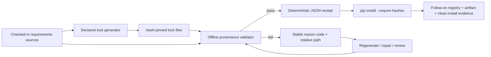

# Python lock provenance receipt

## Status boundary

**Protected `develop` shipped truth (before PR #1369):** naruon installs its active Python lock files with pip hash-checking mode, but protected `develop` does not first attest that each repository-controlled lock declaration still agrees with its declared generator/source contract.

**Active PR #1369:** adds an offline, deterministic declaration receipt before backend dependency installation. The receipt covers repository-controlled exact pins, SHA-256 hash syntax/presence, recognized generator command binding, declared `uv pip compile` output/source paths, and agreement between exact direct source pins and the generated lock.

**Planned follow-on work for issue #1229:** registry metadata resolution, platform-specific artifact selection/hash matching, and a clean `pip install --require-hashes` rehearsal. Those controls are not shipped by this PR and must not be inferred from an offline passing receipt.

## Customer and operator decision

A passing receipt means that the checked-in Python lock declarations are internally consistent with the repository evidence this validator can verify without network access. It does **not** prove that a package index currently serves the expected distributions, that a distribution is available for the target platform, that a remote artifact's bytes match the checked-in hash, or that a clean installation succeeds.

A failing receipt is actionable and fail-closed. The operator should read the stable reason code and affected relative path, regenerate or repair the affected lock from its declared source/generator, review the resulting dependency delta, and rerun Application CI. Do not bypass the receipt or remove hash-checking mode to make a dependency update green.

## Evidence flow

The validator emits only repository-relative paths, SHA-256 digests of the checked-in lock text, requirement/hash counts, generation mode, and stable validation findings. It performs no network request and reads no credentials or package-index tokens.

## Validation contract

The active slice discovers `requirements*.txt` files containing SHA-256 lock entries and validates the following repository-controlled properties:

- each requirement declaration is an exact `==` pin;
- each pinned requirement carries at least one syntactically valid SHA-256 entry;
- detached hashes, malformed SHA-256 entries, and duplicate project declarations fail with stable reason codes;
- a recognized manual `pip download` regeneration command names at least one exact package/version and agrees with the lock;
- a recognized `uv pip compile` command names the lock output and source requirements file, and exact direct pins from that source agree with the generated lock;
- the machine receipt is deterministic and does not serialize an absolute runner path;
- Application CI publishes the receipt before network dependency installation and fails closed when validation exits nonzero.

The implementation intentionally ignores arbitrary explanatory prose as provenance metadata. Only recognized generator command forms create generator-binding obligations. This prevents stale narrative comments from being mistaken for executable provenance while still failing closed on a recognized but incomplete generator declaration.

## Reason-code handling

| Code | Meaning | Operator action |
| --- | --- | --- |
| `requirement-not-exactly-pinned` | A lock entry is not an exact `==` requirement. | Regenerate the lock from the intended source requirements and review the resolved version. |
| `missing-sha256` | A requirement has no valid SHA-256 evidence. | Regenerate hashes for the intended artifacts; do not install without hash checking. |
| `malformed-sha256` | A SHA-256 entry is syntactically invalid. | Recompute the digest through the declared lock-generation path. |
| `orphan-hash` | A hash is not attached to a requirement declaration. | Regenerate or repair the lock structure. |
| `duplicate-requirement` | The same normalized project is declared more than once. | Consolidate the declaration through the source requirements and regenerate. |
| `generation-output-missing` | A recognized `uv` generator omits its output lock path. | Restore the exact `--output-file` declaration and regenerate. |
| `generation-output-mismatch` | The declared generator output is a different lock file. | Correct the generator command or validate the intended lock. |
| `generation-input-missing` | A recognized generator does not identify a usable source/package pin. | Restore the source requirement path or exact manual package pin, then regenerate. |
| `generation-version-mismatch` | The generator/source exact pin disagrees with the lock. | Regenerate from the current source declaration and review the dependency delta. |

## TDD and acceptance evidence

The first PR head intentionally introduced tests before the validator existed so collection failed closed rather than silently passing. Follow-up regressions cover a stale manual generator version, missing manual generator pin, unpinned/unhashed declarations, malformed/orphan/duplicate hash structure, missing or mismatched `uv` source/output bindings, deterministic path-relative receipts, CLI exit behavior, the direct-script guard, the current repository lock inventory, and CI ordering.

For the current exact PR head, merge evidence remains the live protected-branch gate set, not this document and not predecessor-head success. Required CI/security/review evidence must be terminal and exact-head current before the PR can leave Draft and before merge is considered.

## Standards and primary technical grounding

pip's current secure-install guidance defines `--require-hashes` as hash-checking mode and describes hash checking as protection against remote package tampering. The Python Packaging User Guide distinguishes concrete requirements files used for repeatable complete-environment installations from abstract package dependency declarations. NIST SSDF v1.1 remains the final SP 800-218 publication and provides the broader secure-development and provenance-oriented practice context for protecting software and its components. This slice uses those sources to define a deterministic local evidence boundary; it does not claim that local declaration validation substitutes for remote artifact verification or the remaining issue #1229 controls.

### References (APA 7th)

National Institute of Standards and Technology. (2022). *Secure Software Development Framework (SSDF) version 1.1: Recommendations for mitigating the risk of software vulnerabilities* (NIST Special Publication 800-218). https://doi.org/10.6028/NIST.SP.800-218

Python Packaging Authority. (2026). *install_requires vs requirements files*. Python Packaging User Guide. https://packaging.python.org/en/latest/discussions/install-requires-vs-requirements/

Python Packaging Authority. (2026). *Secure installs*. pip documentation. https://pip.pypa.io/en/stable/topics/secure-installs/

Python Packaging Authority. (2026). *Requirements file format*. pip documentation. https://pip.pypa.io/en/stable/reference/requirements-file-format/
