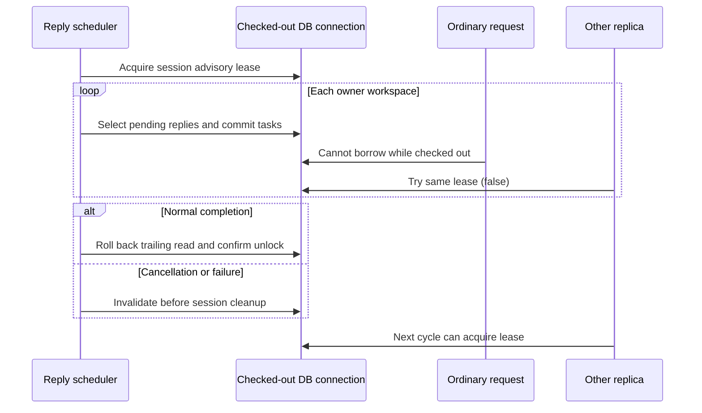

# Reply follow-up physical-connection lease

Status: **Proposed**. Date: 2026-09-05. Decision owner: Naruon maintainers.
This is the scheduler supplement to ADR-0005, not a new allocated ADR number.
The installed `adr-author` package lacks its required
`adr-identity.instructions.md`; its MADR context/options/consequences structure
is used without claiming allocator, state-machine or acceptance validation.

## Context and problem statement

PR [#1486](https://github.com/ContextualWisdomLab/naruon/pull/1486) at
`b32954dbf6066bc0d953887e8ca06820588f2c5f` contains the existing owner/workspace
sweep. Its direct base is `develop` at
`042b0c70531b229af3acbd0421a2f23098d848b3`. It is a broad, unmerged proposal;
the calendar, attachment, migration and Noema changes remain intact. Repairing
this scheduler does not validate those unrelated slices or supersede the PR.

A user has sent a question and has not received a reply after the configured
deadline. A replica creates the source-linked follow-up task and commits. An
ordinary request then borrows that returned pool connection while the replica
continues its sweep on a different connection. The advisory lock still belongs
to the first connection. The final unlock consequently does not release it,
and the next replica cannot start follow-up work even though the first cycle
has finished. Reusing the same Python session object does not establish
physical connection ownership.

The actual database reproduction observed `worker=[79], reader=79`, a persisted
blocked/urgent task, and `replica_can_lead=False` after `_sync()` returned.
The original 12 mocked scheduler tests passed and did not exercise this pool
interleaving. An independent read-only review also identified two existing
manual-request conflict failures: rollback expires the loaded emails before
fallback accesses them, and savepoint rollback already removes failed inserts
before the fallback calls `expunge()` again.

## Requirements and constraints

| Product requirement | Technical invariant | Acceptance evidence |
|---|---|---|
| Follow-ups keep progressing after a saved task | Lease remains on one physical connection across transaction boundaries | Competing replica cannot acquire during a real commit; can acquire after completion |
| One failed mailbox does not stop every mailbox | Healthy transaction failure rolls back; later owner state is reloaded | Real division-by-zero and explicit rollback cases continue to another owner |
| Lost coordination cannot authorize more work | Disconnected backend aborts this sweep | Actual `pg_terminate_backend` of the task-owned worker yields an invalidated DBAPI error and no second owner write |
| A manual request must not lose or duplicate a follow-up | Conflict recovery preserves existing task identity and processes both source workspaces | Real concurrent insert through a second session, bulk and savepoint paths |
| Small connection pools remain usable | One worker connection, no second lease checkout | Pool size 1, overflow 0, real writes and cancellation cases |

Existing opaque task identifiers, owner/organization/workspace queries, 48-hour
default, limits and scheduling interval are retained. No schema, provider
credential, model routing, API payload or browser authorization change is made.
The current Python service is repaired in place; no new Python computation
core or framework is introduced.

## Considered options and decision

The chosen coordination change binds the existing session to the connection
already checked out for the sweep. Transaction ownership remains with the
escalation service. A normal cycle rolls back any trailing read transaction,
then requires a literal boolean successful unlock. Any exception, including
cancellation before acquisition acknowledgement, invalidates that connection
**inside** the session context, before shielded close/rollback can wait.

| Option | Commits retain lease | One pool slot | Existing task transactions | Decision |
|---|---|---|---|---|
| Bind existing session to one checked-out connection | Yes | Yes | Preserved | Chosen |
| Independent lock connection plus ordinary work session | Yes | No | Preserved | Extra checkout can exhaust a one-slot pool |
| Transaction-scoped advisory lock | No | Yes | Lost at each task commit | Does not cover the whole sweep |
| Process-local mutex | Only within one process | Yes | Preserved | Does not coordinate replicas |

An independent lock connection offers a clean separation of responsibilities
and is reasonable for a separately budgeted pool. This scheduler has no such
budget or necessity: binding the session avoids the extra resource and new
abstraction. Transaction locks have automatic cleanup, but changing all task
commits into one sweep transaction would also change failure isolation and
visibility. A local mutex is cheap but cannot protect multiple deployments.

Conflict recovery is a separate sub-decision. The shared escalation service
refreshes each selected mail record after bulk rollback before attempting its
existing fallback. Both redundant `expunge()` calls are removed because actual
savepoint rollback already detaches failed new tasks. The scheduler reloads
configuration before each workspace using a forced database read, so a
successfully recovered conflict does not leave the next workspace reading
expired attributes and a deleted configuration cannot remain authorized by the
session cache. A real second-session deletion after the first committed task
first reproduced two workspace executions, then passed with only one.
Healthy owner failures
record only the exception class, not raw SQL, credentials or mail content.



## Reproduction and verification

Use a fresh isolated PostgreSQL 16 + pgvector instance, not an operator database.
The task runner uses a digest-pinned image, read-only root, non-root user,
`no-new-privileges`, task-owned tmpfs storage, loopback-only random port and
random generated test credentials. Its exact Compose project is
`naruon-pr1486-lease-dbimpf`; cleanup targets only that project. No global prune,
shared database reset or operator environment file is used.

From `backend`, with only the isolated test database URL and generated test
session secret supplied:

```sh
uv sync --locked
uv run --locked python scripts/migrate_db.py
uv run --locked python scripts/migrate_db.py
uv run --locked coverage run --branch \
  --source=services.reply_sla_scheduler,services.reply_sla_escalation_service \
  -m pytest -q -W error -ra --tb=short \
  tests/test_reply_sla_scheduler.py tests/test_reply_sla_scheduler_postgres.py \
  tests/test_reply_sla_escalation_edges.py \
  tests/test_tasks_api.py tests/test_reply_tracking.py \
  tests/test_reply_tracking_service.py tests/test_db_session.py \
  tests/test_alembic_migrations.py tests/test_bootstrap_db.py
uv run --locked coverage report -m
```

The new PostgreSQL test checks the actual `0022_noema_orchestrator_gateway`
migration receipt and does not create ORM metadata or skip on unavailable DB.
The older tasks API smoke still has metadata bootstrap and synthetic unit-like
inputs; its passing result is not used as migration, live-auth or realistic
customer-mail evidence. The runner migrates first, so it cannot hide a broken
fresh upgrade for this receipt.

The test mail is a short observed question from a public mailing-list message.
Its question and original UTC date are preserved. Names, addresses, subject and
message identity are anonymized; the same source is replayed in two isolated
workspaces. Tracking/escalation clocks are fixed three days after that message.
This is a concurrency regression, not a representative inbox, classifier
accuracy, notification delivery, throughput or p95 acceptance test.

Evidence retained under `/private/tmp/naruon-scheduler-lease.dbIMPF`:

| Receipt | Observation |
|---|---|
| `baseline.xml` | Unchanged head: fresh/repeat migrations and 12 mocked tests pass |
| `lease_red.xml` / `lease_green.xml` | Real commit lends held connection: 1 failed → 1 passed |
| `owner_red.xml` / `owner_green.xml` | Healthy rollback and disconnect handling: 3 failed → 4 passed including original lease regression |
| `conflict_red.xml` / `conflict_green.xml` | Bulk and nested real insert races: 2 failed → 2 passed |
| `deletion_red.xml` / `deletion_green.xml` | Committed mailbox deletion between two workspaces: 1 failed → 1 passed |
| `full_candidate.xml` | Failed collection, not runtime GREEN: Starlette deprecated fallback client |
| `expanded_candidate.xml` | Intermediate 149 passed; scheduler-only 103 statements / 26 branches 100% |
| `reviewed_candidate.xml` | 165 passed, zero failures/errors/skips, 3.22 seconds; both changed runtime modules total 259/259 statements and 82/82 branches, zero exclusions |

The final runtime definitions have docstrings on all 24 classes/functions/methods
(scheduler 10/10, escalation service 14/14). The 12 PostgreSQL cases execute
actual migrated database writes, ownership probes or cancellation boundaries;
the 12 new scripted edge cases are explicitly unit tests, not real races.
These percentages cover these two modules only, not repository-wide test,
docstring, edge-case completeness, browser behavior or protected CI. The exact
post-commit rerun and SHA-256 receipts are recorded on the PR head.

A later mechanical naming pass accidentally renamed the existing `db.models`
import in the new unit-only file. Its isolated collection failed with
`ModuleNotFoundError`; intermediate local commit `7ce6592` is **not** a GREEN
receipt. The import is restored in a forward correction, preserving the
framework/package boundary. The earlier 165-pass receipt is historical, and
the full suite must run again on the corrected committed head before push.

The first expanded test collection exposed Starlette 1.3.1's fallback to
deprecated `httpx` when its intended `httpx2` test client was absent. The existing
Naruon #1469 development pin `httpx2==2.5.0` is reused in the dev dependency group
and lockfile, and the obsolete warning-ignore entry is removed. Runtime HTTP
clients and production dependencies are unchanged. No warning suppression is
accepted as the repair. Later receipts belong to their own exact source and
must not inherit intermediate coverage totals.

## Risks, consequences and follow-up

| Risk / cost | Effect and mitigation | Owner |
|---|---|---|
| One connection remains checked out for the sweep | Bounded resource cost; actual one-slot test checks no second checkout | Naruon runtime |
| Multiple owners share the global lease | Serial sweep throughput ceiling; measure before designing per-owner coordination | Naruon runtime |
| Lost DB during an already committed operation | This does not provide exactly-once execution; existing unique source-task identity and subsequent sweep reconcile state | Naruon task service |
| Cancellation while teardown stalls | Test gates real session `__aexit__`; proves invalidation order, not a real network blackhole | Naruon runtime |
| Transaction-pooling proxy changes backend identity | Requires direct PostgreSQL or session-affine pooling; proxy compatibility is unverified | Deployment owner |
| Historical proposal text mistaken for release evidence | ADR-0005 is Proposed; exact-head CI, reviews and protected merge are still required | Naruon maintainers |

If a rollout fails, stop the affected background worker under the operator's
normal deployment controls and preserve queued mail/task data. Do not restore
the known connection-lending implementation, delete task rows to clear a lease,
or terminate unscoped database sessions. Repair the diagnosed owner and rerun
the same migration, regression and deployment verification before resuming.

The existing sibling import-lock repair remains in PR #1317, not copied here.
Attachment worker evidence in #1469 does not certify this scheduler or #1486's
other workers. The canonical Gap ledger remains owned by PR #1557; this branch
does not create a second competing baseline. Hosted checks, independent review,
protected merge, immutable release and deployed behavior remain separate gates.

## References (APA 7th)

PostgreSQL Global Development Group. (n.d.). *Explicit locking: Advisory locks*
(PostgreSQL 16 documentation). Retrieved September 5, 2026, from
https://www.postgresql.org/docs/16/explicit-locking.html#ADVISORY-LOCKS

SQLAlchemy authors. (n.d.). *Session basics: Committing and rolling back*
(SQLAlchemy 2.0 documentation). Retrieved September 5, 2026, from
https://docs.sqlalchemy.org/en/20/orm/session_basics.html

SQLAlchemy authors. (n.d.). *Transactions and connection management*
(SQLAlchemy 2.0 documentation). Retrieved September 5, 2026, from
https://docs.sqlalchemy.org/en/20/orm/session_transaction.html

Public archive author [identity anonymized]. (2014, April 27).
*Postgresql the right tool (queue using advisory_locks + long transactions)*
[Mailing-list message]. PostgreSQL public archives.
https://www.postgresql.org/message-id/CANsFX049q7C_vJAtn2BSJy_4hQPu0%3DJNtv-Lyzb%3DgbZu-be30A%40mail.gmail.com

Only the short cited question is included, not the full copyrighted message or
an assumed-redistributable paper PDF. Context7 was quota-unavailable. DeepWiki
helped locate callers but its claim that a same-session `finally` guarantees
unlock was contradicted by the exact-head PostgreSQL RED; source and executable
evidence take precedence. The tested installed SQLAlchemy version is 2.0.51;
the currently served 2.0 documentation identifies itself as 2.0.52.
