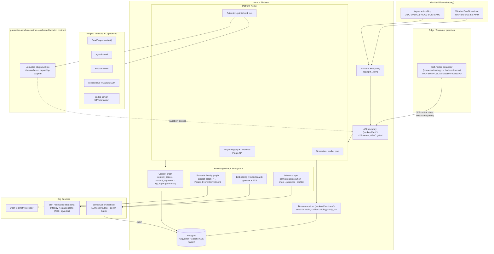
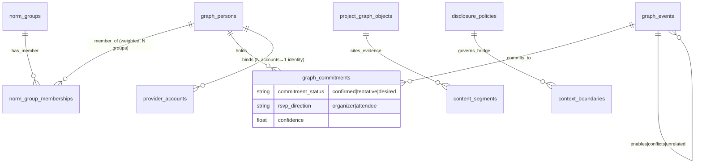

# naruon Platform — Product Planning Document

> A unified product-planning specification consolidating Information Architecture, User Stories, Use Cases, and Architecture for the naruon platform. Grounded in the current-state map of `ContextualWisdomLab/naruon @ develop` (HEAD `9db32d0`, 366 files CodeGraph-indexed).

---

## Executive Summary

**Mission.** naruon turns scattered enterprise context into **judgment-ready structure, then action**. The problem it solves is not a lack of information — it is that *the context needed to judge is scattered* (정보 부족이 아니라 판단할 맥락이 흩어져 있다). naruon does not summarize; it **synthesizes**: it strings scattered records into a dense knowledge graph so a person is *less cognitively taxed* (사람이 덜 소모), not handed more to read. 구슬이 서 말이어도 꿰어야 보배 — beads become treasure only once strung.

The product is a **platform plus à-la-carte plugins**: a self-hostable, email-first workspace (FastAPI backend + Next.js 16 / React 19 frontend + a thin WebSocket connector that proxies IMAP/SMTP/CalDAV/WebDAV from customer premises) whose core is a **two-tier knowledge graph** over Postgres + pgvector. Everything domain-specific — verticals (BandScope, pg-erd-cloud, scopeweave, Inkspan, codec-carver) and capabilities (scheduling, audio minutes, code integration) — attaches through a stable plugin contract. Nothing is mandatory; a user's enabled set reshapes their workspace.

The differentiator is a **dense KG that never asks**. A sufficiently dense, multi-dimensional graph holds the evidence to resolve ambiguity itself, so naruon surfaces a *resolved connection + a recommended judgment + evidence + honest confidence* and lets the human **correct by exception** — it never interrogates. The DIKW ladder (records → contextualize → judgment point → action) is the spine of the whole system, and five inference disciplines (below) are the acceptance criteria that make "no-ask" safe rather than reckless.

This document assembles the full IA, User Stories, Use Cases, and Architecture into one specification, marks what exists in code today versus what is net-new, and closes with a phased roadmap.

---

## Table of Contents

1. [Cross-Cutting Principles](#1-cross-cutting-principles)
2. [Personas](#2-personas)
3. [Status Legend](#3-status-legend)
4. [Information Architecture](#4-information-architecture)
5. [User Stories](#5-user-stories)
6. [Use Cases](#6-use-cases)
7. [Architecture Definition](#7-architecture-definition)
8. [Grounding & Gaps — Exists Today vs Net-New](#8-grounding--gaps--exists-today-vs-net-new)
9. [Phased Roadmap](#9-phased-roadmap)

---

## 1. Cross-Cutting Principles

These five disciplines are the load-bearing rules of the entire platform. They are **acceptance criteria, not aspirations**, and they bind every screen, story, use case, and code path below. Each carries a stable ID; the User Stories reference them as **G1–G6** and the Use Cases as **Laws NA/EF/CS/PB** (aliases are noted per principle so the sections read consistently).

### CP-1 — DIKW spine (records → contextualize → judgment point → action)
Every surface sits on one rung of the ladder; navigation *is* this pipeline, not a feature menu. Every subsystem must move a unit of data toward a judgment point and **reduce human cognitive load** (사람이 덜 소모). The center of gravity is the **knowledge graph**, not the inbox — the inbox is an ingest edge; the graph is the product. Synthesis over summary: link entities and unresolved commitments; do not merely shorten text.

### CP-2 — No-ask / dense-KG auto-resolution *(alias: Law NA · G1)*
The system **must not ask the user a disambiguation question** — asking re-imposes the scattered-context load the platform exists to remove. A dense, multi-dimensional KG already holds the evidence (hotel location vs. event venue, host = partner vs. colleague, commitment status, past patterns, travel time). Therefore the system **auto-resolves**, then surfaces the **resolved connection + recommended judgment/action + cited evidence + calibrated confidence**. The human **corrects by exception** (approve / hold / override) but is never interrogated. Even "pick one of these options" is treated as a residue of asking and is avoided in favor of a single resolved recommendation with alternatives collapsed behind it. Irreversible/externally-visible actions (sending, booking, approving) still terminate at a human approve/hold — delivered as a correction surface, not a question. Every auto-resolution is one gesture to undo/correct, and corrections are captured as first-class KG feedback (`*_corrections`) that updates the responsible extractor/edge confidence.

### CP-3 — Ecological-fallacy discipline *(alias: Law EF · G3)*
Every inference is made **at its correct level of analysis**. Group / domain / norm-group base rates are **priors**, updated by **individual-level content** to a **posterior**:

```
posterior(individual | evidence) ∝ prior(norm_group) × likelihood(individual content)
```

A group rate is **never imputed onto an individual** (nor an individual's behavior generalized onto a group). Each person belongs to **N simultaneous, overlapping norm/reference groups** — a **multi-membership graph, not a tree**. Norms are group-relative, so the applicable norm-group(s) for an interaction are **resolved before acting**. Every inference records its level of analysis; mixing levels within one claim is prevented. All surfaced inferences carry **honest, calibrated confidence** (not a raw model logit), with evidence one click away; low-confidence resolutions are shown as *tentative* and never silently acted upon.

### CP-4 — Commitment-status weighting *(alias: Law CS)*
Every commitment carries a status on the axis **{confirmed | tentative | desired}**, and RSVP **direction** {organizer | attendee}. Conflict detection is **status-weighted**: `confirmed` outranks `tentative` outranks `desired`. A `desired` item (e.g., an RSVP I am about to send) proposed over a `confirmed` slot (e.g., a paid booking) is a **conflict the confirmed side wins** — the system **never silently breaks a confirmed commitment**. Any recommendation that would touch a confirmed item is flagged high-stakes and defaults to *hold*. e-Approval (전자결재) outcomes (leave/travel/expense) are **first-class KG events** linked to the life/work events they *enable* — anticipatory coordination, not reactive.

### CP-5 — Privacy: default-segregated + consented minimal-disclosure bridge *(alias: Law PB · G4)*
Contexts — **personal / work→{former employer, current employer} / per-project / per-band** — are **segregated by default**, classified by **content, not by account**. A private fact may affect another context only by propagating the **necessary consequence** (e.g., *"unavailable Tue–Thu"*), **never the private reason** (e.g., *"hospitalized"*). The user controls the disclosure level per bridge (minimum by default); data minimization and purpose limitation are enforced structurally at the boundary; every bridge is consent-gated, revocable, and audited.

**Two further constants** apply everywhere and are folded into the above:
- **Language-agnostic (G6):** entity/relation extraction, resolution, and search
  work consistently across EN/KO/JA/ZH/VI through language-agnostic lexical and
  multilingual dense retrieval plus source-backed extraction — **no dependency
  on morphological analyzers** (Kiwi/Nori-style), which cause performance
  cliffs. Cross-lingual structural topic measurement is a **PLANNED** optional
  TEPP integration, not a current Naruon search or inference signal.
- **À-la-carte plugins:** nothing is mandatory; verticals/capabilities slot into fixed extension points; a user's enabled set reshapes their navigation.

**Cross-cutting definition of done.** A unit of work is "done" only when it demonstrably honors all disciplines together: the happy path asked **zero questions** (CP-2); **no confirmed commitment was silently broken** (CP-4); every inference was made and labeled at the **correct level of analysis** (CP-3); and **no private reason crossed a context boundary** — only the necessary consequence, with consent and audit (CP-5).

---

## 2. Personas

| ID | Persona | Description |
|----|---------|-------------|
| **P1 — Jae** | Org lead | Data architect + data Product Manager + AI System Architect on an AI business team. Reviews legal/regulatory (법령) exposure, owns data models, uses cloud-erd.app (pg-erd-cloud). Optimizes for rigorous, level-correct inference and defensible decisions. |
| **P2 — Mina** | Digital-Trust pro + musician (Jae's partner) | Works in a Digital Trust / personal-data-protection (개인정보보호) team. Plays in **N** overlapping amateur workplace bands (a multi-membership graph). Heavy BandScope + naruon user; chronically over-committed. The flagship "double-booking rescue" scenario is hers. |
| **P3 — Sam** | Generic knowledge worker | Lives in email, calendar, tickets, and docs across a couple of accounts. Wants the load lifted without learning a new discipline. |

System actors referenced throughout: **SYS** (the naruon platform), **KG** (the dense knowledge graph), **CONN** (the self-hosted connector), **ORCH** (contextual-orchestrator LLM gateway), **HUMAN** (whichever user owns the workspace — the ultimate approver/corrector).

---

## 3. Status Legend

Every entity, screen, relation, and flow below is grounded and tagged:

| Tag | Meaning |
| --- | --- |
| `[LIVE]` | Implemented and wired into production today |
| `[PARTIAL]` | Exists but incomplete, test-only, or not reconciled with the live path |
| `[NEW]` | Net-new; specified here, not yet built |
| `[PLANNED]` | Aspirational in the vision; this document gives it a concrete home |

---

## 4. Information Architecture

> The IA is organized around **synthesis, not summary** (CP-1). Records are threaded into a dense knowledge graph so a person is *less taxed*, not handed more to read.

### 4.1 Organizing principles (IA-specific application of the cross-cutting rules)

1. **DIKW as the spine** (CP-1) — navigation is the pipeline records → contextualize → judgment point → action.
2. **Synthesis over summary** (CP-1) — the center of gravity is the **knowledge graph**; the inbox is an ingest edge.
3. **Auto-resolve, never interrogate** (CP-2) — surface the resolved connection + recommendation + evidence + honest confidence; the human corrects by exception.
4. **Contexts segregated by default, bridged by consent** (CP-5).
5. **Inference discipline** (CP-3) — every inference at its correct level; N overlapping norm-groups resolved before acting.
6. **À-la-carte plugins** — capabilities slot into fixed extension points; the enabled set reshapes navigation.

### 4.2 Top-level information structure — the three planes

```
IDENTITY & GOVERNANCE PLANE   (who, which tenant, what may I see)   [LIVE]
  user_accounts · provider_accounts · organization_entities
  scoped_role_assignments (ABAC) · tenant_configs · audit_logs
RECORD PLANE   (raw material, DOM-decomposed)   [LIVE email · NEW channels]
  Message · Attachment · Thread · content_nodes/segments · calendar · chat/code/issue/audio
KNOWLEDGE PLANE   (dense semantic KG — the product)   [PARTIAL]
  Person · Org · NormGroup · Project/Band · Event · Commitment
  + typed, evidence-cited, confidence-weighted relations
```

Scaffolding exists (`project_graph_objects` generic strings) but first-class Person/Event/Commitment entities are `[NEW]`; the semantic extractor is **test-only**, not wired into ingest.

### 4.3 Core entity model

| Entity | KG role | Current-state home | Status |
| --- | --- | --- | --- |
| **Person** | Human actor; multi-membership into norm-groups | generic `participant` + `sender_relationships` | `[NEW]` |
| **Org** | Employer / counterparty / institution | `organization_entities`, `organization_groups` | `[LIVE]` |
| **NormGroup** | Reference frame for judging an interaction; overlapping | — | `[NEW]` |
| **Project / Band** | Bounded collaboration context (Band = BandScope vertical) | `project_folders`, `workspace_entities`, `project_candidate` | `[PARTIAL]` |
| **Thread** | Conversation spine across accounts/channels | `thread_id` live; `email_threads`+edges partial | `[LIVE/PARTIAL]` |
| **Message** | Atomic communication record | `email_records` live; `email_messages/instances/raws` | `[LIVE/PARTIAL]` |
| **Attachment** | Payload; DOM-parsed like a message | `email_attachments` | `[LIVE]` |
| **ContentNode/Segment** | DOM decomposition of every message/attachment | `content_nodes`, `content_segments` | `[LIVE]` |
| **Event** | Scheduled occurrence as first-class KG node | CalDAV sync/writeback only; no event entity | `[NEW]` |
| **Commitment** | Promise/obligation w/ status axis; realized-by Events | proxied by `reply_trackers`, `ticket_tasks` | `[NEW]` |
| **Approval outcome** | 전자결재 result (leave/travel/expense) enabling events | — | `[PLANNED]` |
| **WorkItem** | requirement/feature/issue/milestone/WBS/deliverable… | `project_graph_objects.object_type` (strings) | `[PARTIAL]` |
| **TicketTask** | Actionable work from the graph (self-note, reply-SLA) | `ticket_tasks` | `[LIVE]` |
| **Plugin** | Registered à-la-carte extension (manifest, version) | only `attachment_parser` + extractor seams | `[NEW]` |
| **DisclosureConsent** | Which consequence of a private fact may cross a boundary | ABAC `owner_filters` + `access_policy` substrate | `[NEW]` |

### 4.4 KG relation (edge) types

The graph is deliberately dense/multi-dimensional (입체적·빡빡한). Every edge carries **type, confidence, and evidence** (cited source segments).

```
STRUCTURAL (DOM)     parent_of · child_of · sibling_of                 [LIVE]
COMMUNICATION        authored_by · addressed_to · reply_to ·           [LIVE/PARTIAL]
                     references · belongs_to_thread
PERSON-CENTRIC       person↔person · person↔org ·                      [NEW]
                     member_of(norm_group) · participates_in(project)
EVENT-CENTRIC        event↔event : enables | conflicts | unrelated     [NEW] resolved by density, not asking
COMMITMENT           commitment→realized_by→event ·                    [NEW] status-weighted; confirmed wins,
                     commitment↔commitment (conflicts)                       never silently broken
ANTICIPATORY         approval_outcome→enables→life/work_event          [PLANNED]
EVIDENCE/PROVENANCE  node↔message · cites(segment→object) ·            [LIVE/PARTIAL]
                     extracted_by
ONTOLOGY             sender_relationship→next_action                   [LIVE-light]
DISCLOSURE BRIDGE    private_fact —(consequence only)→ work_context    [NEW] reason stays private
```

**Commitment status axis** (encoded in *form*, not just color): `confirmed` (paid booking) · `tentative` · `desired` (an RSVP I'm sending). **RSVP direction** (organizer vs. attendee) matters. Conflict detection is **status-weighted** (CP-4) — a *desired* item over a *confirmed* slot is a conflict; confirmed wins.

### 4.5 Content taxonomy (six orthogonal axes)

1. **Context domain (primary, privacy-segregated)** — `personal` · `work→{former, current}` · `project/<id>` · `band/<id>`. Content-based, not account-based. *Email-to-self → personal reference node.*
2. **DIKW layer** — record · contextualized · judgment_point · action.
3. **Entity type** — the §4.3 taxonomy.
4. **Commitment status × RSVP direction** — `{confirmed|tentative|desired}` × `{organizer|attendee}`.
5. **Work-item type** — Phase / Activity / Task / Duty; requirement, feature, issue, milestone, wbs_item, deliverable, data_requirement, erd_candidate, infra_requirement…
6. **Source channel** — email `[LIVE]` · calendar `[LIVE]` · chat/code/issue/audio `[NEW via plugins]` · approval `[NEW]`.

Every item also carries **honest confidence** and **provenance** (segments cited, extractor + version) so any auto-resolution is auditable.

### 4.6 Navigation & screen hierarchy

Top-level navigation *is* the DIKW pipeline: `STREAMS (records) → CONTEXT/SYNTHESIS (the graph) → JUDGMENT POINT (decide by exception) → ACTION (do it)`.

```
naruon
├─ /  Workspace Home (DashboardLayout)                          [LIVE]
│    └─ Today: judgment points, conflicts, due commitments      [NEW panels]
├─ STREAMS · records
│   ├─ /mail       EmailList + EmailDetail                       [LIVE]
│   ├─ /streams    unified: email+chat+code+issue+audio lanes    [NEW]
│   └─ /calendar   CalendarLayout (CalDAV)                        [LIVE]
├─ CONTEXT / SYNTHESIS · contextualize
│   ├─ /data       DataLayout + IngestionPipelineTab             [LIVE]
│   │    ├─ Content-graph (nodes/segments, structural edges)     [LIVE]
│   │    ├─ Semantic-graph (Person/Event/Commitment)             [NEW]
│   │    └─ NetworkGraph (vis-network viz)                        [LIVE cmp]
│   ├─ /search     hybrid FTS + pgvector                          [LIVE email-only]
│   │    └─ extend to content_segments + project objects          [NEW]
│   ├─ /projects   candidates / confirm / correct + traceability  [PARTIAL]
│   └─ Context switcher  personal / work{former|current} /
│        project / band  (privacy segregation)                    [NEW dimension]
├─ JUDGMENT · judgment point
│   ├─ /tasks      reply-SLA escalations, self-notes              [LIVE]
│   ├─ Decision Points  resolved connection + recommended
│   │    action + evidence + confidence; approve/hold/correct     [LIVE cmp, NEW wiring]
│   └─ Conflict inbox  status-weighted commitment/event           [NEW]
├─ ACTION · action
│   ├─ Compose (Inkspan editor)                                   [PLANNED plugin]
│   ├─ Scheduling actions (§4.8)                                  [NEW]
│   ├─ Approvals (전자결재 → KG events)                           [PLANNED]
│   └─ DAV writeback (CalDAV/WebDAV) via connector                [LIVE]
├─ PLUGINS & CAPABILITIES · à-la-carte (§4.7)
│   ├─ /ai-hub · /prompt-studio · /tools                          [LIVE]
│   ├─ /plugins  registry / gallery / permissions                 [NEW]
│   └─ <plugin-contributed segments & panels>                     [NEW]
├─ GOVERNANCE
│   ├─ /security   audit events, DAV writeback sources            [LIVE]
│   ├─ /settings   SMTP/IMAP/POP3/OAuth, accounts                 [LIVE]
│   └─ /privacy    disclosure controls & consent bridges (§4.9)   [NEW]
└─ AUTH (routes)  /auth/* · BFF proxy /api/[...path]              [LIVE]
```

**Per-context views & privacy segregation.** The **context switcher** is a cross-cutting dimension (not one screen); selecting a context re-scopes *every* stream, graph, task, and search view:

```
Personal → Work{Former employer | Current employer} → Project/<id> → Band/<id>
```

Isolation is the default — row-level owner scoping + ABAC are the `[LIVE]` substrate; the per-context navigation boundary is `[NEW]`. A **bridge indicator** shows only *what consequence* crossed and *at what level*, never the private reason (CP-5).

### 4.7 Plugin surfaces & the à-la-carte IA

The IA reserves named **slots** each extension point attaches to. Today only two static seams exist (`attachment_parser` descriptor registry; `project_graph` extractors keyed by name/version); a runtime-registerable plugin API is `[NEW]`.

| Extension point | Where it appears | Status |
| --- | --- | --- |
| **Ingest source** (email/chat/code/issue/audio/DAV) | Lane in /streams; source under Settings | `[LIVE email/DAV] [NEW others]` |
| **DOM/analysis processor** | Content-graph pipeline in /data; extends `attachment_parser` | `[PARTIAL]` |
| **KG enricher** (LLM extractor, multilingual) | Semantic-graph view in /data | `[NEW]` |
| **Work-item type** | New object types in /projects, /tasks | `[PARTIAL]` |
| **UI panel** | Side panel in any context view; or a route segment | `[NEW]` |
| **Agent** (Naruon workspace runtime) | /ai-hub + inline action on Decision Points | `[NEW]` |
| **Scheduling** (RSVP, free/busy, room) | The §4.8 scheduling family | `[NEW]` |

**Registry & lifecycle** (`/plugins`, `[NEW]`): browse & enable (enabled set reshapes nav) · manifest & contract (extension points, permissions, version) · versioned stable plugin API · permissions/data-scope grant · isolated execution for untrusted plugins through the separately released **quarantine-sandbox-runtime** contract.

**Verticals & capabilities that plug in:** **BandScope** (`band/<id>` context + rehearsal scheduling — the killer demo) · **pg-erd-cloud** (ERD panel; data-requirement & erd_candidate) · **Inkspan** (TipTap WYSIWYG compose; Markdown→HTML on send) · **scopeweave** (PM/WBS/EVM/CPM + ITSM) · **codec-carver** (audio/video STT + diarization + consented voiceprint → meeting minutes) · **contextual-orchestrator** (not a UI surface; the LLM cost-router KG enrichers call).

### 4.8 Scheduling views (a plugin family)

```
/calendar  aggregated multi-account (CalDAV)                     [LIVE sync]
Conflict detection  status-weighted (confirmed > tentative)      [NEW]
  └─ KILLER FLOW: band-rehearsal double-book vs. prior commitments
     → auto-detect → remind → correct-by-exception (privacy-preserving)  [NEW]
Find-free-time  free/busy across contexts                        [NEW]
RSVP  iTIP/iMIP; organizer vs. attendee                          [NEW]
Room / resource booking                                          [NEW]
```

### 4.9 Privacy & disclosure IA (`/privacy`, `[NEW]`)

```
Context boundaries   (default: fully segregated)                 [LIVE substrate]
Consent bridges      personal fact ─consequence only→ work
  hospitalization (personal) ──unavailability──▶ sick-leave / OOO / reschedule (work)
  • only the consequence crosses, never the private reason
  • user controls disclosure level per bridge
Data minimization & purpose limitation
Multi-account binding  (N accounts → one identity; content-based)
Audit trail  (audit_logs / security_audit_events)               [LIVE]
```

Because the system auto-resolves rather than asking, it never forces a user to re-surface scattered private context just to answer a question.

---

## 5. User Stories

> **Story-level acceptance criteria** reference the cross-cutting principles by their alias IDs (G1–G6 = CP-2, CP-4-adjacent, CP-3, CP-5, honest-confidence, language-agnostic). The disciplines are defined once in §1 and are not restated here. Story-specific criteria add specifics on top of those always-on rules.

**Alias map:** G1 = CP-2 (no-ask) · G2 = CP-2 (correct-by-exception + reversibility) · G3 = CP-3 (ecological-fallacy-safe) · G4 = CP-5 (privacy bridge) · G5 = honest confidence (part of CP-3) · G6 = language-agnostic (part of §1).

### Epic 1 — Context Threading & Synthesis
*Records → contextualize. Thread scattered artifacts (email/chat/code/issue) into a single judgment-ready object.*

**1.1 Cross-source thread stitching.** *As Sam, I want naruon to stitch the same conversation across email, chat, tickets, and code references into one thread, so that I read the whole story in one place.*
- Joins `email_threads`/`email_thread_edges`, ticket_tasks, and linked code/issue references into one timeline, ordered by time with edge `confidence` shown.
- Stitching is by **content** (rfc_message_id, references/in-reply-to, canonical_hash, quoted-body overlap, participants, subject-normalized), not by account (G6).
- No confirmation question; a low-confidence join is *tentative* and detachable in one gesture (G1, G2, G5).

**1.2 Judgment-ready synthesis (DIKW checkpoint).** *As Jae, I want each thread to surface a synthesized "where this stands / what's the decision / what's the next action" card.*
- Names current state, the open judgment point, recommended action, blocking dependencies, and cited evidence segments (G5).
- **Structure over summary** — links entities and unresolved commitments; does not merely shorten text.
- Contradicting messages are flagged as unresolved tension, not averaged away.

**1.3 Attachment-aware decomposition.** *As Sam, I want attachments DOM-decomposed and threaded alongside the message body.*
- Parsed to content_nodes/content_segments (via newsdom-api/MinerU PDF→DOM) and linked to the parent message node.
- Extracted facts (dates, amounts, parties, commitments) become referenceable KG nodes with citations to the exact segment.
- Parse failures degrade gracefully: still threaded and searchable by filename/metadata.

**1.4 Event↔event relation resolution.** *As Jae, I want related events resolved as enables / conflicts / unrelated.*
- Edges computed from KG density (shared entities, temporal/causal language, dependency cues), not by asking (G1); each carries type, evidence, confidence (G5); wrong edges correctable in one gesture (G2).

**1.5 Email-to-self = personal storage, not a conversation.** *As Sam, I want from==to messages treated as personal notes/storage.*
- Classified as personal storage → KG reference node; never a two-party interaction or reply-SLA obligation. Extracted facts/tasks feed the KG (self-note → TicketTask intact), scoped personal by default (G4).

### Epic 2 — Dense-KG Auto-Resolution (No-Ask, Correct-by-Exception)
*The discipline epic. A sufficiently dense, multi-dimensional KG resolves ambiguity itself.*

**2.1 Auto-resolve referential ambiguity from density.** *As Mina, I want naruon to resolve "where/who/which" ambiguities from graph evidence.*
- Multi-dimensional evidence (past patterns, travel time, participant relationships, prior threads) → a **resolved** connection with evidence + confidence (G1, G3, G5). Exactly one recommendation, alternates collapsed (G1). Below threshold → *tentative* + the safe (never irreversible) default (G2, G5).

**2.2 Norm-group resolution before acting.** *As Jae, I want the system to resolve which norm/reference group(s) an interaction belongs to before it recommends anything.*
- Each person is a member of **N overlapping norm-groups**; the applicable group(s) resolved first (G3). Recommendations (tone, urgency, escalation, disclosure) are norm-group-relative; a message spanning two groups surfaces both norm sets. Norms are group priors updated by this person's history — never a blanket stereotype (G3).

**2.3 Ecological-fallacy guardrail on any imputed attribute.** *As Jae, I want an explicit guardrail that blocks group-rate-to-individual imputation.*
- Thin individual evidence → state the prior honestly AND flag no individual posterior exists yet (G3, G5). Every inference records its level of analysis; reverse imputation (person→group) equally blocked.

**2.4 Surface the resolved connection, recommend, wait for correction.** *As Sam, I want the system to show me the connection it made and the action it recommends, letting me correct only if it's wrong.*
- Renders *resolved connection → evidence → recommended judgment/action → confidence* with one-gesture correct/undo (G1, G2). Corrections write a `*_corrections` record and measurably update extractor/edge confidence (closed loop).

**2.5 Honest-confidence rendering.** *As Mina, I want confidence shown plainly and low-confidence items visibly held back.*
- Calibrated (not raw logit); *tentative* items visually distinct and never trigger irreversible actions alone (G5, G2); evidence one click away.

### Epic 3 — Scheduling & Conflict Avoidance *(the killer scenario)*
*Anticipatory coordination. Commitment-status-weighted so a confirmed commitment is never silently broken.*

**3.1 The double-booking rescue (killer demo).** *As Mina, I want naruon to aggregate all my calendars + extract commitments and warn me before I double-book a band rehearsal over a prior commitment.*
- Aggregates N calendars + extracts commitments into first-class Commitment/Event nodes with status axis + RSVP direction. **Status-weighted**: a *desired* item over a *confirmed* slot = conflict; **confirmed wins, never silently overridden**. On conflict, naruon does not ask "which?"; it recommends protecting the confirmed commitment with evidence + confidence, Mina corrects by exception (G1, G2). Reminders fire with enough lead time (travel-time-aware, see 3.5).

**3.2 Status-weighted conflict engine.** Conflicts scored by commitment status, not raw overlap; surfaces the *specific* losing item + a non-destructive resolution; never auto-cancels a confirmed commitment (G2); cross-context conflicts detected without leaking private detail (G4).

**3.3 RSVP negotiation (iTIP/iMIP).** Incoming invites → Event nodes with attendee/RSVP-direction; outgoing responses honor status weighting; recommended response surfaced, sending is the human's approve gesture (G1, G2); organizer vs attendee changes the recommendation.

**3.4 Find-free-time (free/busy) + room booking.** Free/busy across aggregated calendars respecting status weighting + each attendee's norm-group hours (G3); room booking is recommended-then-confirmed (irreversible → approve/hold, G2); a single best proposal, alternates collapsed (G1).

**3.5 Anticipatory approval → travel/logistics chaining.** Approved 전자결재 outcomes ingested as first-class Event/Commitment nodes linked (*enables*) to what they unlock — only the consequence (e.g., "OOO 3/12–3/14") crosses contexts, not the reason (G4). Recommends downstream logistics with status-weighted checks; bookings/sends human-approved; chaining itself asks nothing (G1, G2).

**3.6 Never silently break a confirmed commitment.** Hard rule: no flow (RSVP, conflict resolution, travel chaining) may cancel/modify a confirmed commitment without explicit human approval; touching a confirmed item defaults to *hold* (G2, G5).

### Epic 4 — Multi-Account & Content-Based Context Classification
*Bind N accounts to one identity; classify by content, not by which mailbox it arrived in.*

**4.1 Multi-account binding to one identity.** N provider_accounts → one identity; reconcile the live email model with the normalized model (email_messages/instances/raws/threads) as one source of truth; dedup across accounts via canonical_hash/rfc_message_id (G6).

**4.2 Content-based (not account-based) classification.** Classification by content + participants + norm-group resolution, independent of receiving account (G3, G6); misfiles re-classified in one gesture (G2); cross-account topics stitch into one thread (1.1) retaining per-context privacy (G4).

**4.3 Per-context isolation boundary.** Each context an isolation boundary beyond row-level scope; queries/views scoped to active context by default (G4); any cross-boundary surfacing is an explicit, logged, consent-gated bridge (Epic 5), never an implicit join.

### Epic 5 — Privacy Bridge / Consent Minimal-Disclosure
*Default-segregated, but a personal fact can affect work by propagating only the necessary consequence.*

**5.1 Minimal-disclosure consequence propagation.** A personal fact (hospitalization) triggers the right work consequence (sick leave / reschedule / OOO) **without** the private reason; disclosure level user-controlled ("minimum" default); fires as an approvable recommendation, fully logged (G1, G2, G4).

**5.2 Consent-gated, auditable bridges.** Each bridge records source/target context, disclosed field(s), level, consent, timestamp → security_audit_events; purpose limitation enforced (a field disclosed for scheduling can't be reused without new consent); revocable, with downstream consequences flagged on revocation (G2, G4).

**5.3 Disclosure-level preview before propagation.** Show the precise payload that will cross and to whom, defaulted to minimal; approval one gesture; declining keeps everything segregated (G1, G2, G4).

**5.4 Privacy posture is legible.** A privacy surface lists active contexts, active/expired bridges, and recent disclosure audit events (G4, G5).

### Epic 6 — Plugins & Verticals
*True à-la-carte plugin architecture: manifest/contract, stable versioned API, registry, isolated execution; nothing mandatory.*

**6.1 Enable/disable plugins à la carte.** Plugins declare a manifest/contract and register against defined extension points; users enable combinations freely; a disabled plugin's nodes remain but its behaviors stop; disabling never corrupts the core KG.

**6.2 Stable versioned plugin API + registry.** Versioned API; a plugin declares the API version it targets; incompatible versions refused at registration with a clear reason; registry lists installed plugins, versions, occupied extension points (conflict detection when two claim the same exclusive hook).

**6.3 Isolated execution for untrusted plugins.** Untrusted plugins run least-privilege through a released `quarantine-sandbox-runtime` contract scoped to granted extension points and contexts; they cannot bridge or read an ungranted context, and denied attempts are audited (G4). Naruon does not import an owner branch or treat Noema as its application runtime.

**6.4 BandScope vertical (P2's world).** Registers Band/Rehearsal/Setlist entities + rehearsal Events into the shared KG; rehearsal commitments participate in status-weighted conflict detection (Epic 3) and per-band isolation (Epics 4/5) automatically — the killer demo works because BandScope is a first-class plugin.

**6.5 ERD vertical (pg-erd-cloud / cloud-erd.app) (P1's tool).** data_requirement/erd_candidate objects surface as draft entities with citations (G5); ERD edits write back as corrections/enrichments (G2).

**6.6 Editor vertical (Inkspan) + email composition.** UI-panel + work-item plugin; Markdown→HTML on send; base64 inline images; multilingual (Noto OFL) rendering (G6); drafts can pull cited facts/entities from the KG.

**6.7 PM vertical (scopeweave).** Registers work-item types (requirement/feature/issue/milestone/wbs_item/deliverable) and reads/writes project_graph_objects/edges; planned-vs-actual and dependencies as KG-derived, cited views (G5).

### Epic 7 — Legal / Contract
**7.1 Contract extraction into the KG.** Contracts decomposed into parties, obligations, dates, amounts, renewal/termination as typed Commitment/Obligation nodes with clause citations (G5), across languages (G6); key dates → Events feeding conflict/reminder flows (Epic 3).
**7.2 Legal/regulatory (법령) review surface.** Flags where a document may touch a relevant regulation and cites the specific clause + source with calibrated confidence — *review-recommended*, never legal advice (G5); jurisdiction/norm-aware (G3); no blocking question, low-confidence flags dismissible (G1, G2).
**7.3 Obligation deadline anticipation.** Obligation Events feed status-weighted scheduling; a confirmed contractual deadline is a high-stakes confirmed commitment (3.6, G2).

### Epic 8 — Audio / Minutes
**8.1 Diarized transcription with consented voiceprint.** codec-carver plugs in as ingest+processor producing a diarized transcript; voiceprint use consent-gated and audited (G4); speakers link to Person nodes only when resolvable — unknown speakers stay labeled, not guessed (G3, G5).
**8.2 Auto meeting minutes → commitments.** Minutes synthesize decisions, open questions, action items; action items → Commitment/TicketTask with owner + due date + transcript-segment citations (G5); enter status-weighted scheduling (Epic 3); respect context scope (a band recording is personal/per-band, not work) (G4).

### Epic 9 — Code Integration
*Link real GitHub/GitLab repos/commits/PRs to the KG and PM — do NOT rebuild GitHub.*
**9.1 Link real code artifacts to threads/projects.** References live GitHub/GitLab objects (no mirror/rebuild); links carry provenance + confidence (G5); thread into the same synthesis card (Epic 1).
**9.2 Code ↔ PM traceability.** Commits/PRs traced (*fulfills / relates-to*) to project_graph_objects with citations; requirement → PR → merge-status views (G5); wrong links corrected in one gesture (G2).
**9.3 In-agent code/graph/data analysis (Naruon workspace agent).** The workspace agent runs in Naruon's application boundary with scoped, audited access; answers cite concrete artifacts + confidence; recommends and acts under approve/hold for anything irreversible (G1, G2, G5). Model routing is consumed through a released `contextual-orchestrator` contract, while separately isolated execution requires a released `quarantine-sandbox-runtime` contract.

*Coverage: 3 personas × 9 epics × 34 user stories.*

---

## 6. Use Cases

> Each use case follows: **Actors · Preconditions · Trigger · Main Flow · Alternate Flows · Exception Flows · Postconditions · Discipline Notes.** The three-to-four governing laws (Law NA/EF/CS/PB) are the cross-cutting principles of §1 (CP-2/CP-3/CP-4/CP-5) and are referenced by alias, not redefined. Domain vocabulary: *NormGroup* (a reference group a person belongs to); *Commitment* (a KG obligation with a CP-4 status); *enables / conflicts / unrelated* (the three event↔event verdicts the KG resolves without asking).

### UC-01 — Band-rehearsal double-booking auto-resolved
**Actors:** P2 (primary), SYS, KG, BandScope (calendar source), CONN (CalDAV).
**Preconditions:** P2 has N bands registered as distinct NormGroups; a prior `confirmed` commitment exists for the contested slot; calendars aggregated into one identity (Law PB).
**Trigger:** A new *Band B* rehearsal entry overlaps the existing prior commitment — P2 double-booked without noticing.
**Main Flow:**
1. SYS ingests the new rehearsal (DOM-decomposed; date/time/venue/organizer → Event + Commitment).
2. SYS resolves NormGroup (Band B) and commitment status (`desired`/`tentative`) per Law CS.
3. Status-weighted overlap detection: prior = `confirmed`, new = lower → **conflict, confirmed side wins**.
4. Law EF: no "P2 always prioritizes Band A" group assumption; combine the prior (past pattern for these two NormGroups) with individual content of *this* invite → posterior + calibrated confidence.
5. SYS surfaces the resolved conflict: *"This Band B rehearsal (Thu 19:00–21:00) conflicts with your confirmed {prior commitment}. Recommended: keep the confirmed item, propose Band B move to {next free slot}."* — one recommendation, not a question (Law NA).
6. P2 corrects by exception; on approval SYS drafts the reschedule/decline and prepares CalDAV writeback via CONN.
**Alternate:** A1 both `desired`/`tentative` → lightweight ranked nudge, still no asking. A2 new item `confirmed`, prior `tentative` → new wins. A3 travel-time-infeasible → flagged via venue geocodes.
**Exception:** E1 ambiguous NormGroup → resolve via density; below threshold still no ask, surface top-confidence with evidence exposed. E2 stale calendar → mark provisional, re-sync via CONN, re-evaluate.
**Postconditions:** No confirmed commitment silently broken; KG records the resolution as a first-class outcome feeding future priors; P2 spent one approval click.
**Discipline Notes:** Laws CS, EF, NA.

### UC-02 — Confirmed personal date protects against an inbound work invite; auto-decline with private reason withheld
**Actors:** P2/P1 (primary), SYS, KG, CONN (SMTP), Scheduling plugin (iTIP/iMIP).
**Preconditions:** A `confirmed` personal commitment for Feb 14 (hotel booking + date) in the personal NormGroup; the reason (a date) is private (Law PB).
**Trigger:** An inbound meeting/event invitation for Feb 14 arrives.
**Main Flow:**
1. SYS extracts the invite → Event + `desired` attendance request; resolves NormGroup (work/other band).
2. Cross-context status-weighted detection: personal `confirmed` vs inbound `desired` → **conflict, confirmed wins** (Law CS).
3. SYS composes an auto-decline via the minimal-disclosure bridge (Law PB): reply propagates only the consequence — *"I have a prior personal commitment on Feb 14 and won't be able to attend"* — never the reason.
4. SYS surfaces the drafted decline + evidence (the confirmed booking) as one recommendation (Law NA).
5. HUMAN corrects by exception → approve sends the decline (iMIP DECLINED) via CONN/SMTP.
**Alternate:** A1 organizer offers alternatives → match against free-busy, disclose only availability. A2 inbound itself `confirmed`+mandatory → no auto-decline; surface a genuine trade-off as a *hold*, reason still masked.
**Exception:** E1 booking only `tentative` (unpaid) → recommend confirming/releasing, don't overstate. E2 higher disclosure level set → still default minimal, explicit opt-in to reveal more.
**Postconditions:** Confirmed personal plan protected; the other side gets a courteous decline with zero private detail; disclosure level logged.
**Discipline Notes:** Laws CS, PB, NA.

### UC-03 — Organizer-side RSVP aggregation confirms an event I host
**Actors:** P1 (primary, organizer), SYS, KG, Scheduling plugin, CONN.
**Preconditions:** P1 organizes a Mar 14 event (RSVP direction = organizer); P1 has his own `confirmed` lodging/travel around Mar 14; inbound attendee RSVPs arriving.
**Trigger:** Inbound RSVPs land; combined with lodging, enough evidence to move the event `tentative`→`confirmed`.
**Main Flow:**
1. SYS links each RSVP to the Event; updates accepted/declined/tentative tallies.
2. Recognizes organizer direction: acceptances = event is happening; P1's lodging corroborates his commitment.
3. Resolves event↔lodging as **enables** via density (location/date match, travel time) without asking (Law NA).
4. Law EF: "events with quorum usually proceed" is a prior only, updated by individual RSVP content + booking → posterior; confidence surfaced.
5. Status progresses toward `confirmed` (CS); surfaces *"Mar 14 event on track (X of Y accepted; lodging booked, supports attendance). Recommended: mark confirmed / send logistics."*
6. P1 corrects by exception → approve triggers confirmation + optional logistics via CONN.
**Alternate:** A1 declines dominate → keep `tentative`, surface shortfall, maybe recommend reschedule. A2 lodging date mismatch → relation `unrelated`/`conflict`, lower confidence.
**Exception:** E1 duplicate RSVPs → dedup via canonical-hash. E2 "maybe" reply → `tentative`, weighted below firm acceptances.
**Postconditions:** Status reflects aggregated evidence; lodging linked as enabling; confirmed with one action.
**Discipline Notes:** Laws CS (organizer direction), EF, NA.

### UC-04 — Attendee RSVP + my lodging: dense-KG auto-resolves enables / conflict / unrelated WITHOUT asking
**Actors:** P1/P2 (primary, attendee), SYS, KG, Scheduling plugin.
**Preconditions:** On Mar 14 the user is an attendee; also has lodging booked around Mar 14; KG holds both with venues/dates/hosts/travel geometry.
**Trigger:** User drafts/sends a `desired` attendee RSVP while lodging sits in the KG for overlapping dates. The event↔lodging relation is *a priori* ambiguous.
**Main Flow (the no-ask resolution):**
1. SYS extracts the RSVP as attendee-direction `desired`; links to the Event.
2. Computes event↔event relation using density — without asking (Law NA): venue/geo proximity → *enables*; date/time fit + travel time → *enables*; host identity (staying *at* venue vs independent hotel) → refines; purpose match (booked *for* this trip vs different reason) → distinguishes *enables* from *unrelated*.
3. Emits one auto-resolved verdict with confidence: **enables** (recommend confirm), **conflict** (recommend decline/adjust; CS: confirmed wins), or **unrelated** (keep separate).
4. Law EF throughout: "people who book a hotel in the event's city usually attend" is a prior only, updated by this user's booking content + history → posterior; group rate never imputed as fact.
5. Surfaces the single resolved connection + recommendation (e.g., *"Your Seoul hotel (Mar 13–15) enables the Mar 14 event — recommend sending your RSVP as Accept"*); no option-picking prompt (Law NA).
6. HUMAN corrects by exception.
**Alternate:** A1 confidence split → still no ask; present highest-confidence verdict with competing evidence visible. A2 lodging conflicts with a *different* `confirmed` item → raise that too, prioritize confirmed.
**Exception:** E1 sparse KG (missing geocode) → degrade gracefully, lower confidence honestly, still no ask. E2 RSVP direction misread (actually co-organizer) → re-route to UC-03.
**Postconditions:** Relation stored as enables/conflict/unrelated with evidence + confidence; RSVP recommended accordingly; user answered no question.
**Discipline Notes:** Canonical Law NA demonstration; also EF, CS.

### UC-05 — e-Approval (전자결재) leave outcome drives anticipatory travel coordination
**Actors:** P1 (primary), SYS, KG, e-approval source, Scheduling plugin, CONN.
**Preconditions:** P1 submitted an e-approval (leave/business-trip/expense); the outcome email is a first-class KG event, not a mere notification.
**Trigger:** Approval granted — e.g., leave Mar 20–22.
**Main Flow:**
1. SYS ingests the approval, extracts {type=leave, dates, scope} → KG Approval-Event linked to the work NormGroup.
2. Links to downstream events it *enables*: the trip, the travel booking, the OOO window, calendar blocking, commitments in that window needing adjustment.
3. Anticipatory: surfaces the next actions the approval makes possible — *"Leave approved Mar 20–22. Recommended: set OOO, block calendar, check the two meetings in that window for reschedule."* — recommendations, not questions (Law NA).
4. Status-weighted detection (CS) between the leave and existing commitments, protecting anything `confirmed`.
5. Law EF: approval is an individual-level fact; no team-wide inference nor departmental average.
6. HUMAN corrects by exception → approvals trigger OOO/calendar/writeback via CONN.
**Alternate:** A1 rejected/partial → update enabled events to not-enabled, retract suggestions. A2 travel authorization → anticipate fare/availability windows, recommend booking timing.
**Exception:** E1 approval lacks explicit dates → extract from the linked original request thread via KG, don't ask. E2 overlapping approvals → reconcile into one availability picture.
**Postconditions:** Approval is a linked KG event whose consequences are anticipated and staged for one-click approval; nothing re-typed.
**Discipline Notes:** Laws NA, CS, EF; e-approval outcomes are first-class events.

### UC-06 — Hospitalization → work availability via consent minimal-disclosure bridge
**Actors:** P2 (primary), SYS, KG, CONN (SMTP), work NormGroup counterparties.
**Preconditions:** A personal health event captured in the personal context, `confirmed` for a date range (Tue–Thu); the reason is private (Law PB); work commitments exist in that window.
**Trigger:** Hospitalization dates overlap work commitments; work must adapt without learning the reason.
**Main Flow (the bridge):**
1. SYS detects overlap between the personal `confirmed` health event and work-context commitments.
2. Invokes the minimal-disclosure bridge (Law PB): derives the consequence — *"unavailable Tue–Thu"* — and propagates only that. The private cause does not cross.
3. Composes work-side actions using the consequence only: OOO, a sick-leave request (if e-approval applies → UC-05), reschedule proposals via free-busy.
4. Surfaces the drafted actions + disclosure level (*"reason withheld; only unavailability shared"*) as recommendations (Law NA); user controls whether even "sick leave" vs bare "unavailable" is used.
5. Law EF: P2's individual availability change; no team generalization, no group health-rate inference.
6. HUMAN corrects by exception → approvals send OOO/reschedules via CONN.
**Alternate:** A1 sick-leave e-approval required → route through UC-05, masking the reason where policy allows. A2 higher disclosure level for a trusted manager → only with explicit opt-in.
**Exception:** E1 health event `tentative` → prepare but hold work-side propagation as a *ready-if-confirmed* draft. E2 confirmed work commitment can't move (CS) → surface the genuine conflict for human judgment, reason still masked.
**Postconditions:** Work coordinated around unavailability; no private medical reason leaked; disclosure level logged.
**Discipline Notes:** Canonical Law PB demonstration; also CS, EF.

### UC-07 — Multi-account content-based context classification: personal / current / former employer
**Actors:** P1/P2 (primary), SYS, KG, CONN (IMAP/POP3 across N accounts).
**Preconditions:** N accounts bound to one identity; classification is content-based, not account-based; KG holds Org nodes for former and current employers.
**Trigger:** New mail across bound accounts must be routed to the correct segregated context.
**Main Flow:**
1. SYS ingests each message (DOM decomposition; language-agnostic extraction over EN/KO/JA/ZH/VI via ORCH — no morphological-analyzer dependency).
2. Classifies by content and graph position: sender/recipient identities, Org membership edges, project/thread lineage, signature blocks, domains as *one signal among many* — not the receiving account alone.
3. Distinguishes former vs current employer via KG temporal edges (employment start/end, project recency); a message from an ex-colleague about old work routes to work→former even if it hit the current-work inbox.
4. Segregation enforced (Law PB); cross-context effects require the minimal-disclosure bridge (UC-06).
5. Law EF: per-message individual-level classification; domain is a prior updated by content → posterior with confidence.
6. Ambiguous cases auto-resolved to top-confidence context, surfaced for exception-correction, never asked (Law NA); a single correction retrains the prior.
**Alternate:** A1 mixed-context thread → split at message/segment level. A2 new employer appears → open a new Org NormGroup, reclassify current/former by date.
**Exception:** E1 newly-bound account backlog → batch-classify content-first; corrections propagate as prior updates. E2 spoofed/lookalike sender → text-safety signals lower trust; flag rather than misclassify into a trusted context.
**Postconditions:** Every message in its content-derived context with former/current disambiguated; segregation intact; one identity across N accounts; no manual sorting.
**Discipline Notes:** Laws PB, EF, NA.

### UC-08 — Email-to-self as personal storage → KG reference node, not interpersonal communication
**Actors:** HUMAN (primary), SYS, KG.
**Preconditions:** User sends `from == to` mail (note, link stash, document, reminder); the KG distinguishes interpersonal communication from personal storage.
**Trigger:** A `from==to` email is ingested.
**Main Flow:**
1. SYS detects the self-addressed pattern (sender identity == recipient identity within the bound identity).
2. Classifies as personal storage/notes → a KG reference node, not a Thread requiring a reply or reply-SLA tracking.
3. Indexed (hybrid dense + lexical) and linked to entities its content mentions (projects, events, people) — a stashed booking becomes a Commitment feeding UC-02/UC-04.
4. Suppresses interpersonal machinery: no reply-SLA escalation, no "awaiting response," no relationship-next-action.
5. Law EF: attributed to the individual's own knowledge store, not treated as a signal about a correspondent.
**Alternate:** A1 actionable self-note → extract a TicketTask (self-note → task) while staying non-interpersonal. A2 self-forward of an external doc → attachment DOM-parsed as a reference artifact.
**Exception:** E1 mailing-list/loopback artifact → use headers to avoid misfiling automated loopbacks. E2 shared mailbox where "self" is a team alias → resolve individual vs shared identity first.
**Postconditions:** Self-mail is a searchable KG reference node (and optionally a task), never a phantom SLA conversation.
**Discipline Notes:** Product rule "email-to-self = personal storage → KG reference node"; Laws EF, PB.

### UC-09 — A BandScope musician runs naruon across N overlapping bands *(flagship demo)*
**Actors:** P2 (primary), SYS, KG, BandScope (vertical plugin), Scheduling plugin, CONN.
**Preconditions:** P2 belongs to N bands simultaneously, each a distinct NormGroup; membership is a **multi-membership graph, not a tree** (Law EF); P2 uses naruon email + BandScope as an à-la-carte plugin on one identity; both read the same dense KG; each band has group-relative norms.
**Trigger:** Ongoing life across bands (invites, gigs, setlist threads, member messages) plus non-band personal and work commitments, all mixed together.
**Main Flow:**
1. SYS resolves which NormGroup(s) each item belongs to before acting (Law EF): "Thursday practice" bound to the correct band via roster, venue, and thread lineage — not a global average.
2. Per-band segregation with bridges (Law PB): each band's context isolated; a personal constraint propagates only its consequence into affected bands (UC-06 pattern).
3. Cross-band conflict detection (Law CS): rehearsals/gigs across bands and against personal/work commitments checked status-weighted; `confirmed` gigs beat `desired` rehearsals; the double-booking case is UC-01 across N NormGroups.
4. Norms are group-relative: each band's cadence/expectations as a prior for that band, updated by P2's individual behavior → posterior; never averaged across bands (Law EF).
5. Everything surfaces as auto-resolved recommendations (Law NA): reschedule proposals, RSVP suggestions, reminders — the killer demo, privacy-preserving.
6. HUMAN corrects by exception.
**Alternate:** A1 two bands share a member/venue → overlapping-graph model handles it, no single-band tree assignment. A2 a paid `confirmed` gig → a protected wall for UC-01/UC-02. A3 P2 disables BandScope → naruon email unbroken, KG persists.
**Exception:** E1 new band mid-stream → open a new NormGroup, learn norms from a cold prior, honestly low-confidence at first. E2 ambiguous band for a shared-venue rehearsal → auto-resolved to top-confidence band with evidence exposed, corrected by exception, never asked.
**Postconditions:** P2 manages N overlapping bands + work + personal from one aggregated, conflict-aware, privacy-preserving surface — stops forgetting, stops double-booking, answered no questions, revealed no private reasons across contexts.
**Discipline Notes:** All four laws converge — EF (overlapping norm-groups, group-relative norms, no averaging), CS (cross-band status-weighted conflicts), PB (per-band segregation + consequence bridges), NA (auto-resolve + remind). The platform's flagship BandScope-on-naruon demo.

*Every Main Flow maps to KG operations (extract → link → resolve relation → status-weight → surface recommendation); each Discipline Note pins the inference law that must constrain the code path. Every exception correction updates the relevant prior so future auto-resolutions improve — closing the DIKW loop back to better contextualization.*

---

## 7. Architecture Definition

> Baseline architecture (v1), grounded in the current-state map. Sections distinguish **LIVE / PARTIAL / TARGET** so the document doubles as a gap-closure contract. The five first principles that constrain every decision here are the cross-cutting principles of §1 (DIKW checkpoints; no-ask correct-by-exception; ecological-fallacy-safe inference; privacy segregation + consented minimal-disclosure; everything-is-a-plugin) — plus a licensing constraint: only **commercially-sellable permissive-license** OSS (MIT / Apache-2.0 / BSD / ISC / MPL-with-care) may be imported — **no GPL/AGPL/copyleft**.

### 7.1 System Overview & Component Diagram

naruon is a self-hostable, email-first workspace: **FastAPI** backend, **Next.js 16 / React 19** frontend, and a thin **WebSocket connector** that lets customer-hosted runners proxy IMAP/SMTP/CalDAV/WebDAV without the platform ever holding mailbox credentials in the cloud. Its differentiator is a **two-tier knowledge graph** over Postgres + pgvector.



`*` CardDAV appears in protocol enums but has no connector handler yet (TARGET).

**Runtime topology.**

| Plane | Runtime | Trust | Notes |
|---|---|---|---|
| Perimeter | Wardnet (WAF/IDS/APIM), Keyverse (IdP) | Org-controlled | All ingress authenticated before BFF |
| Presentation | Next.js 16 App Router + BFF proxy | First-party | `app/api/[...path]` server-side proxy holds session; no browser-held tokens |
| Application | FastAPI, `PRIVATE_API_DEPENDENCIES` on ~25 routers | First-party | ABAC via `access_policy.evaluate_access` + `scoped_role_assignments` |
| Kernel | Plugin registry, hook bus, worker pool | First-party | New layer (TARGET) the API and services register against |
| Plugins (trusted) | In-process / first-party capabilities | First-party, reviewed | pg-erd, Inkspan, scopeweave, codec-carver |
| Plugins (untrusted) | **quarantine-sandbox-runtime** contract | Untrusted | Capability-scoped, no ambient DB/creds |
| Data | Postgres + pgvector (+ Apache AGE, TARGET) | First-party | `EncryptedString` for secrets; row-level owner scoping |
| Edge | Self-hosted connector | Customer-controlled | Mailbox creds never leave premises |

### 7.2 Platform vs Plugin Architecture

The **platform** owns identity, tenancy, the connector control-plane, the KG substrate (content + entity graph, embeddings, inference), the scheduler, and the plugin kernel. **Everything domain-specific is a plugin** — including first-party capabilities. This inversion lets BandScope (a rehearsal app) and pg-erd-cloud (an ERD tool) coexist without the core knowing either exists.

**Current state: ASPIRATIONAL.** The only extension seams that exist are (a) `attachment_parser`'s static descriptor registry keyed by extension/content-type, and (b) `project_graph` extractors keyed by `extractor_name` + `version`. Both are hardcoded tables. The kernel below generalizes those two seams into one contract.

**Plugin manifest & contract** — a plugin is a signed bundle with a declarative manifest; the kernel refuses to load anything whose declared capabilities exceed its grant or whose API range is incompatible:

```yaml
# plugin.manifest.yaml
plugin_id: "bandscope"
plugin_version: "1.4.2"
display_name: "BandScope"
plugin_kind: "vertical"              # vertical | capability | connector | agent
api_range: ">=2.0.0 <3.0.0"          # semver range against the Plugin API
license_spdx: "Apache-2.0"           # gate: must be permissive (see §7.8)
trust_tier: "trusted"                # trusted (in-proc) | untrusted (external isolation contract)
extension_points:
  - point: "ingest.source"
    handler: "bandscope.ingest:RehearsalCalendarSource"
  - point: "kg.enricher"
    handler: "bandscope.kg:BandMembershipEnricher"
  - point: "workitem.type"
    handler: "bandscope.work:RehearsalConflict"
  - point: "ui.panel"
    handler: "bandscope.ui:RehearsalPanel"
    mount: "/calendar#bands"
  - point: "agent"
    handler: "bandscope.agent:SchedulerAgent"
capabilities_requested:
  kg_node_types: ["Band", "Rehearsal"]
  kg_edge_types: ["plays_in", "conflicts_with"]
  scopes: ["read:calendar", "write:workitem", "read:kg.event", "read:kg.commitment"]
  network_egress: []
scheduling:
  cron: []
signature: "ed25519:…"
```

Contract rules: **namespaced graph types** (a plugin may only create node/edge types it declared; core Person/Event/Commitment are read-only unless granted); **no ambient authority** (a handler receives a `PluginContext` with exactly its granted capabilities — scoped repositories, scoped KG accessors, scoped LLM handle routed through contextual-orchestrator; no `import backend.db.session`); **declarative scheduling** (plugins *declare* schedules, the platform scheduler *owns* execution).

**Extension points (hooks)** — a fixed, versioned taxonomy, deliberately small so the API stays compatible across minor versions:

| Extension point | Purpose | Generalizes today's seam |
|---|---|---|
| `ingest.source` | Pull records from a new source | `imap_worker`/`pop3_worker` fetch loop |
| `dom.processor` | DOM/analysis processor for a content/attachment type | `attachment_parser` descriptor registry |
| `kg.enricher` | Add nodes/edges/attributes after structural parse | (none — new) |
| `kg.extractor` | Register a named+versioned entity/relation extractor | `project_graph` extractor registry |
| `search.ranker` | Contribute a signal to hybrid ranking | `api/search` `_search_score` |
| `workitem.type` | Define a new work-item type + lifecycle | `ticket_tasks.source_type` strings |
| `ui.panel` | Mount a React panel into a route segment | per-area `*Layout.tsx` |
| `agent` | Register a Naruon workspace agent; external isolation is contract-bound | `agent_run_records` |
| `schedule` | Declare recurring jobs | `reply_sla_scheduler` |

Hooks are **typed and ordered** (each point has a Pydantic input/output contract and deterministic invocation order by priority then plugin_id). Enrichers/extractors return **candidate** nodes/edges with confidence; the **kernel — not the plugin — commits them**, applying provenance (`extractor_name`, `version`, cited source segments) and the inference layer's confidence discipline.

**Registry & versioned API** — `plugin_registrations` table + service is source of truth for installed plugins, granted capabilities, trust tier, signature verification, enable/disable per tenant/user. The kernel advertises `platform_api_version`; a plugin's `api_range` must satisfy it. **Additive within a major; breaking changes bump the major** behind a deprecation window (mirrors the org NO-REGRESSION posture). Load-time compatibility gate: license SPDX check → signature verify → api_range satisfiability → capability subset check → type-namespace reservation; any failure = refuse + audit event.

**quarantine-sandbox-runtime contract** — untrusted plugins never run in-process: a separately published owner service provides process/container isolation, seccomp/namespace restrictions, no host filesystem, no ambient network, and capability-mediated I/O. CPU/memory/wall-clock/token budgets are enforced by the scheduler; every KG mutation is tagged with `plugin_id`/`version` and lands as a *candidate* subject to human-correct-by-exception. Naruon's workspace agent remains in the Naruon application boundary; this plan does not assign it to Noema or copy an isolation owner's implementation.

**How verticals attach:** **BandScope** binds `ingest.source` + `kg.enricher` (Band/Rehearsal nodes, `plays_in`, membership as a **norm-group**) + `workitem.type` + `ui.panel` + `agent`, reusing the platform's Event/Commitment entities and status-weighted conflict engine (the killer demo is BandScope contributing nodes + the platform doing the work). **pg-erd-cloud** binds `dom.processor`/`kg.extractor` (schema → `erd_candidate`) + `ui.panel`. **Inkspan** binds `ui.panel` + compose (TipTap Markdown/HTML, offline Noto OFL fonts, base64 inline images). **scopeweave** binds `kg.extractor` + `workitem.type` + `ui.panel` (WBS/EVM/CPM over dependency edges). **codec-carver** binds `dom.processor` (STT/omni over audio+video → transcript content nodes + diarized speaker/voiceprint nodes, consent-gated).

### 7.3 Knowledge Graph Subsystem

**Storage substrate.** Postgres as system of record; **pgvector** for dense embeddings (LIVE — `Vector(1536)` on `email_records`, `email_attachments`, `project_graph_objects`); **Apache AGE** (Apache-2.0) as the graph-query engine over the same Postgres instance (TARGET) — co-locates graph + relational + vector data (no separate graph DB to sync) and speaks the same query language as SDP.

**Two tiers, evolving to three:**
1. **Content graph (LIVE)** — `content_nodes` + `content_segments` + `knowledge_graph_edges`: DOM decomposition of every email/attachment into structural nodes (`node_path`/`ordinal`) with **structural** edges (parent/child/sibling). Wired into ingest (alembic 0005–0007), built in one transaction with the email.
2. **Semantic/project graph (PARTIAL)** — `project_graph_objects` / `_edges` / `_corrections` (alembic 0009) with a full read/confirm/correct/traceability API. Today entities are generic `object_type` **strings** and the graph is **unpopulated in production** because `extract_project_semantics` / `persist_project_graph_projection` are **test-only** (verified: `callers_of(extract_project_semantics)` → not_found as a graph node; only test callers). Closing this is the single highest-leverage gap.
3. **Entity graph (TARGET)** — first-class typed entities and cross-entity relations, promoted from generic object strings.

**Node & edge taxonomy.** Node types: `person`, `org`, `norm_group`, `project` (incl. Band), `thread`, `message`, `attachment`, `content_node`, `event`, `commitment`, `deliverable`, `requirement`, `wbs_item`, `erd_candidate`. Edge axes (density comes from many *simultaneous* relation axes): Social (`person—person`, `person—org`, `person—norm_group` **multi-membership**), Communication (`message—thread`, in_reply_to/references, sender/recipient), Temporal/event (`event—event` **enables/conflicts/unrelated**, resolved by density not asking; `event—commitment`), Commitment (status axis {confirmed|tentative|desired} + RSVP direction), Provenance (`object—content_segment` cited evidence, `object—extractor`, `correction—object`). Every semantic node/edge stores `confidence`, `extractor_name`, `extractor_version`, and cited `source_segment_uids` — auditable back to the exact DOM segment.

**Language-agnostic extraction.** LLM-based entity/relation extraction (via contextual-orchestrator) replaces today's deterministic rule extractor; extractors register through `kg.extractor`, emit candidates with confidence, cite segments; deterministic rules remain as a cheap first pass / offline-deterministic test fallback. Multilingual embeddings + subword/byte tokenization; **no morphological-analyzer dependency** (Kiwi/Nori cause performance cliffs). Cross-lingual **structural topic measurement is PLANNED, not LIVE**: it may feed search or norm-group research only after a separately accepted TEPP fitted artifact/API publishes frozen preprocessing and vocabulary, applicable multilevel/multiple-membership and temporal covariates, mixed-membership uncertainty and diagnostics, and fail-closed compatibility rules. The lexical `keyword_extractor` is never topic evidence. Attachment DOM parsing is first-class (PDF→DOM via newsdom-api / MinerU Apache-2.0; audio/video via codec-carver), parsed into the same content_node/segment space so extraction and search treat body and attachment uniformly.

**Hybrid dense + sparse search.** LIVE: `api/search.hybrid_search` combines Postgres FTS (`to_tsvector`/`ts_rank_cd`) with pgvector `cosine_distance` (`_search_score = fts_score − vector_distance`), degrading gracefully to FTS-only; scoped over `email_records`/`email_attachments` bodies. TARGET: extend to `content_segments` and typed `project_graph_objects` (search the *meaning*); expose rank fusion (e.g., reciprocal-rank fusion) as a `search.ranker` extension point; move embedding from **inline per-import** to a **batch embedding pipeline** driven by contextual-orchestrator / pg-llm-batch (`batch_embedding_service` does not exist today) so re-embedding and high-volume ingest don't block the ingest transaction.

**The Inference Layer** (turns a dense graph into judgment; where the architect-level rigor lives):
- **Norm-group resolution (before any inference)** — resolve which norm-group(s) an interaction belongs to by implemented graph evidence (sender's `member_of` edges, thread project scope, account, past patterns); a person is in **N overlapping groups** → a weighted set, not a label; all downstream norms evaluated relative to the resolved group(s). A future fitted topic posterior may become an additional, non-causal signal only after the separately governed contract in `docs/topic-intelligence/` is implemented and validated; no lexical substitute is permitted.
- **Ecological-fallacy-safe estimation** — `posterior ∝ prior(norm_group) × likelihood(individual content)`; never report a group base rate as an individual's property, never generalize an individual to their group; confidence is honest and propagated.
- **Status-weighted conflict detection** — event↔event conflicts resolved by density (travel time, venue vs hotel, host = partner vs work), not by asking; `confirmed` wins and is never silently broken; `desired` over `confirmed` = surfaced conflict; RSVP direction matters; e-approval outcomes are first-class KG events linked to the events they enable (anticipatory).
- **Output contract** — never a question; emits a **DecisionPoint** (resolved connection + recommendation + cited evidence + honest confidence, rendered by `DecisionPointCard.tsx`); the human corrects by exception; corrections land in `project_graph_corrections` and become training signal + higher-priority evidence.

### 7.4 The Connector (self-hosted runner)

**LIVE:** `connector/main.py` (66 LoC env wrapper) builds a `SelfHostedConnector` from `backend/runner` and dials the control plane over WebSocket (`naruon.net/ws/runner/{token}`). Dispatch: `_handle_fetch_imap`, `_handle_send_smtp`, `_handle_write_webdav`, `_handle_write_caldav` → `local_mail_adapters` / `local_dav_adapters`. GitHub-Actions-runner-shaped: platform sends *intents*, the customer-hosted runner executes against local IMAP/SMTP/CalDAV/WebDAV and streams results back. **Trust boundary:** mailbox/DAV credentials live on customer premises; the platform stores only what `tenant_configs` needs (via `EncryptedString`). `workspace_runner_configs` + `connector_signal_events` track runner health (surfaced by `api/observability`).
**Gaps (TARGET):** **CardDAV** declared in protocol enums but no runner handler; **POP3** has a worker but the WS proxy does not expose it. Both should become `ingest.source` / writeback handlers behind the same dispatch contract.

### 7.5 Integrations (org services)

| Service | Role | Current state | Target integration |
|---|---|---|---|
| **contextual-orchestrator** | LLM cost optimizer + LB + routing hub; batch via **pg-llm-batch** | **ASPIRATIONAL** — no code refs; LLM via local `llm_service`/`llm_providers`/`tenant_config` keys | All LLM calls (extraction, embedding, agents) route through the orchestrator with a per-tenant/per-plugin **cost bucket**; batch via pg-llm-batch; `OPENAI_API_KEY` etc. from the **KV/credential registry, not `os.getenv`**. |
| **SDP / semantic-data-portal** | Higher ontology & catalog plane (Apache AGE + pgvector) | External | naruon owns `content_graph` + `project_graph`; **SDP is the upper ontology** entity types conform to; naruon publishes typed entities up, SDP resolves cross-domain catalog identity. |
| **Keyverse / cwl-idp** | Passwordless IdP (OIDC/OAuth2.1/FIDO2/SCIM/SAML-ADFS/LDAP), Keycloak (Apache-2.0) | Frontend has OIDC routes | All human + service auth via Keyverse; SCIM provisions `user_accounts`; no passwords in naruon. |
| **Wardnet / waf-ids-ai-soc** | WAF/IDS/SOC/LB/APIM edge | External | All ingress transits Wardnet before BFF; SOC consumes `security_audit_events`. |
| **OpenTelemetry** | Distributed tracing + metrics | **LIVE-shallow** — Prometheus + OTEL flags, operational-signal API | Deepen to true distributed tracing BFF → API → kernel → plugins → connector; KG-quality dashboards beyond read endpoints. |

### 7.6 Privacy & Security Architecture

- **Context segregation (default) + consented minimal-disclosure bridge (CP-5).** Default-segregated contexts; classification content-based not account-based (email-to-self = personal storage → KG reference nodes). The minimal-disclosure bridge: the inference layer computes the *consequence*; a disclosure-policy object decides what may cross a boundary; only the consequence node (with a redacted provenance pointer) is projected into the target context. Data minimization + purpose limitation: each derived node records the purpose that justified it.
- **Multi-account identity (PARTIAL/in-transition).** `provider_accounts` + normalized `email_raws`/`email_messages`/`email_instances`/`email_threads`/`email_thread_edges` express *N accounts → one identity* with `canonical_hash` dedup, but **live ingest still writes the older single `email_records` model**; the two are **not reconciled**. Target: normalized model as source of truth, `email_records` as legacy read-through.
- **Authorization/secrets/audit.** ABAC: `access_policy.evaluate_access` + `scoped_role_assignments` + row-level owner scoping; every router under `PRIVATE_API_DEPENDENCIES`. Secrets via `EncryptedString` and the KV/credential registry, not `os.getenv`. Audit: `audit_logs` + `security_audit_events` (SOC-consumable) + `project_graph_corrections`; every plugin KG mutation and cross-context disclosure audited with plugin/version provenance.

### 7.7 Data Architecture

Postgres is the system of record. **All new object names are 2+ word `snake_case`** (existing Camel/Pascal names left as-is). 38 SQLAlchemy tables today.

*Current core tables by domain:* **Identity/tenant** (`user_accounts`, `provider_accounts`, `organization_entities`, `organization_groups`, `scoped_role_assignments`, `workspace_entities`, `project_folders`, `tenant_configs`, `workspace_documents`); **Email live/legacy** (`email_records`, `email_attachments`); **Email normalized/in-progress** (`email_raws`, `email_messages`, `email_instances`, `email_threads`, `email_thread_edges` — not yet linked to `email_records`); **Content graph live** (`content_nodes`, `content_segments`, `knowledge_graph_edges`); **Project/semantic graph** (read-side live, extraction test-only: `project_graph_objects`, `project_graph_edges`, `project_graph_corrections`); **Tasks/workflow** (`ticket_tasks`, `workflow_definitions`, `agent_run_records`, `prompt_templates`); **Connectors/DAV/scheduling** (`caldav_accounts`, `webdav_accounts`, `calendar_writeback_sources`, `reply_trackers`, `sender_relationships`, `connector_signal_events`, `provider_writeback_retry_items`, `workspace_runner_configs`); **LLM/governance** (`llm_providers`, `audit_logs`, `security_audit_events`).

*Proposed additions (TARGET, all 2+word snake_case):*

| Table | Purpose |
|---|---|
| `plugin_registrations` | Installed plugins: id, version, kind, trust_tier, api_range, license_spdx, signature, enabled_scopes |
| `plugin_grants` | Per-tenant/user capability grants (scopes, kg_node_types, kg_edge_types, network_egress) |
| `graph_persons` | First-class Person (promoted from `participant` strings), multi-account bound |
| `graph_events` | First-class Event (start/end, venue, source RSVP direction) |
| `graph_commitments` | Commitment with `commitment_status` {confirmed·tentative·desired}, `rsvp_direction`, linked event |
| `norm_groups` | Reference/norm groups |
| `norm_group_memberships` | Person↔norm_group multi-membership edges with weight + evidence, time-bounded |
| `disclosure_policies` | Per-context consent + disclosure-level rules for the minimal-disclosure bridge |
| `context_boundaries` | Segregated-context definitions + classification rules |
| `batch_embedding_jobs` | Queue/state for the batch embedding pipeline (replaces inline per-import) |



### 7.8 Cross-Cutting Constraints

- **Licensing:** import only commercially-sellable permissive OSS — MIT / Apache-2.0 / BSD / ISC / MPL (with care); **no GPL/AGPL/copyleft.** Safe named deps: Apache AGE, pgvector, Keycloak, MinerU (all Apache-2.0), Noto fonts (OFL). `license_spdx` is a hard plugin load-gate.
- **Naming:** all new DB object names are 2+ word `snake_case`; existing Camel/Pascal names untouched.
- **Config/secrets:** from the KV/credential registry, not `os.getenv`.
- **Observability:** OpenTelemetry spans across every plane; KG-quality and inference-confidence are first-class metrics, not just read endpoints.

---

## 8. Grounding & Gaps — Exists Today vs Net-New

This section is the honest reconciliation of vision against the code as it stands at `develop` HEAD `9db32d0`.

### 8.1 `[LIVE]` — exists today, **extend**
- Email ingest + dedupe (`imap_worker`/`pop3_worker` → `email_import_service`, owner import-quota lock, per-body/attachment embeddings).
- DOM content graph + **structural** knowledge-graph edges, built in-ingest in one transaction (alembic 0005–0007).
- Hybrid FTS + pgvector search over email/attachment bodies, degrading gracefully to FTS-only.
- CalDAV/WebDAV writeback via the self-hosted connector; provider-writeback retry queue.
- Reply-SLA escalation → TicketTask; self-sent-note → TicketTask; sender-relationship ontology → next_action.
- ABAC owner-scoping + `EncryptedString` secrets; Prometheus/OTEL flags + operational-signal API; audit + security-audit events.
- Live screens (`/mail`, `/calendar`, `/tasks`, `/projects`, `/data`, `/search`, `/ai-hub`, `/prompt-studio`, `/tools`, `/security`, `/settings`) + the BFF proxy; `NetworkGraph.tsx` and `DecisionPointCard.tsx` components.

### 8.2 `[PARTIAL]` — exists but incomplete, **reconcile / wire**
- **Semantic project graph:** a full read/confirm/correct/traceability API over `project_graph_objects`/`_edges`/`_corrections` is live, but its extractor (`extract_project_semantics`/`persist_project_graph_projection`) is **test-only** — no ingest worker or API calls it, so the semantic graph is **unpopulated in production**. (Verified via `callers_of` → not_found + grep showing only test callers.) *Highest-leverage gap: the dense KG is built but empty.*
- **Multi-account model:** a normalized `email_messages/instances/raws/threads` model exists in parallel to the live `email_records` model and is **not reconciled**; live ingest still writes the legacy model.
- **Project-graph curation UI** (`/projects`) is read/confirm/correct only; extraction not wired.

### 8.3 `[NEW]` / `[PLANNED]` — net-new, **build**
- First-class typed entities: **Person / NormGroup / Event / Commitment / Approval-outcome / DisclosureConsent** (today only generic `object_type` strings) and their typed, evidence-cited relations.
- The **inference layer**: norm-group resolution → posterior estimation → status-weighted conflict → DecisionPoint auto-resolve + correct-by-exception wiring.
- **Scheduling / RSVP family**: status-weighted conflict engine, free/busy, iTIP/iMIP RSVP, room booking, anticipatory approval chaining (today: reply-SLA + DAV writeback only; no attendee/RSVP entities).
- **LLM-driven, language-agnostic extraction** routed through **contextual-orchestrator** (today: deterministic rules, local LLM keys, no gateway integration).
- **Plugin architecture**: runtime registry, versioned Plugin API, hook bus, extension slots, and a released **quarantine-sandbox-runtime** contract (today: only two hardcoded static seams).
- **Privacy**: context switcher + per-context isolation boundary + consent-bridge disclosure model + `disclosure_policies`/`context_boundaries` tables (today: row-level owner scope + ABAC substrate only).
- **Unified `/streams`** (email+chat+code+issue+audio); **batch embedding pipeline** (`batch_embedding_service` does not exist); hybrid search over segments/entities.
- **Connector completeness**: CardDAV handler + POP3 over WS (both declared, not implemented end-to-end).
- **Deep OpenTelemetry** distributed tracing; KG-quality dashboards beyond read endpoints.
- Verticals as plugins: **BandScope, pg-erd-cloud, Inkspan, scopeweave, codec-carver**; legal/contract, audio-minutes, and code-integration capabilities.

---

## 9. Phased Roadmap

Ordered for maximum leverage against the vision while keeping each phase independently shippable. Every phase moves a concrete current-state gap toward the mission and preserves all five cross-cutting principles.

### Phase 0 — MVP: make the dense KG real (populate what's already built)
The single highest-leverage move: the semantic graph exists but is empty.
1. **Wire semantic extraction into ingest** — call `extract_project_semantics` / `persist_project_graph_projection` from the ingest worker so `project_graph_objects` populate in production (today they are test-only).
2. **Reconcile the multi-account email model** enough to have one source of truth for threads/messages feeding the graph.
3. **Extend hybrid search** to `content_segments` and populated `project_graph_objects` (search meaning, not just bodies).
4. Wire the existing `DecisionPointCard` to real synthesized thread cards (Epic 1 / UC-08) — first visible "judgment-ready structure."
*Delivers CP-1 (DIKW spine) end-to-end on live data.*

### Phase 1 — Platform / Plugin SDK
5. **Stand up the plugin kernel** — registry (`plugin_registrations`/`plugin_grants`), versioned Plugin API, typed/ordered hook bus — by generalizing the `attachment_parser` + `project_graph` extractor seams into one contract.
6. Adopt a released **quarantine-sandbox-runtime** contract for untrusted plugins (capability-scoped, budget-bounded, candidate-only KG mutations); develop missing isolation capability in its canonical owner first.
7. Ship the `/plugins` registry UI and the manifest/license/signature load-gate.
*Makes "everything is a plugin" real; unblocks every vertical.*

### Phase 2 — Dense-KG Inference (the discipline layer)
8. **Swap deterministic extraction for LLM-based**, routed through **contextual-orchestrator**, deterministic rules retained as fallback; add the **batch embedding pipeline** (`batch_embedding_jobs`). Language-agnostic (no morphological analyzers).
9. **Promote generic `object_type` strings to typed entities** (`graph_persons`, `graph_events`, `graph_commitments`, `norm_groups`, `norm_group_memberships`).
10. **Build the inference layer**: norm-group resolution → prior×likelihood posterior (CP-3) → DecisionPoint auto-resolve + correct-by-exception (CP-2). *Delivers Epic 2 / UC-04 — the canonical no-ask demonstration.*

### Phase 3 — Scheduling & Conflict Avoidance (the killer scenario)
11. **Status-weighted conflict engine** over `graph_commitments` (CP-4); free/busy; iTIP/iMIP RSVP with organizer/attendee direction; room booking; anticipatory 전자결재 approval chaining.
12. Connector completeness (**CardDAV** + **POP3 over WS**) to feed scheduling fully.
*Delivers Epics 3 & 5-adjacent; UC-01/02/03/05 — "never silently break a confirmed commitment."*

### Phase 4 — Privacy Bridge
13. **Context switcher + per-context isolation boundaries** (`context_boundaries`), content-based classification (UC-07).
14. **Consent minimal-disclosure bridge** (`disclosure_policies`): consequence-only propagation, disclosure-level preview, consent gating, audit, revocation (CP-5; UC-06). Ship `/privacy` posture surface.
*Delivers Epic 5; makes the Digital-Trust persona defensible.*

### Phase 5 — Verticals
15. **BandScope** (the flagship UC-09 demo — reuses Phase 3's conflict engine + Phase 4's per-band isolation), then **pg-erd-cloud**, **scopeweave**, **Inkspan**, **codec-carver** (audio minutes), plus **legal/contract** and **code-integration** capabilities — all as à-la-carte plugins on the Phase 1 SDK.

**Cross-cutting throughout every phase:** deepen OpenTelemetry distributed tracing and KG-quality/inference-confidence metrics; enforce the licensing gate (permissive-only), 2+word `snake_case` for new DB objects, and KV-registry (not `os.getenv`) secrets; route all LLM traffic through contextual-orchestrator; and hold the four disciplines (no-ask, status-weighted, ecological-fallacy-safe, minimal-disclosure) as the definition of done for every unit of work.
