# Naruon Product and Technical Gap Baseline

**Snapshot:** `ContextualWisdomLab/naruon` `develop` at
`dd8d15191338b841f9e6f3a06507c6a5643b95d0` (2026-08-21)

This document turns the current product plan, architecture, operational
documents, tests, and the active PR queue into buyer-facing acceptance work.
It is deliberately a snapshot: before merging or releasing, re-check every
PR's current head SHA, review threads, required checks, and protected-branch
rules.

## Product promise and boundary

Naruon is the ecosystem hub: it ingests customer-owned email and files,
preserves source provenance, projects a content/project graph, and helps a user
move from context to a defensible judgment and an executable action. Mailbox,
calendar, file, identity, and provider truth remain customer-owned. Sibling
products remain optional adapters or standalone modules; Naruon does not copy
their source.

The platform plan and current architecture already provide useful foundations:

- signed-session and tenant/workspace authorization boundaries;
- source-linked email, attachment, content-segment, and project-graph records;
- a pluggable project-graph extractor seam with a deterministic fallback;
- optional self-hosted mail/DAV connector boundaries;
- a frontend workspace IA and a growing accessible component contract; and
- protected CI/security evidence for changed heads.

The items below are the remaining buyer-visible gaps, not a claim that the
foundations alone constitute production readiness.

## Priority gap register

| ID | Buyer-visible gap | Current evidence | Owner / smallest next proof | Acceptance condition |
|---|---|---|---|---|
| G-01 | The semantic project graph can be structurally complete yet empty in a real deployment. | [`naruon-platform-plan.md`](planning/naruon-platform-plan.md) identifies `extract_project_semantics` and `persist_project_graph_projection` as test-only in the captured baseline. | Naruon ingest boundary; wire the accepted extractor seam into the production import worker behind an explicit tenant/provider policy. | A real PostgreSQL import creates source-linked objects and typed edges, preserves citations, is idempotent, and is visible through the traceability/decision APIs without synthetic-only claims. |
| G-02 | A buyer cannot yet prove end-to-end provider writeback and delivery confirmation on their own connectors. | [`source-of-truth-and-writeback-sovereignty.md`](operations/source-of-truth-and-writeback-sovereignty.md) and the product QA report preserve this limitation. | Naruon plus self-hosted runner; add a customer-owned IMAP/SMTP/CalDAV acceptance profile and an audited writeback receipt. | A non-production customer-owned connector run proves read, proposed action, writeback, provider acknowledgement, retry/idempotency, and failure recovery with no secret leakage. |
| G-03 | Production multi-tenant assurance still needs an identity choice and historical owner/organization backfill evidence. | [`auth-key-management.md`](operations/auth-key-management.md) and the README require verified OIDC/JWKS membership and audited backfills before mixing real tenants. | Naruon operations/security boundary. | A production-like OIDC/JWKS run proves tenant/workspace isolation, deny-first policy decisions, backfill completeness, audit correlation, and rollback/rotation procedures. |
| G-04 | Large and unsupported attachments need predictable outcomes instead of a 1 MiB product ceiling or silent parser guessing. | Active attachment parser work records a 64 MiB signed import transport, bounded image-prefix inspection, MIME signature checks, and explicit unsupported-type outcomes. | Naruon parser/import boundary; current attachment PR must land with exact-head tests and migration evidence. | A 20 MiB+ supported file imports without truncation; an unsupported type returns a stable parse outcome and next action; the original bytes/digest and provenance are retained; no unbounded decompression or base64 scan occurs. |
| G-05 | Inline/base64 images are not yet a complete searchable evidence unit with OCR/object/caption provenance. | [`image-content-detection.md`](architecture/image-content-detection.md) defines the problem; active parser work defines bounded metadata and a deferred vision sidecar. | Naruon attachment/image evidence contract; add a versioned sidecar only after local storage, model provenance, retention, and tenant policy are accepted. | A browser-visible image keeps its DOM/MIME location, digest, dimensions, OCR/object/caption annotations, model/run provenance, and optional embedding as separate normalized records; raw base64 is never the searchable field. |
| G-06 | Operational procurement evidence is incomplete for HA, rollback, observability, support, and measurable ROI. | [`postgresql-physical-replication.md`](operations/postgresql-physical-replication.md), [`release-deployment-architecture.md`](operations/release-deployment-architecture.md), and product QA reports explicitly retain these prerequisites. | Naruon operations; drill the Compose deployment with customer-sized data and publish non-secret evidence. | Restore/rollback, replication promotion, alert thresholds, incident response, upgrade compatibility, and buyer ROI measures are demonstrated from a repeatable runbook. |
| G-07 | Plugin/module boundaries must stay useful both alone and inside the hub. | The platform plan defines the hub and optional plugins; existing `rankweave` and extractor seams demonstrate the intended boundary. | Repository owner of the second consumer; split only when a second consumer and stable contract exist. | Each extracted module has an independent testable release, versioned API/event contract, dependency policy, and an integration test from Naruon. |
| G-08 | Topic measurement must not be marketed as STM until a versioned fitted artifact and acceptance evidence exist. | [`docs/adr/0001-topic-measurement-authority.md`](adr/0001-topic-measurement-authority.md) and `docs/topic-intelligence/` fail closed when the upstream fitted artifact is absent. | Naruon topic-intelligence boundary plus an independently accepted upstream artifact. | The product exposes model/version/analysis-unit/uncertainty evidence only after the artifact contract and scientific validation are independently accepted. |

## Active PR evidence map

The following exact-head anchors were observed while creating this baseline.
They are queue evidence, not merge approval; a moved head invalidates its
checks and review evidence.

| PR | Surface | Current observed head | Delivery note |
|---:|---|---|---|
| #1392 | Customer/operator README and contributor guidance | `2ac4223fbc623be34838c431964a0e0fa823ff41` | Documentation-only; current CI rerun was queued when captured. |
| #1419 | Attachment parser, image metadata, unsupported-type and large-import contract | `012c008c336aaf63eef3086a9c16fc59db3a8309` | Directly advances G-04/G-05; keep raw real datasets out of tests and artifacts. |
| #1421 | Settings accessibility and icon semantics | `1c9860d09bdc6528e0ed36865a09d9e3cf1a0ee7` | Buyer-visible keyboard/screen-reader quality; verify current frontend checks. |
| #1384 | Noema/contextual-orchestrator decision-agent boundary | `4b4e7ac2a33746f3f9d76ae05212164f5abfa477` | Keep provider/credential and fail-closed boundaries explicit. |
| #1376 | Inline email media dimension recognition | `25bf479d4bf2599e1a52a8db232633e2864274dd` | Complements G-05; source attribute and image-header checks are regression-tested. |
| #1373 | HWPX recognition and stable source identity | `32099709bafcee19fb32c385bbe89e0df15fe102` | Draft; do not describe as released until its owner makes it merge-ready. |
| #1418 | Handoff/API error contracts | `543f1368aa6cf58bbdeb72d35d3bd738819f7424` | Protected merge remains dependent on current review/check evidence. |
| #1417 | Shared send-throttle concurrency | `ae254c127eea838f19e4da59074d12e3a15a3c62` | Protected merge remains dependent on current review/check evidence. |

The merge loop must process each open PR in this order: current-head review
and thread check, current required-check rollup, smallest root-cause fix,
focused and hosted revalidation, normal protected merge with the expected head,
then the next PR. A stale approval, queued run, or old CodeRabbit finding is
not current-head evidence. Draft PRs remain draft until their owner-provided
scope and acceptance proof are complete.

## Architecture and delivery rules

```mermaid
flowchart LR
  Mail[Customer mail/files] --> Import[Signed import boundary]
  Import --> Parse[Parser and provenance]
  Parse --> Segments[Meaning units and embeddings]
  Segments --> KG[Content/project graph]
  KG --> Judge[Grounded judgment and decision]
  Judge --> Action[Human-confirmed connector writeback]
  Action --> Receipt[Provider receipt and audit]
  Receipt --> Loop[Current-head checks and next delivery loop]
```

- Preserve the hub boundary in Naruon; move a capability to another repository
  only when product responsibility, a second consumer, and a stable contract
  justify the split.
- Use semantic units for retrieval: paragraphs, DOM blocks, MIME parts,
  sender/recipient roles, and source-linked graph entities. Store image
  location/provenance separately from OCR, object, caption, and embedding
  results.
- Keep PII available to authorized work while reducing exposure through
  purpose limitation, tenant/workspace authorization, encryption, audit,
  retention, and redaction at exports/logs—not by destroying the source needed
  for the customer workflow.
- Use Rust only where a measured safety, parsing, concurrency, or performance
  boundary warrants a standalone module. Do not rewrite stable Python/TypeScript
  code without a benchmark, compatibility contract, and operational owner.
- Keep central OpenCode/Strix/Noema and hourly scheduler ownership in the
  organization `.github` repository. Naruon consumes the contract and proves
  its own source behavior; it does not create a competing local copy.

## Definition of done for a gap

1. The gap has a customer/operator action and an owning repository boundary.
2. The source, API/DB contract, security posture, and architecture docs agree.
3. Tests cover supported, invalid, boundary, concurrency, and recovery paths;
   real external data is anonymized or supplied only through an approved
   non-production boundary.
4. Required hosted checks pass on the exact current head, and any scanner
   finding is fixed or narrowly documented with evidence.
5. The PR body records exact commands/results, limitations, research grounding,
   and release impact. A releasable capability updates `CHANGELOG.md` and its
   version; a planning-only document does not create a false release.

## Research and standards grounding (APA 7th)

International Organization for Standardization. (2023). *ISO/IEC 25010:2023
Systems and software engineering—Systems and software Quality Requirements and
Evaluation (SQuaRE)—Product quality model* (2nd ed.).
https://www.iso.org/standard/78176.html

Hu, V. C., Ferraiolo, D., Kuhn, R., Schnitzer, A., Sandlin, K., Miller, R., &
Scarfone, K. (2019). *Guide to attribute based access control (ABAC)
definition and considerations* (NIST Special Publication 800-162, updated
2019). National Institute of Standards and Technology.
https://doi.org/10.6028/NIST.SP.800-162

National Institute of Standards and Technology. (2022). *Secure software
development framework (SSDF) version 1.1: Recommendations for mitigating the
risk of software vulnerabilities* (NIST Special Publication 800-218).
https://doi.org/10.6028/NIST.SP.800-218

OpenID Foundation. (2014). *OpenID Connect Core 1.0 incorporating errata set
1*. https://openid.net/specs/openid-connect-core-1_0-18.html

Pan, S., Luo, L., Wang, Y., Chen, C., Wang, J., & Wu, X. (2024). Unifying large
language models and knowledge graphs: A roadmap. *IEEE Transactions on Knowledge
and Data Engineering, 36*(7), 3580–3599. https://doi.org/10.1109/TKDE.2024.3352100

The repository follows the research-grounding rule in `AGENTS.md`: attach an
open-access PDF only when redistribution is permitted; otherwise keep the
complete citation, source link, and a concise evidence summary. No confidential
real-data attachment is included in this baseline.
