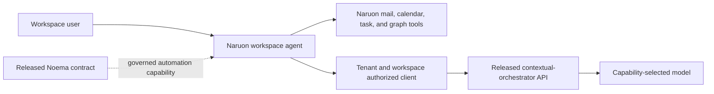

# Product and technical gap baseline

Snapshot: 2026-09-04. This file is a point-in-time planning record, not merge,
release, deployment, or commercial authority.

## Evidence boundary

- Naruon protected `develop`: `6cb9cc93a398e72c1c0daa564da7acbca65376fb`.
- Noema protected `main`: `e1ac9d50f6c646f04be8c137c8acdc7200182fcd`.
- Candidate heads are mutable and lose review/check evidence whenever changed.

## Current gap

| Gap | Customer impact | Protected state | Candidate evidence | Acceptance criterion | Next owner action |
| --- | --- | --- | --- | --- | --- |
| GAP-001 Noema consumer boundary | Workspace assistance can bypass governed model routing or depend on unreleased code, making behavior and supportability unpredictable. | Naruon has workspace-agent code; Noema says routing belongs to `contextual-orchestrator`. No released shared Noema runtime is proven. | Naruon #1384 `0fd330137cdd19068fa8903dc70e1dc88f42cdc9` and #1486 `b32954dbf6066bc0d953887e8ca06820588f2c5f` are draft. Noema #536 `a14cbe020d81fb7276ea4216f56d3f41c762c622` is draft. Naruon #1527 `23680b13b443bb4eb7659b9a75073ecc1b67e133` has an unrelated-history base and contradictory decisions. | A released orchestrator contract is tenant/workspace-authorized; direct-provider fallback fails closed; Naruon domain tools remain Naruon-owned; any shared package is immutable and contract-tested; current-head checks and independent review pass. | Repair the routing lane in #1384, reconcile #1486 without copying routing ownership, and consume Noema output only after an owner release. |

## Decision and flow

The normative proposal is [ADR-0001](adr/0001-noema-consumer-boundary.md).

## Verification plan

1. Add an architecture regression that rejects direct provider construction in
   the Naruon workspace-agent path.
2. Exercise the released orchestrator request and failure path with tenant and
   workspace authorization in focused tests and a real integration smoke test.
3. Verify any Noema package/API against an immutable release, not an open PR.
4. Re-fetch each candidate head, reviews, required checks, and merge base before
   making readiness or protected-merge claims.
