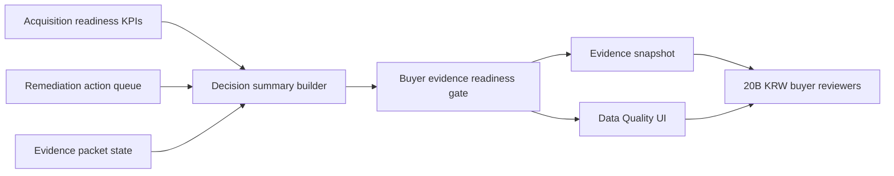

# Acquisition Diligence Decision Summary Implementation Plan

> **For agentic workers:** REQUIRED SUB-SKILL: Use superpowers:subagent-driven-development (recommended) or superpowers:executing-plans to implement this plan task-by-task. Steps use checkbox (`- [ ]`) syntax for tracking.

**Goal:** Compress the Phase 17 remediation queue and Phase 18 KPI scorecard into a buyer-facing acquisition diligence decision summary for the Data Quality surface and redacted evidence snapshot.

**Architecture:** Reuse the existing `acquisition_readiness_gate` as the boundary. Add one deterministic decision-summary model derived only from existing KPI rows, remediation actions, `evidence_packet_ready`, and `snapshot_verification_ready`, then render that safe summary in the current Data Quality buyer-evidence card.

**Tech Stack:** FastAPI, Pydantic, existing Data API quality checks, React/TypeScript, Vitest, pytest, ruff, FigJam.

## Global Constraints

- Preserve unrelated `.Jules/*` worktree changes by staging only Phase 19 files.
- Do not add dependencies, migrations, submodules, package splits, raw-content export, LLM calls, provider writes, browser-stored bearer tokens, public identity headers, or Figma Code Connect.
- The decision summary must expose only derived safe values: recommendation code, risk level, target-gap count, remediation action counts by priority, buyer-facing headline, next step, and provider-write boundary.
- The decision summary must not expose raw sender emails, message IDs, thread IDs, attachment bytes, database IDs, provider credentials, DB evidence-source column strings, source paths, provider names, or unredacted content.
- Review process and queued/pending CI are not blockers; failed CI is actionable.
- No separate library or submodule is introduced in this phase because the logic is still coupled to local acquisition-readiness gate fields.

---

### Task 1: Backend Contract Tests

**Files:**
- Modify: `backend/tests/test_data_api.py`

**Interfaces:**
- Expects `DataAcquisitionReadinessGate.decision_summary`
- Expects `DataAcquisitionDecisionSummary`

- [x] **Step 1: Add expected decision-summary helper**

Add `_expected_acquisition_decision_summary()` near `_expected_acquisition_readiness_kpis()`:

```python
def _expected_acquisition_decision_summary():
    return {
        "summary_key": "buyer_diligence_decision",
        "recommendation_code": "remediate_before_close",
        "risk_level": "high",
        "target_gap_count": 9,
        "critical_action_count": 2,
        "high_action_count": 6,
        "medium_action_count": 1,
        "headline_text": "Remediate acquisition evidence gaps before close.",
        "next_step_text": (
            "Resolve critical and high remediation actions, then regenerate the "
            "diligence evidence snapshot."
        ),
        "provider_write_executed": False,
    }
```

- [x] **Step 2: Extend quality-surface gate assertion**

In `test_data_quality_surface_returns_source_backed_counts_without_secrets`, add:

```python
"decision_summary": _expected_acquisition_decision_summary(),
```

inside `data["acquisition_readiness_gate"]`.

- [x] **Step 3: Extend snapshot assertion**

In `test_data_quality_evidence_snapshot_returns_shareable_redacted_surface`, add the same `decision_summary` field to the expected snapshot gate and assert:

```python
summary = snapshot["acquisition_readiness_gate"]["decision_summary"]
assert summary["recommendation_code"] == "remediate_before_close"
assert summary["risk_level"] == "high"
assert summary["target_gap_count"] == 9
assert summary["provider_write_executed"] is False
```

- [x] **Step 4: Run focused backend tests to verify failure**

Run:

```bash
cd backend
python -m pytest -q tests/test_data_api.py::test_data_quality_surface_returns_source_backed_counts_without_secrets tests/test_data_api.py::test_data_quality_evidence_snapshot_returns_shareable_redacted_surface
```

Expected: FAIL because `decision_summary` is not implemented yet.

### Task 2: Backend Implementation

**Files:**
- Modify: `backend/api/data.py`

**Interfaces:**
- Produces `DataAcquisitionDecisionSummary`
- Produces `_acquisition_decision_summary(...) -> DataAcquisitionDecisionSummary`

- [x] **Step 1: Add literal types and model**

Add:

```python
DiligenceRecommendation = Literal[
    "ready_for_diligence",
    "remediate_before_close",
    "insufficient_evidence",
]
DiligenceRiskLevel = Literal["low", "medium", "high"]
```

Add:

```python
class DataAcquisitionDecisionSummary(BaseModel):
    summary_key: str
    recommendation_code: DiligenceRecommendation
    risk_level: DiligenceRiskLevel
    target_gap_count: int
    critical_action_count: int
    high_action_count: int
    medium_action_count: int
    headline_text: str
    next_step_text: str
    provider_write_executed: bool
```

Add `decision_summary: DataAcquisitionDecisionSummary` to `DataAcquisitionReadinessGate`.

- [x] **Step 2: Add deterministic summary builder**

Implement:

```python
def _acquisition_decision_summary(
    *,
    kpis: list[DataAcquisitionReadinessKpi],
    remediation_actions: list[DataAcquisitionRemediationAction],
    evidence_packet_ready: bool,
    snapshot_verification_ready: bool,
) -> DataAcquisitionDecisionSummary:
    target_gap_count = sum(1 for kpi in kpis if not kpi.target_met)
    critical_action_count = sum(
        1 for action in remediation_actions if action.priority_code == "critical"
    )
    high_action_count = sum(
        1 for action in remediation_actions if action.priority_code == "high"
    )
    medium_action_count = sum(
        1 for action in remediation_actions if action.priority_code == "medium"
    )
    if not evidence_packet_ready or not snapshot_verification_ready:
        recommendation_code: DiligenceRecommendation = "insufficient_evidence"
        risk_level: DiligenceRiskLevel = "high"
        headline_text = "Evidence is insufficient for buyer diligence."
        next_step_text = (
            "Generate the evidence packet and snapshot verification before sharing "
            "diligence materials."
        )
    elif critical_action_count > 0 or target_gap_count > 0:
        recommendation_code = "remediate_before_close"
        risk_level = "high" if critical_action_count > 0 else "medium"
        headline_text = "Remediate acquisition evidence gaps before close."
        next_step_text = (
            "Resolve critical and high remediation actions, then regenerate the "
            "diligence evidence snapshot."
        )
    else:
        recommendation_code = "ready_for_diligence"
        risk_level = "low"
        headline_text = "Evidence is ready for buyer diligence review."
        next_step_text = (
            "Share the verified evidence snapshot with buyer diligence reviewers."
        )
    return DataAcquisitionDecisionSummary(
        summary_key="buyer_diligence_decision",
        recommendation_code=recommendation_code,
        risk_level=risk_level,
        target_gap_count=target_gap_count,
        critical_action_count=critical_action_count,
        high_action_count=high_action_count,
        medium_action_count=medium_action_count,
        headline_text=headline_text,
        next_step_text=next_step_text,
        provider_write_executed=False,
    )
```

- [x] **Step 3: Wire the gate without recomputing inputs**

In `_acquisition_readiness_gate`, compute `kpis` and `remediation_actions` once, then pass `decision_summary=_acquisition_decision_summary(...)` into `DataAcquisitionReadinessGate`.

- [x] **Step 4: Run focused backend validation**

Run:

```bash
cd backend
python -m pytest -q tests/test_data_api.py::test_data_quality_surface_returns_source_backed_counts_without_secrets tests/test_data_api.py::test_data_quality_evidence_snapshot_returns_shareable_redacted_surface
python -m ruff check api/data.py tests/test_data_api.py
```

Expected: PASS.

### Task 3: Frontend Contract and Rendering

**Files:**
- Modify: `frontend/src/components/data-layout/types.ts`
- Modify: `frontend/src/components/data-layout/QualityCheckTab.tsx`
- Modify: `frontend/src/app/data/page.test.tsx`

**Interfaces:**
- Consumes `AcquisitionReadinessGate.decision_summary`
- Produces visible `Acquisition decision summary` UI block

- [x] **Step 1: Add TypeScript types and fixtures**

Add `AcquisitionDecisionSummary` with the same fields as the backend model, add `decision_summary` to `AcquisitionReadinessGate`, and add the same expected fixture object to both `dataQualitySurface.acquisition_readiness_gate` and `dataEvidenceSnapshot.acquisition_readiness_gate`.

- [x] **Step 2: Render the decision summary in the buyer evidence card**

In `QualityCheckTab.tsx`, render a bordered block after the top readiness `<dl>` and before blocking check keys:

```tsx
<div className="border-t border-border p-5">
  <p className="text-xs font-black text-muted-foreground">Acquisition decision summary</p>
  <div className="mt-3 rounded-xl border border-border bg-background p-4">
    <div className="flex flex-col gap-3 sm:flex-row sm:items-start sm:justify-between">
      <div className="min-w-0">
        <h3 className="text-sm font-black">{toSafeReactText(acquisitionReadinessGate.decision_summary.headline_text)}</h3>
        <p className="mt-1 text-sm leading-6 text-muted-foreground">{toSafeReactText(acquisitionReadinessGate.decision_summary.next_step_text)}</p>
      </div>
      <span className="w-fit shrink-0 rounded-full bg-secondary px-2 py-1 text-xs font-bold text-secondary-foreground">
        {toSafeReactText(acquisitionReadinessGate.decision_summary.recommendation_code)} · {toSafeReactText(acquisitionReadinessGate.decision_summary.risk_level)}
      </span>
    </div>
  </div>
</div>
```

Include counts for target gaps, critical/high/medium actions, and provider-write boundary in a nested `<dl>`.

- [x] **Step 3: Extend frontend tests**

In `frontend/src/app/data/page.test.tsx`, assert that the rendered page includes:

```ts
expect(container.textContent).toContain("Acquisition decision summary");
expect(container.textContent).toContain("Remediate acquisition evidence gaps before close.");
expect(container.textContent).toContain("remediate_before_close");
expect(container.textContent).toContain("Resolve critical and high remediation actions");
```

After copying the evidence snapshot, assert:

```ts
expect(copiedSnapshot.acquisition_readiness_gate.decision_summary.recommendation_code).toBe("remediate_before_close");
expect(copiedSnapshot.acquisition_readiness_gate.decision_summary.target_gap_count).toBe(9);
```

- [x] **Step 4: Run frontend validation**

Run:

```bash
cd frontend
npx vitest run src/app/data/page.test.tsx
```

Expected: PASS.

### Task 4: FigJam Evidence, Final Validation, and PR Update

**Files:**
- Modify: `docs/superpowers/plans/2026-07-02-acquisition-diligence-decision-summary.md`
- Produce screenshot evidence under `work/figjam-phase19-acquisition-diligence-decision-summary.png`

**Interfaces:**
- Produces FigJam group named `Phase 19 Acquisition Diligence Decision Summary Group`
- Updates PR #895 body with Phase 19 evidence

- [x] **Step 1: Generate the FigJam diagram**

Use the Figma plugin, not Figma Code Connect. Generate a FigJam diagram named `Phase 19 Acquisition Diligence Decision Summary` showing:



- [x] **Step 2: Capture screenshot evidence**

Save a screenshot to:

```text
/Users/seonghobae/Documents/Codex/2026-07-02/https-github-com-contextualwisdomlab-noema-figma-2/work/figjam-phase19-acquisition-diligence-decision-summary.png
```

- [x] **Step 3: Run final validation**

Run:

```bash
cd backend
python -m pytest -q tests/test_data_api.py::test_data_quality_surface_returns_source_backed_counts_without_secrets tests/test_data_api.py::test_data_quality_evidence_snapshot_returns_shareable_redacted_surface tests/test_data_api.py::test_member_data_quality_queries_are_owner_scoped
python -m ruff check api/data.py tests/test_data_api.py
cd ../frontend
npx vitest run src/app/data/page.test.tsx
cd ..
git diff --check
```

Expected: PASS.

- [x] **Step 4: Mark this plan complete and commit**

Change every checkbox in this plan to `[x]`, add a short completion evidence section, then commit:

```bash
git add backend/api/data.py backend/tests/test_data_api.py frontend/src/components/data-layout/types.ts frontend/src/components/data-layout/QualityCheckTab.tsx frontend/src/app/data/page.test.tsx docs/superpowers/plans/2026-07-02-acquisition-diligence-decision-summary.md
git commit -m "feat: add acquisition diligence decision summary"
git commit -m "docs: mark phase 19 plan complete"
```

- [x] **Step 5: Push and update PR #895**

Run:

```bash
git push origin HEAD:plan/email-dom-paragraph-kg-2026-07-02
gh pr edit 895 --repo ContextualWisdomLab/naruon --body-file /tmp/naruon-pr-895-body.md
gh pr view 895 --repo ContextualWisdomLab/naruon --json url,headRefOid,mergeable,mergeStateStatus,statusCheckRollup,reviewDecision
```

Expected: branch pushed, PR body includes Phase 19 validation and screenshot evidence, unresolved review threads remain zero unless a new reviewer comment appears.

## Completion Evidence

- Backend contract added `decision_summary` to `acquisition_readiness_gate` for both `/api/data/quality-surface` and `/api/data/quality-surface/evidence-snapshot`.
- Frontend Data Quality UI renders `Acquisition decision summary` with recommendation, risk, target-gap count, action counts, summary key, next step, and write boundary.
- FigJam evidence: `Phase 19 Acquisition Diligence Decision Summary Group` (`45:828`) in `zXkcwT2E2aBtNhMVznLT4l`.
- Screenshot evidence: `/Users/seonghobae/Documents/Codex/2026-07-02/https-github-com-contextualwisdomlab-noema-figma-2/work/figjam-phase19-acquisition-diligence-decision-summary.png`.
- Validation passed:
  - `python -m pytest -q tests/test_data_api.py::test_data_quality_surface_returns_source_backed_counts_without_secrets tests/test_data_api.py::test_data_quality_evidence_snapshot_returns_shareable_redacted_surface tests/test_data_api.py::test_member_data_quality_queries_are_owner_scoped`
  - `python -m ruff check api/data.py tests/test_data_api.py`
  - `npx vitest run src/app/data/page.test.tsx`
  - `git diff --check`
