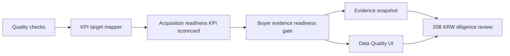

# Acquisition Readiness KPI Scorecard Implementation Plan

> **For agentic workers:** REQUIRED SUB-SKILL: Use superpowers:subagent-driven-development (recommended) or superpowers:executing-plans to implement this plan task-by-task. Steps use checkbox (`- [ ]`) syntax for tracking.

**Goal:** Add a buyer-facing acquisition readiness KPI scorecard that shows current quality coverage against 100% diligence targets for email DOM/paragraph, attachment parsing, KG, semantic evidence, source, and connector readiness.

**Architecture:** Reuse the existing `DataQualityCheck` list as the only source of truth. Derive deterministic KPI rows in `backend/api/data.py`, nest them under `acquisition_readiness_gate`, and render the same safe rows in the Data Quality UI and evidence snapshot. Keep the implementation inside the existing Data API/UI contract because the KPI rows are still coupled to local quality-check keys.

**Tech Stack:** FastAPI, Pydantic, existing Data API quality checks, React/TypeScript, Vitest, pytest, ruff, FigJam.

## Global Constraints

- Preserve unrelated `.Jules/*` worktree changes by staging only Phase 18 files.
- Do not add dependencies, migrations, submodules, package splits, raw-content export, LLM calls, provider writes, browser-stored bearer tokens, public identity headers, or Figma Code Connect.
- KPI rows must expose only safe keys, display names, owner areas, target/current percentages, status, generic guardrail copy, and provider-write boundary.
- KPI rows must not expose raw sender emails, message IDs, thread IDs, attachment bytes, database IDs, provider credentials, DB evidence-source column strings, source paths, or provider names.
- Review process and queued/pending CI are not blockers; failed CI is actionable.

---

### Task 1: Backend Contract Tests

**Files:**
- Modify: `backend/tests/test_data_api.py`

**Interfaces:**
- Expects `DataAcquisitionReadinessGate.kpis`
- Expects `DataAcquisitionReadinessKpi`

- [x] **Step 1: Add expected KPI helper**

Add `_expected_acquisition_readiness_kpis()` near `_expected_acquisition_remediation_actions()`. The helper returns twelve rows sorted by `priority_rank`. Expected first row:

```python
{
    "kpi_key": "thread_id_integrity_target",
    "source_check_key": "thread_id_integrity",
    "display_name": "Thread id integrity target",
    "owner_area": "email_ingestion",
    "priority_rank": 1,
    "current_percent": 75,
    "target_percent": 100,
    "target_met": False,
    "status_code": "needs_attention",
    "guardrail_text": "Thread provenance must reach target before acquisition close.",
    "provider_write_executed": False,
}
```

Expected final row:

```python
{
    "kpi_key": "semantic_kg_readiness_target",
    "source_check_key": "semantic_kg_readiness",
    "display_name": "Semantic KG evidence target",
    "owner_area": "semantic_kg",
    "priority_rank": 12,
    "current_percent": 100,
    "target_percent": 100,
    "target_met": True,
    "status_code": "pass",
    "guardrail_text": "Semantic KG evidence must remain provenance-approved.",
    "provider_write_executed": False,
}
```

Include rows for these check keys and current percentages:

```python
[
    ("thread_id_integrity", 75),
    ("dedupe_fingerprint", 50),
    ("attachment_content", 67),
    ("content_graph_coverage", 75),
    ("knowledge_graph_coverage", 50),
    ("content_segment_text_readiness", 88),
    ("knowledge_graph_evidence_endpoint_readiness", 80),
    ("semantic_relation_source_backing", 67),
    ("attachment_parse_coverage", 67),
    ("source_registry", 100),
    ("connector_signal", 100),
    ("semantic_kg_readiness", 100),
]
```

- [x] **Step 2: Extend quality-surface gate assertion**

In `test_data_quality_surface_returns_source_backed_counts_without_secrets`, add:

```python
"kpis": _expected_acquisition_readiness_kpis(),
```

inside `data["acquisition_readiness_gate"]`.

- [x] **Step 3: Extend snapshot assertion**

In `test_data_quality_evidence_snapshot_returns_shareable_redacted_surface`, add the same `kpis` field to the expected snapshot gate and assert:

```python
kpis = snapshot["acquisition_readiness_gate"]["kpis"]
assert len(kpis) == 12
assert kpis[0]["kpi_key"] == "thread_id_integrity_target"
assert kpis[0]["current_percent"] == 75
assert kpis[-1]["target_met"] is True
```

- [x] **Step 4: Run focused backend tests to verify failure**

Run:

```bash
cd backend
python -m pytest -q tests/test_data_api.py::test_data_quality_surface_returns_source_backed_counts_without_secrets tests/test_data_api.py::test_data_quality_evidence_snapshot_returns_shareable_redacted_surface
```

Expected: FAIL because `kpis` is not implemented yet.

### Task 2: Backend Implementation

**Files:**
- Modify: `backend/api/data.py`

**Interfaces:**
- Produces `DataAcquisitionReadinessKpi`
- Produces `_acquisition_readiness_kpis(quality_checks: list[DataQualityCheck]) -> list[DataAcquisitionReadinessKpi]`

- [x] **Step 1: Add KPI type**

Add:

```python
class DataAcquisitionReadinessKpi(BaseModel):
    kpi_key: str
    source_check_key: str
    display_name: str
    owner_area: str
    priority_rank: int
    current_percent: int
    target_percent: int
    target_met: bool
    status_code: QualityStatus
    guardrail_text: str
    provider_write_executed: bool
```

Add `kpis: list[DataAcquisitionReadinessKpi]` to `DataAcquisitionReadinessGate`.

- [x] **Step 2: Add deterministic KPI target mapping**

Add `_ACQUISITION_KPI_TARGETS_BY_CHECK_KEY` keyed by quality check. Every target uses `target_percent=100`. Include the same twelve check keys listed in Task 1, with owner area, priority rank, display name, and generic guardrail text.

- [x] **Step 3: Add completion helper**

Implement:

```python
def _quality_check_completion_percent(check: DataQualityCheck) -> int:
    if check.total_count <= 0:
        return 0
    passed_count = max(check.total_count - check.issue_count, 0)
    return round((passed_count / check.total_count) * 100)
```

- [x] **Step 4: Add KPI builder**

Implement:

```python
def _acquisition_readiness_kpis(
    quality_checks: list[DataQualityCheck],
) -> list[DataAcquisitionReadinessKpi]:
    kpis: list[DataAcquisitionReadinessKpi] = []
    for check in quality_checks:
        target = _ACQUISITION_KPI_TARGETS_BY_CHECK_KEY.get(check.check_key)
        if target is None:
            continue
        current_percent = _quality_check_completion_percent(check)
        target_percent = target["target_percent"]
        kpis.append(
            DataAcquisitionReadinessKpi(
                source_check_key=check.check_key,
                current_percent=current_percent,
                target_met=check.status_code == "pass"
                and current_percent >= target_percent,
                status_code=check.status_code,
                provider_write_executed=False,
                **target,
            )
        )
    return sorted(kpis, key=lambda kpi: kpi.priority_rank)
```

- [x] **Step 5: Wire gate helper and run backend validation**

In `_acquisition_readiness_gate`, add:

```python
kpis=_acquisition_readiness_kpis(quality_checks),
```

Run:

```bash
cd backend
python -m pytest -q tests/test_data_api.py::test_data_quality_surface_returns_source_backed_counts_without_secrets tests/test_data_api.py::test_data_quality_evidence_snapshot_returns_shareable_redacted_surface
python -m ruff check api/data.py tests/test_data_api.py
```

Expected: PASS.

### Task 3: Frontend Rendering and Snapshot Copy

**Files:**
- Modify: `frontend/src/components/data-layout/types.ts`
- Modify: `frontend/src/components/data-layout/QualityCheckTab.tsx`
- Modify: `frontend/src/app/data/page.test.tsx`

**Interfaces:**
- Consumes `acquisition_readiness_gate.kpis`

- [x] **Step 1: Add TypeScript type fields and fixtures**

Add `AcquisitionReadinessKpi` and include `kpis` in `AcquisitionReadinessGate`.

Update the `dataQualitySurface` and `dataEvidenceSnapshot` fixtures with the twelve KPI rows. Include first and final rows exactly as in Task 1.

- [x] **Step 2: Render KPI scorecard**

Inside the Buyer evidence readiness card, above remediation actions, render:

- heading: `Acquisition KPI targets`
- each KPI display name
- current percent and target percent
- owner area
- status
- guardrail text
- provider write boundary

- [x] **Step 3: Add UI and clipboard assertions**

In `renders API-backed pipeline embedding and quality tabs`, assert:

```ts
expect(container.textContent).toContain("Acquisition KPI targets");
expect(container.textContent).toContain("Thread id integrity target");
expect(container.textContent).toContain("75% / 100%");
expect(container.textContent).toContain("Semantic KG evidence target");
expect(container.textContent).toContain("Semantic KG evidence must remain provenance-approved");
```

After copying the snapshot, assert:

```ts
expect(copiedSnapshot.acquisition_readiness_gate.kpis).toHaveLength(12);
expect(copiedSnapshot.acquisition_readiness_gate.kpis[0].kpi_key).toBe("thread_id_integrity_target");
```

- [x] **Step 4: Run frontend validation**

Run:

```bash
cd frontend
npx vitest run src/app/data/page.test.tsx
```

Expected: PASS.

### Task 4: FigJam Evidence and PR Completion

**Files:**
- Update: `docs/superpowers/plans/2026-07-02-acquisition-readiness-kpi-scorecard.md`

**Interfaces:**
- Produces a Phase 18 FigJam diagram, screenshot evidence, commits, and PR update

- [x] **Step 1: Generate FigJam diagram**

Use Figma/FigJam, not Figma Code Connect, to add this flow to board `zXkcwT2E2aBtNhMVznLT4l`:



Expected local screenshot path:

```text
/Users/seonghobae/Documents/Codex/2026-07-02/https-github-com-contextualwisdomlab-noema-figma-2/work/figjam-phase18-acquisition-readiness-kpi-scorecard.png
```

- [x] **Step 2: Run final validation**

Run:

```bash
cd backend
python -m pytest -q tests/test_data_api.py::test_data_quality_surface_returns_source_backed_counts_without_secrets tests/test_data_api.py::test_data_quality_evidence_snapshot_returns_shareable_redacted_surface tests/test_data_api.py::test_member_data_quality_queries_are_owner_scoped
python -m ruff check api/data.py tests/test_data_api.py
cd ../frontend
npx vitest run src/app/data/page.test.tsx
cd ..
git diff --check
```

Expected: PASS.

- [x] **Step 3: Mark this plan complete**

Replace implementation task checkboxes with `[x]` and add completion evidence.

- [x] **Step 4: Commit and push**

Use separate commits:

```bash
git add docs/superpowers/plans/2026-07-02-acquisition-readiness-kpi-scorecard.md
git commit -m "docs: plan acquisition readiness kpis"
git add backend/api/data.py backend/tests/test_data_api.py frontend/src/components/data-layout/types.ts frontend/src/components/data-layout/QualityCheckTab.tsx frontend/src/app/data/page.test.tsx
git commit -m "feat: add acquisition readiness kpi scorecard"
git add docs/superpowers/plans/2026-07-02-acquisition-readiness-kpi-scorecard.md
git commit -m "docs: mark phase 18 plan complete"
git push origin HEAD:plan/email-dom-paragraph-kg-2026-07-02
```

Expected: PR #895 head updates, unrelated `.Jules/*` files remain unstaged.

## Completion Evidence

- Backend contract and implementation added deterministic `acquisition_readiness_gate.kpis` to `/api/data/quality-surface` and `/api/data/quality-surface/evidence-snapshot`.
- KPI rows are derived only from existing `DataQualityCheck.issue_count` and `DataQualityCheck.total_count`; no new query, migration, dependency, package, or submodule was added.
- Frontend Data Quality UI renders `Acquisition KPI targets` with current/target percent, owner area, status, guardrail copy, source check key, and provider-write boundary.
- FigJam board: `https://www.figma.com/board/zXkcwT2E2aBtNhMVznLT4l`
- FigJam group: `43:788` (`Phase 18 Acquisition Readiness KPI Scorecard Group`)
- Screenshot evidence: `/Users/seonghobae/Documents/Codex/2026-07-02/https-github-com-contextualwisdomlab-noema-figma-2/work/figjam-phase18-acquisition-readiness-kpi-scorecard.png`
- Validation: backend focused tests plus owner-scope test `3 passed`; ruff passed; frontend Vitest `12 passed`; `git diff --check` passed.
- Library/submodule decision: no split. The KPI scorecard is a thin deterministic projection over the existing quality-check contract and should stay in the Data API until a reusable parser/runtime boundary exists.
- Safety boundary: no Figma Code Connect, raw email content export, attachment bytes, provider write, LLM call, source-path leak, credential exposure, or public identity header added.
