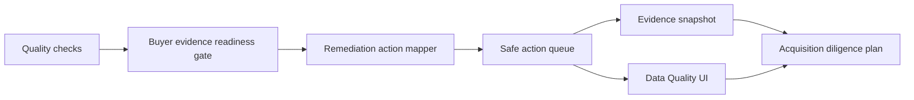

# Acquisition Remediation Actions Implementation Plan

> **For agentic workers:** REQUIRED SUB-SKILL: Use superpowers:subagent-driven-development (recommended) or superpowers:executing-plans to implement this plan task-by-task. Steps use checkbox (`- [ ]`) syntax for tracking.

**Goal:** Turn buyer evidence readiness blockers into safe remediation actions so the 20B KRW diligence packet shows what must be fixed next, not only the current score.

**Architecture:** Reuse the existing `DataQualityCheck` list as the source of truth and derive deterministic remediation actions in `backend/api/data.py`. Nest those safe actions under `acquisition_readiness_gate` so both the quality surface and tamper-evident evidence snapshot carry the same buyer-facing action plan. Render the actions in the existing Data Quality tab without raw corpus details, provider IDs, evidence-source column strings, or provider writes.

**Tech Stack:** FastAPI, Pydantic, existing Data API quality checks, React/TypeScript, Vitest, pytest, ruff, FigJam.

## Global Constraints

- Preserve unrelated `.Jules/*` worktree changes by staging only Phase 17 files.
- Do not add dependencies, migrations, submodules, package splits, raw-content export, LLM calls, provider writes, browser-stored bearer tokens, public identity headers, or Figma Code Connect.
- Remediation actions expose only safe action keys, check keys, priority, owner area, and generic next-step copy; they must not expose raw email addresses, message IDs, thread IDs, attachment bytes, database IDs, provider credentials, or evidence-source column strings.
- Review process and queued/pending CI are not blockers; failed CI is actionable.

---

### Task 1: Backend Contract Tests

**Files:**
- Modify: `backend/tests/test_data_api.py`

**Interfaces:**
- Expects `DataAcquisitionReadinessGate.remediation_actions`
- Expects `DataAcquisitionRemediationAction`

- [x] **Step 1: Extend quality-surface gate assertions**

In `test_data_quality_surface_returns_source_backed_counts_without_secrets`, add these fields to the expected `acquisition_readiness_gate`:

```python
"remediation_actions": [
    {
        "action_key": "repair_thread_id_integrity",
        "blocking_check_key": "thread_id_integrity",
        "display_name": "Canonical thread repair",
        "owner_area": "email_ingestion",
        "priority_rank": 1,
        "priority_code": "critical",
        "impact_text": "Thread provenance must be stable before buyer review.",
        "recommended_next_step": (
            "Run canonical threading repair for affected scoped emails."
        ),
        "provider_write_executed": False,
    },
    ...
]
```

Assert `len(data["acquisition_readiness_gate"]["remediation_actions"]) == 9` and assert the final action is:

```python
assert data["acquisition_readiness_gate"]["remediation_actions"][-1] == {
    "action_key": "expand_attachment_parse_coverage",
    "blocking_check_key": "attachment_parse_coverage",
    "display_name": "Attachment parser coverage",
    "owner_area": "attachment_parsing",
    "priority_rank": 9,
    "priority_code": "medium",
    "impact_text": "Unsupported attachments leave buyer-visible corpus gaps.",
    "recommended_next_step": (
        "Add parser coverage or metadata-only exception evidence for unsupported "
        "attachment types."
    ),
    "provider_write_executed": False,
}
```

- [x] **Step 2: Extend snapshot assertions**

In `test_data_quality_evidence_snapshot_returns_shareable_redacted_surface`, assert:

```python
actions = snapshot["acquisition_readiness_gate"]["remediation_actions"]
assert len(actions) == 9
assert actions[0]["action_key"] == "repair_thread_id_integrity"
assert actions[0]["provider_write_executed"] is False
assert actions[-1]["action_key"] == "expand_attachment_parse_coverage"
```

Keep the existing forbidden-string assertions so raw source values remain blocked.

- [x] **Step 3: Run focused backend tests to verify failure**

Run:

```bash
cd backend
python -m pytest -q tests/test_data_api.py::test_data_quality_surface_returns_source_backed_counts_without_secrets tests/test_data_api.py::test_data_quality_evidence_snapshot_returns_shareable_redacted_surface
```

Expected: FAIL because `remediation_actions` is not implemented yet.

### Task 2: Backend Implementation

**Files:**
- Modify: `backend/api/data.py`

**Interfaces:**
- Produces `DataAcquisitionRemediationAction`
- Produces `_acquisition_remediation_actions(quality_checks: list[DataQualityCheck]) -> list[DataAcquisitionRemediationAction]`

- [x] **Step 1: Add action types**

Add:

```python
RemediationPriority = Literal["critical", "high", "medium"]


class DataAcquisitionRemediationAction(BaseModel):
    action_key: str
    blocking_check_key: str
    display_name: str
    owner_area: str
    priority_rank: int
    priority_code: RemediationPriority
    impact_text: str
    recommended_next_step: str
    provider_write_executed: bool
```

Add `remediation_actions: list[DataAcquisitionRemediationAction]` to `DataAcquisitionReadinessGate`.

- [x] **Step 2: Add deterministic remediation mapping**

Implement a static map keyed by `check_key`. Include mappings for:

- `thread_id_integrity`
- `dedupe_fingerprint`
- `attachment_content`
- `content_graph_coverage`
- `knowledge_graph_coverage`
- `content_segment_text_readiness`
- `knowledge_graph_evidence_endpoint_readiness`
- `semantic_relation_source_backing`
- `attachment_parse_coverage`
- `source_registry`
- `connector_signal`
- `semantic_kg_readiness`

Use only generic, safe copy. Do not include counts, record IDs, evidence-source columns, provider names, raw addresses, or source paths.

- [x] **Step 3: Wire gate helper**

In `_acquisition_readiness_gate`, compute:

```python
remediation_actions = _acquisition_remediation_actions(quality_checks)
```

Return the list inside `DataAcquisitionReadinessGate`.

- [x] **Step 4: Run backend validation**

Run:

```bash
cd backend
python -m pytest -q tests/test_data_api.py::test_data_quality_surface_returns_source_backed_counts_without_secrets tests/test_data_api.py::test_data_quality_evidence_snapshot_returns_shareable_redacted_surface
python -m ruff check api/data.py tests/test_data_api.py
```

Expected: PASS.

### Task 3: Frontend Rendering and Snapshot Copy

**Files:**
- Modify: `frontend/src/components/data-layout/types.ts`
- Modify: `frontend/src/components/data-layout/QualityCheckTab.tsx`
- Modify: `frontend/src/app/data/page.test.tsx`

**Interfaces:**
- Consumes `acquisition_readiness_gate.remediation_actions`

- [x] **Step 1: Add TypeScript type fields and fixtures**

Add `AcquisitionRemediationAction` and include `remediation_actions` in `AcquisitionReadinessGate`.

Update the `dataQualitySurface` and `dataEvidenceSnapshot` fixtures with the nine safe remediation actions.

- [x] **Step 2: Render remediation actions**

Inside the Buyer evidence readiness card, below blocking check keys, render:

- heading: `Remediation actions`
- each action display name
- owner area
- priority code and rank
- recommended next step
- provider write boundary

- [x] **Step 3: Add UI and clipboard assertions**

In `renders API-backed pipeline embedding and quality tabs`, assert:

```ts
expect(container.textContent).toContain("Remediation actions");
expect(container.textContent).toContain("Canonical thread repair");
expect(container.textContent).toContain("email_ingestion");
expect(container.textContent).toContain("Run canonical threading repair");
expect(container.textContent).toContain("Attachment parser coverage");
```

After copying the snapshot, assert:

```ts
expect(copiedSnapshot.acquisition_readiness_gate.remediation_actions).toHaveLength(9);
expect(copiedSnapshot.acquisition_readiness_gate.remediation_actions[0].action_key).toBe("repair_thread_id_integrity");
```

- [x] **Step 4: Run frontend validation**

Run:

```bash
cd frontend
npx vitest run src/app/data/page.test.tsx
```

Expected: PASS.

### Task 4: FigJam Evidence and PR Completion

**Files:**
- Update: `docs/superpowers/plans/2026-07-02-acquisition-remediation-actions.md`

**Interfaces:**
- Produces a Phase 17 FigJam diagram, screenshot evidence, commits, and PR update

- [x] **Step 1: Generate FigJam diagram**

Use Figma/FigJam, not Figma Code Connect, to add this flow to board `zXkcwT2E2aBtNhMVznLT4l`:



Expected local screenshot path:

```text
/Users/seonghobae/Documents/Codex/2026-07-02/https-github-com-contextualwisdomlab-noema-figma-2/work/figjam-phase17-acquisition-remediation-actions.png
```

- [x] **Step 2: Run final validation**

Run:

```bash
cd backend
python -m pytest -q tests/test_data_api.py::test_data_quality_surface_returns_source_backed_counts_without_secrets tests/test_data_api.py::test_data_quality_evidence_snapshot_returns_shareable_redacted_surface tests/test_data_api.py::test_member_data_quality_queries_are_owner_scoped
python -m ruff check api/data.py tests/test_data_api.py
cd ../frontend
npx vitest run src/app/data/page.test.tsx
cd ..
git diff --check
```

Expected: PASS.

- [x] **Step 3: Mark this plan complete**

Replace implementation task checkboxes with `[x]` and add completion evidence.

- [x] **Step 4: Commit and push**

Use separate commits:

```bash
git add docs/superpowers/plans/2026-07-02-acquisition-remediation-actions.md
git commit -m "docs: plan acquisition remediation actions"
git add backend/api/data.py backend/tests/test_data_api.py frontend/src/components/data-layout/types.ts frontend/src/components/data-layout/QualityCheckTab.tsx frontend/src/app/data/page.test.tsx
git commit -m "feat: add acquisition remediation actions"
git add docs/superpowers/plans/2026-07-02-acquisition-remediation-actions.md
git commit -m "docs: mark phase 17 plan complete"
git push origin HEAD:plan/email-dom-paragraph-kg-2026-07-02
```

Expected: PR #895 head updates, unrelated `.Jules/*` files remain unstaged.

## Completion Evidence

- Backend contract and implementation added deterministic, safe `remediation_actions` to `acquisition_readiness_gate` for both `/api/data/quality-surface` and `/api/data/quality-evidence-snapshot`.
- Frontend Data Quality UI now renders a buyer-facing remediation action queue and includes it in copied evidence snapshots.
- FigJam board: `https://www.figma.com/board/zXkcwT2E2aBtNhMVznLT4l`
- FigJam group: `41:753` (`Phase 17 Acquisition Remediation Actions Group`)
- Screenshot evidence: `/Users/seonghobae/Documents/Codex/2026-07-02/https-github-com-contextualwisdomlab-noema-figma-2/work/figjam-phase17-acquisition-remediation-actions.png`
- Library/submodule decision: no new library, submodule, dependency, or migration in Phase 17. The remediation mapper is deterministic and still tightly coupled to the existing Data API quality-check contract; extraction becomes appropriate only after the parser/quality action contract is reused by another runtime boundary.
- Safety boundary: no Figma Code Connect, raw email content export, attachment bytes, provider write, LLM call, source-path leak, credential exposure, or public identity header added.
