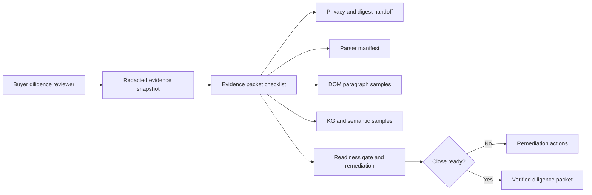

# Buyer Diligence Evidence Packet Checklist Implementation Plan

> **For agentic workers:** REQUIRED SUB-SKILL: Use superpowers:subagent-driven-development (recommended) or superpowers:executing-plans to implement this plan task-by-task. Steps use checkbox (`- [ ]`) syntax for tracking.

**Goal:** Add a buyer-facing evidence packet checklist to the redacted evidence snapshot so acquisition reviewers can see which email DOM, attachment parsing, paragraph, KG, semantic, privacy, and offline-verification artifacts are ready.

**Architecture:** Keep the contract inside the existing `DataEvidenceSnapshotResponse` instead of creating a new package, submodule, or dependency. The checklist is derived from already-redacted snapshot fields and readiness state, then rendered inside the existing `QualityCheckTab` evidence snapshot card.

**Tech Stack:** FastAPI, Pydantic, pytest, React, TypeScript, Vitest, existing DataLayout styles.

## Global Constraints

- Do not use Figma Code Connect.
- Do not introduce a new library or git submodule for this phase; the checklist is a narrow API/UI contract on existing evidence data.
- Do not expose raw email body, raw HTML, attachment bytes, stable provider IDs, database IDs, credentials, or database column evidence strings in the UI.
- Keep `provider_write_executed` false for checklist records; this is a read-only diligence surface.
- Preserve unrelated dirty files, especially `.Jules/palette.md` and `.Jules/sentinel.md`.
- Treat queued review/check workflow state as non-blocking. Failed local validation or failed live checks are actionable.

---

### Task 1: Backend Snapshot Checklist Contract

**Files:**
- Modify: `backend/api/data.py`
- Test: `backend/tests/test_data_api.py`

**Interfaces:**
- Produces: `DataEvidencePacketChecklistItem` Pydantic model with fields `checklist_key`, `display_name`, `state_code`, `source_field`, `required_artifact`, `detail_text`, `provider_write_executed`.
- Produces: `evidence_packet_checklist: list[DataEvidencePacketChecklistItem]` on `DataEvidenceSnapshotResponse`.
- Consumes: existing `DataQualitySurfaceResponse` and `DataEvidenceSnapshotResponse` fields.

- [ ] **Step 1: Write the expected backend checklist fixture**

Add `_expected_evidence_packet_checklist()` in `backend/tests/test_data_api.py` with these exact records:

```python
def _expected_evidence_packet_checklist():
    return [
        {
            "checklist_key": "privacy_redaction_policy",
            "display_name": "Privacy redaction policy",
            "state_code": "ready",
            "source_field": "privacy_redaction_policy",
            "required_artifact": "redacted_snapshot_policy",
            "detail_text": "Snapshot excludes raw content, stable identifiers, credentials, and database evidence strings.",
            "provider_write_executed": False,
        },
        {
            "checklist_key": "parser_manifest",
            "display_name": "Attachment parser manifest",
            "state_code": "ready",
            "source_field": "parser_manifest_summary",
            "required_artifact": "attachment_parser_registry",
            "detail_text": "Parser family, supported content types, extensions, and unsupported binary fallback are included.",
            "provider_write_executed": False,
        },
        {
            "checklist_key": "content_graph_topology",
            "display_name": "DOM paragraph topology",
            "state_code": "ready",
            "source_field": "content_graph_topology_counts",
            "required_artifact": "source_kind_segment_kind_counts",
            "detail_text": "Email body and attachment segments are summarized by source and paragraph or heading kind.",
            "provider_write_executed": False,
        },
        {
            "checklist_key": "content_graph_samples",
            "display_name": "Paragraph evidence samples",
            "state_code": "ready",
            "source_field": "content_graph_evidence_samples",
            "required_artifact": "redacted_segment_samples",
            "detail_text": "Redacted paragraph samples include source kind, segment kind, path, and word count.",
            "provider_write_executed": False,
        },
        {
            "checklist_key": "knowledge_graph_topology",
            "display_name": "Knowledge graph topology",
            "state_code": "ready",
            "source_field": "knowledge_graph_topology_counts",
            "required_artifact": "source_kind_edge_kind_counts",
            "detail_text": "Stored KG edges are summarized by source and edge kind for acquisition review.",
            "provider_write_executed": False,
        },
        {
            "checklist_key": "knowledge_graph_samples",
            "display_name": "KG evidence samples",
            "state_code": "ready",
            "source_field": "knowledge_graph_evidence_samples",
            "required_artifact": "redacted_edge_samples",
            "detail_text": "Redacted KG samples include edge path and endpoint readiness without exposing raw IDs.",
            "provider_write_executed": False,
        },
        {
            "checklist_key": "semantic_relation_samples",
            "display_name": "Semantic relation evidence",
            "state_code": "ready",
            "source_field": "semantic_relation_evidence_samples",
            "required_artifact": "source_backed_relation_samples",
            "detail_text": "Semantic relationship samples include confidence, source scope, and next action.",
            "provider_write_executed": False,
        },
        {
            "checklist_key": "semantic_extraction_manifest",
            "display_name": "Semantic extraction manifest",
            "state_code": "ready",
            "source_field": "semantic_extraction_manifest",
            "required_artifact": "extractor_provenance_manifest",
            "detail_text": "Entity/relation extraction readiness and required provenance evidence are included.",
            "provider_write_executed": False,
        },
        {
            "checklist_key": "acquisition_readiness_gate",
            "display_name": "Acquisition readiness gate",
            "state_code": "needs_attention",
            "source_field": "acquisition_readiness_gate",
            "required_artifact": "buyer_evidence_readiness_gate",
            "detail_text": "Buyer readiness score, blocking checks, KPIs, decision summary, and remediation actions are included.",
            "provider_write_executed": False,
        },
        {
            "checklist_key": "offline_snapshot_verification",
            "display_name": "Offline snapshot verification",
            "state_code": "ready",
            "source_field": "verification_handoff",
            "required_artifact": "offline_digest_verifier_handoff",
            "detail_text": "Offline verifier command, accepted input, digest algorithm, excluded fields, and exit codes are included.",
            "provider_write_executed": False,
        },
    ]
```

- [ ] **Step 2: Run the focused backend test and confirm it fails**

Run:

```bash
cd backend && python -m pytest -q tests/test_data_api.py::test_data_quality_evidence_snapshot_returns_shareable_redacted_surface
```

Expected: FAIL because `evidence_packet_checklist` is not yet present.

- [ ] **Step 3: Add the Pydantic model and derived checklist helper**

In `backend/api/data.py`, add `EvidencePacketChecklistState = Literal["ready", "needs_attention", "pending"]`, the `DataEvidencePacketChecklistItem` model, and `_evidence_packet_checklist(surface, snapshot)` that returns the ten records above. Compute readiness from presence of snapshot arrays and `surface.acquisition_readiness_gate.state_code`.

- [ ] **Step 4: Add the field to the snapshot response and digest**

Add `evidence_packet_checklist` to `DataEvidenceSnapshotResponse`, populate it in `_evidence_snapshot_from_surface()` after initial snapshot creation, and ensure digest calculation includes it automatically. The field must appear in `canonical_payload_fields`.

- [ ] **Step 5: Run backend validation**

Run:

```bash
cd backend && python -m pytest -q tests/test_data_api.py::test_data_quality_evidence_snapshot_returns_shareable_redacted_surface tests/test_evidence_snapshot_verifier.py
cd backend && python -m ruff check api/data.py tests/test_data_api.py scripts/verify_evidence_snapshot.py tests/test_evidence_snapshot_verifier.py
```

Expected: all selected tests pass and ruff reports no issues.

- [ ] **Step 6: Commit backend implementation**

Run:

```bash
git add backend/api/data.py backend/tests/test_data_api.py
git commit -m "feat: add evidence packet checklist"
```

### Task 2: Frontend Evidence Snapshot Checklist Surface

**Files:**
- Modify: `frontend/src/components/data-layout/types.ts`
- Modify: `frontend/src/components/data-layout/QualityCheckTab.tsx`
- Test: `frontend/src/app/data/page.test.tsx`

**Interfaces:**
- Consumes: `dataEvidenceSnapshot.evidence_packet_checklist`.
- Produces: an existing-style section titled `Buyer diligence packet checklist` in the `실사 스냅샷` card.

- [ ] **Step 1: Add the TypeScript contract and test fixture**

Add the `evidence_packet_checklist` field to `DataEvidenceSnapshotResponse` and update `dataEvidenceSnapshot` in `frontend/src/app/data/page.test.tsx` with the same ten records from Task 1.

- [ ] **Step 2: Add failing UI assertions**

In the quality-tab render test, assert the screen contains:

```ts
expect(container.textContent).toContain("Buyer diligence packet checklist");
expect(container.textContent).toContain("Privacy redaction policy");
expect(container.textContent).toContain("Attachment parser manifest");
expect(container.textContent).toContain("DOM paragraph topology");
expect(container.textContent).toContain("Offline snapshot verification");
expect(container.textContent).toContain("redacted_snapshot_policy");
expect(container.textContent).toContain("buyer_evidence_readiness_gate");
```

Also assert copied JSON includes:

```ts
expect(copiedSnapshot.evidence_packet_checklist).toHaveLength(10);
expect(copiedSnapshot.evidence_packet_checklist[0].checklist_key).toBe("privacy_redaction_policy");
expect(copiedSnapshot.evidence_packet_checklist[8].state_code).toBe("needs_attention");
```

- [ ] **Step 3: Render the checklist in the snapshot card**

Add a bordered section after `Snapshot verification handoff` that maps `evidenceSnapshot.evidence_packet_checklist`. Use existing `rounded-xl border border-border bg-background p-4`, `getSurfaceStatusClass`, `getSurfaceStatusLabel`, `toSafeReactText`, and `getWriteBoundaryLabel` patterns.

- [ ] **Step 4: Run frontend validation**

Run:

```bash
cd frontend && npx vitest run src/app/data/page.test.tsx
git diff --check
```

Expected: Vitest passes and diff hygiene passes.

- [ ] **Step 5: Commit frontend implementation**

Run:

```bash
git add frontend/src/components/data-layout/types.ts frontend/src/components/data-layout/QualityCheckTab.tsx frontend/src/app/data/page.test.tsx
git commit -m "feat: show buyer evidence packet checklist"
```

### Task 3: FigJam, Plan Completion, PR Update

**Files:**
- Modify: `docs/superpowers/plans/2026-07-02-buyer-diligence-evidence-packet-checklist.md`

**Interfaces:**
- Produces: FigJam diagram link or screenshot artifact documenting how Phase 21 closes buyer diligence packet gaps.
- Produces: PR #895 body update with Phase 21 evidence.

- [ ] **Step 1: Generate FigJam diagram**

Create a FigJam flowchart with the path:



- [ ] **Step 2: Mark this plan complete**

Update each checkbox in this plan to `[x]` after execution and commit:

```bash
git add docs/superpowers/plans/2026-07-02-buyer-diligence-evidence-packet-checklist.md
git commit -m "docs: mark phase 21 plan complete"
```

- [ ] **Step 3: Push and update PR**

Run:

```bash
git push
gh pr edit 895 --repo ContextualWisdomLab/naruon --body-file /tmp/naruon-pr-895-body.md
```

The PR body update must include Phase 21 commits, validation commands, FigJam link or local screenshot path, and the no-library/submodule decision.

- [ ] **Step 4: Verify live PR state**

Run:

```bash
gh pr view 895 --repo ContextualWisdomLab/naruon --json url,headRefOid,mergeable,mergeStateStatus,statusCheckRollup,reviewDecision
gh api graphql -f owner=ContextualWisdomLab -f name=naruon -F number=895 -f query='query($owner:String!,$name:String!,$number:Int!){repository(owner:$owner,name:$name){pullRequest(number:$number){reviewThreads(first:100){nodes{isResolved}}}}}' --jq '[.data.repository.pullRequest.reviewThreads.nodes[] | select(.isResolved == false)] | length'
```

Expected: new head SHA is pushed; unresolved review thread count is 0 or any unresolved thread is reported with the exact reason; queued checks are not treated as blockers.
