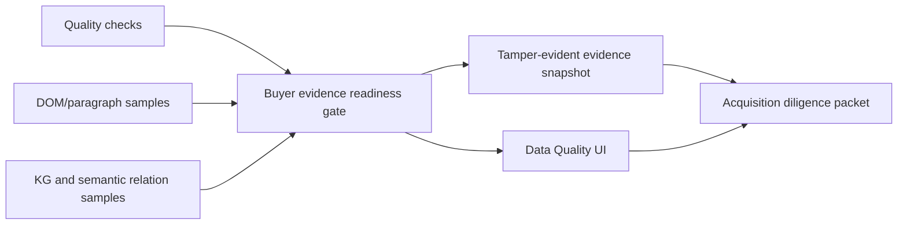

# Buyer Evidence Readiness Gate Implementation Plan

> **For agentic workers:** REQUIRED SUB-SKILL: Use superpowers:subagent-driven-development (recommended) or superpowers:executing-plans to implement this plan task-by-task. Steps use checkbox (`- [ ]`) syntax for tracking.

**Goal:** Add a buyer-facing acquisition readiness gate that summarizes whether the email body, attachment parsing, DOM/paragraph, KG, semantic relation, and tamper-evident snapshot evidence is ready for a 20B KRW diligence story.

**Architecture:** Keep the gate inside the existing `backend/api/data.py` quality surface and snapshot contracts, because the required data is already queried there and splitting a separate package would add deployment and review surface without reducing complexity. The gate uses existing quality checks and safe evidence samples; it never reads raw email body, attachment content, stable provider IDs, provider credentials, or evidence-source SQL strings. The React Data Quality tab renders the gate as a compact operational status panel above the detailed checks.

**Tech Stack:** FastAPI, Pydantic, SQLAlchemy-backed existing aggregates, React/TypeScript, Vitest, pytest, ruff, FigJam.

## Global Constraints

- Preserve unrelated `.Jules/*` worktree changes by staging only Phase 16 files.
- Do not add dependencies, migrations, submodules, package splits, raw-content export, LLM calls, provider writes, browser-stored bearer tokens, public identity headers, or Figma Code Connect.
- The readiness gate must expose only aggregate counts, check keys, booleans, status codes, and display copy; it must not expose raw email addresses, message IDs, thread IDs, attachment bytes, database IDs, provider credentials, or evidence-source column strings in the snapshot.
- Review process and queued/pending CI are not blockers; failed CI is actionable.

---

### Task 1: Backend Contract Tests

**Files:**
- Modify: `backend/tests/test_data_api.py`

**Interfaces:**
- Expects `DataQualitySurfaceResponse.acquisition_readiness_gate`
- Expects `DataEvidenceSnapshotResponse.acquisition_readiness_gate`
- Expects `DataAcquisitionReadinessGate.blocking_check_keys: list[str]`

- [x] **Step 1: Add quality-surface assertions**

In `test_data_quality_surface_returns_source_backed_counts_without_secrets`, assert the mock surface gate:

```python
assert data["acquisition_readiness_gate"] == {
    "gate_key": "buyer_evidence_readiness",
    "display_name": "Buyer evidence readiness",
    "state_code": "needs_attention",
    "readiness_score": 25,
    "passed_checks": 3,
    "issue_checks": 9,
    "pending_checks": 0,
    "total_checks": 12,
    "blocking_check_keys": [
        "thread_id_integrity",
        "dedupe_fingerprint",
        "attachment_content",
        "content_graph_coverage",
        "knowledge_graph_coverage",
        "content_segment_text_readiness",
        "knowledge_graph_evidence_endpoint_readiness",
        "semantic_relation_source_backing",
    ],
    "evidence_packet_ready": True,
    "snapshot_verification_ready": True,
    "provider_write_executed": False,
    "detail_text": (
        "Buyer evidence packet is generated, but blocking quality checks remain."
    ),
}
```

- [x] **Step 2: Add snapshot assertions**

In `test_data_quality_evidence_snapshot_returns_shareable_redacted_surface`, assert the same gate is present and included in `canonical_payload_fields`:

```python
assert "acquisition_readiness_gate" in snapshot["canonical_payload_fields"]
assert snapshot["acquisition_readiness_gate"]["readiness_score"] == 25
assert snapshot["acquisition_readiness_gate"]["state_code"] == "needs_attention"
assert snapshot["acquisition_readiness_gate"]["blocking_check_keys"] == [
    "thread_id_integrity",
    "dedupe_fingerprint",
    "attachment_content",
    "content_graph_coverage",
    "knowledge_graph_coverage",
    "content_segment_text_readiness",
    "knowledge_graph_evidence_endpoint_readiness",
    "semantic_relation_source_backing",
]
```

- [x] **Step 3: Run focused backend tests to verify failure**

Run:

```bash
cd backend
python -m pytest -q tests/test_data_api.py::test_data_quality_surface_returns_source_backed_counts_without_secrets tests/test_data_api.py::test_data_quality_evidence_snapshot_returns_shareable_redacted_surface
```

Expected: FAIL because `acquisition_readiness_gate` is not implemented yet.

### Task 2: Backend Implementation

**Files:**
- Modify: `backend/api/data.py`

**Interfaces:**
- Produces `DataAcquisitionReadinessGate`
- Produces `_acquisition_readiness_gate(...) -> DataAcquisitionReadinessGate`
- Adds `acquisition_readiness_gate` to quality-surface and evidence-snapshot responses

- [x] **Step 1: Add gate types**

Add:

```python
AcquisitionReadinessState = Literal["ready", "needs_attention", "pending"]


class DataAcquisitionReadinessGate(BaseModel):
    gate_key: str
    display_name: str
    state_code: AcquisitionReadinessState
    readiness_score: int
    passed_checks: int
    issue_checks: int
    pending_checks: int
    total_checks: int
    blocking_check_keys: list[str]
    evidence_packet_ready: bool
    snapshot_verification_ready: bool
    provider_write_executed: bool
    detail_text: str
```

- [x] **Step 2: Add the helper**

Implement:

```python
def _acquisition_readiness_gate(
    *,
    quality_checks: list[DataQualityCheck],
    content_graph_evidence_samples: list[DataContentGraphEvidenceSample],
    knowledge_graph_evidence_samples: list[DataKnowledgeGraphEvidenceSample],
    semantic_relation_evidence_samples: list[DataSemanticRelationEvidenceSample],
) -> DataAcquisitionReadinessGate:
    passed_checks = sum(1 for check in quality_checks if check.status_code == "pass")
    pending_checks = sum(1 for check in quality_checks if check.status_code == "pending")
    blocking_check_keys = [
        check.check_key
        for check in quality_checks
        if check.status_code == "needs_attention" or check.issue_count > 0
    ][:8]
    total_checks = len(quality_checks)
    issue_checks = len(blocking_check_keys)
    readiness_score = round((passed_checks / total_checks) * 100) if total_checks else 0
    evidence_packet_ready = bool(
        content_graph_evidence_samples
        and knowledge_graph_evidence_samples
        and semantic_relation_evidence_samples
    )
    if blocking_check_keys:
        state_code: AcquisitionReadinessState = "needs_attention"
        detail_text = (
            "Buyer evidence packet is generated, but blocking quality checks remain."
        )
    elif pending_checks > 0 or not evidence_packet_ready:
        state_code = "pending"
        detail_text = "Buyer evidence packet is waiting for pending quality evidence."
    else:
        state_code = "ready"
        detail_text = (
            "Buyer evidence packet has complete quality, graph, semantic, and "
            "snapshot verification evidence."
        )
    return DataAcquisitionReadinessGate(
        gate_key="buyer_evidence_readiness",
        display_name="Buyer evidence readiness",
        state_code=state_code,
        readiness_score=readiness_score,
        passed_checks=passed_checks,
        issue_checks=issue_checks,
        pending_checks=pending_checks,
        total_checks=total_checks,
        blocking_check_keys=blocking_check_keys,
        evidence_packet_ready=evidence_packet_ready,
        snapshot_verification_ready=True,
        provider_write_executed=False,
        detail_text=detail_text,
    )
```

- [x] **Step 3: Wire the response models and constructors**

Add `acquisition_readiness_gate: DataAcquisitionReadinessGate` to `DataQualitySurfaceResponse` and `DataEvidenceSnapshotResponse`.

In `get_data_quality_surface`, create `quality_checks` before building the response, then pass those checks and evidence sample lists into `_acquisition_readiness_gate(...)`.

In `_evidence_snapshot_from_surface`, copy `surface.acquisition_readiness_gate` into the snapshot. The digest will automatically include it because `snapshot_digest_payload()` sorts the model dump.

- [x] **Step 4: Run backend tests**

Run:

```bash
cd backend
python -m pytest -q tests/test_data_api.py::test_data_quality_surface_returns_source_backed_counts_without_secrets tests/test_data_api.py::test_data_quality_evidence_snapshot_returns_shareable_redacted_surface
python -m ruff check api/data.py tests/test_data_api.py
```

Expected: PASS.

### Task 3: Frontend Contract and Rendering

**Files:**
- Modify: `frontend/src/components/data-layout/types.ts`
- Modify: `frontend/src/components/data-layout/QualityCheckTab.tsx`
- Modify: `frontend/src/app/data/page.test.tsx`

**Interfaces:**
- Consumes `DataQualitySurfaceResponse.acquisition_readiness_gate`
- Consumes `DataEvidenceSnapshotResponse.acquisition_readiness_gate`

- [x] **Step 1: Add TypeScript types and fixtures**

Add `AcquisitionReadinessState = 'ready' | 'needs_attention' | 'pending'` and a shared gate shape to both surface and snapshot response types.

In `page.test.tsx`, add the fixture gate to `dataQualitySurface`, `dataEvidenceSnapshot`, and `canonical_payload_fields`.

- [x] **Step 2: Render the gate**

In `QualityCheckTab`, add a section above the three quality check summary cards:

```tsx
{dataQualitySurface?.acquisition_readiness_gate && (
  <div className="rounded-2xl border border-border bg-card shadow-sm overflow-hidden">
    ...
  </div>
)}
```

Render:
- title: `Buyer evidence readiness`
- score: `${readiness_score}%`
- status label using `getSurfaceStatusLabel`
- `evidence_packet_ready`
- `snapshot_verification_ready`
- blocking count and safe `blocking_check_keys`
- `detail_text`

- [x] **Step 3: Add UI assertions**

In `renders API-backed pipeline embedding and quality tabs`, assert:

```python
expect(container.textContent).toContain("Buyer evidence readiness");
expect(container.textContent).toContain("25%");
expect(container.textContent).toContain("증거 패킷 생성됨");
expect(container.textContent).toContain("Snapshot verification ready");
expect(container.textContent).toContain("thread_id_integrity");
```

Also assert copied snapshot includes:

```python
expect(copiedSnapshot.acquisition_readiness_gate.gate_key).toBe("buyer_evidence_readiness");
expect(copiedSnapshot.acquisition_readiness_gate.readiness_score).toBe(25);
```

- [x] **Step 4: Run frontend tests**

Run:

```bash
cd frontend
npx vitest run src/app/data/page.test.tsx
```

Expected: PASS.

### Task 4: FigJam Evidence and Completion

**Files:**
- Update: `docs/superpowers/plans/2026-07-02-buyer-evidence-readiness-gate.md`

**Interfaces:**
- Produces a FigJam Phase 16 diagram and local screenshot evidence
- Produces commits and PR update

- [x] **Step 1: Generate a FigJam diagram**

Use Figma/FigJam, not Figma Code Connect, to add a diagram with this flow:



Expected screenshot path:

```text
work/figjam-phase16-buyer-evidence-readiness-gate.png
```

- [x] **Step 2: Run final validation**

Run:

```bash
cd backend
python -m pytest -q tests/test_data_api.py::test_data_quality_surface_returns_source_backed_counts_without_secrets tests/test_data_api.py::test_data_quality_evidence_snapshot_returns_shareable_redacted_surface tests/test_data_api.py::test_member_data_quality_queries_are_owner_scoped
python -m ruff check api/data.py tests/test_data_api.py
cd ../frontend
npx vitest run src/app/data/page.test.tsx
cd ..
git diff --check
```

Expected: PASS.

- [x] **Step 3: Mark this plan complete**

Replace unchecked boxes with checked boxes after implementation and validation evidence exists.

- [x] **Step 4: Commit and push**

Commit plan, implementation, and completion marker separately when practical:

```bash
git add docs/superpowers/plans/2026-07-02-buyer-evidence-readiness-gate.md
git commit -m "docs: plan buyer evidence readiness gate"
git add backend/api/data.py backend/tests/test_data_api.py frontend/src/components/data-layout/types.ts frontend/src/components/data-layout/QualityCheckTab.tsx frontend/src/app/data/page.test.tsx
git commit -m "feat: add buyer evidence readiness gate"
git add docs/superpowers/plans/2026-07-02-buyer-evidence-readiness-gate.md
git commit -m "docs: mark phase 16 plan complete"
git push origin HEAD:plan/email-dom-paragraph-kg-2026-07-02
```

Expected: PR #895 head updates, unrelated `.Jules/*` files remain unstaged.

## Completion Evidence

- Backend final focused tests: `3 passed in 0.18s`.
- Backend lint: `python -m ruff check api/data.py tests/test_data_api.py` returned `All checks passed!`.
- Frontend Data page test: `12 passed`.
- FigJam board: `https://www.figma.com/board/zXkcwT2E2aBtNhMVznLT4l`
- FigJam group: `39:718` (`Phase 16 Buyer Evidence Readiness Gate Group`).
- Screenshot: `/Users/seonghobae/Documents/Codex/2026-07-02/https-github-com-contextualwisdomlab-noema-figma-2/work/figjam-phase16-buyer-evidence-readiness-gate.png`
- Library/submodule decision: no split. The readiness gate composes existing Data API evidence and adding a separate package or submodule would increase integration, auth, and release risk without a reusable parser boundary.
