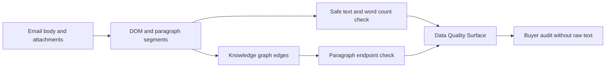

# Content Graph Evidence Readiness Guardrails Implementation Plan

> **For agentic workers:** REQUIRED SUB-SKILL: Use superpowers:executing-plans to implement this plan task-by-task. Steps use checkbox (`- [ ]`) syntax for tracking.

**Goal:** Add buyer-auditable evidence-readiness checks for DOM paragraph segments and persisted knowledge graph edges without exposing raw email bodies, raw HTML, attachment bytes, message IDs, or attachment IDs.

**Architecture:** Keep the implementation inside the existing `/api/data/quality-surface` aggregate endpoint. Add two scoped SQL aggregates and two `DataQualityCheck` rows:

- `content_segment_text_readiness`: counts segments with non-empty safe text and positive word counts.
- `knowledge_graph_evidence_endpoint_readiness`: counts graph edges that have at least one paragraph segment endpoint.

No new parser library, package split, submodule, migration, provider write, or Figma Code Connect work is needed in this phase.

**Tech Stack:** Python 3.14, FastAPI/Pydantic, SQLAlchemy async ORM, React/TypeScript, pytest, Vitest, ruff, Figma/FigJam.

## Global Constraints

- Preserve unrelated `.Jules/*` worktree changes by staging only Phase 8 files.
- Do not expose raw segment text, raw HTML, unsupported binary bytes, message IDs, attachment IDs, provider credentials, or full bodies through user-facing APIs.
- Review process and pending CI are not blockers; failed CI is actionable.
- Figma board updates are documentation/design artifacts only, not Code Connect metadata.
- Keep the change local to the existing Data Quality Surface unless tests prove a wider change is necessary.

---

### Task 1: Backend Contract Test

**Files:**
- Modify: `backend/tests/test_data_api.py`

**Interfaces:**
- Expects: `quality_checks[].check_key == "content_segment_text_readiness"`
- Expects: `quality_checks[].check_key == "knowledge_graph_evidence_endpoint_readiness"`

- [x] **Step 1: Add failing mock aggregate rows**

After the existing content graph and knowledge graph inventory stats, add mock query results:

```python
(8, 1),  # content segment text readiness stats
(10, 2),  # knowledge graph evidence endpoint readiness stats
```

- [x] **Step 2: Assert the new quality checks**

Assert exact response objects:

```python
assert quality_by_key["content_segment_text_readiness"] == {
    "check_key": "content_segment_text_readiness",
    "display_name": "Content segment text readiness",
    "status_code": "needs_attention",
    "issue_count": 1,
    "total_count": 8,
    "evidence_source": "content_segments.word_count, content_segments.safe_text_content",
    "detail_text": "Some DOM paragraph segments need non-empty safe text and word counts.",
    "provider_write_executed": False,
}
assert quality_by_key["knowledge_graph_evidence_endpoint_readiness"] == {
    "check_key": "knowledge_graph_evidence_endpoint_readiness",
    "display_name": "Knowledge graph evidence endpoints",
    "status_code": "needs_attention",
    "issue_count": 2,
    "total_count": 10,
    "evidence_source": "knowledge_graph_edges.source_segment_id, knowledge_graph_edges.target_segment_id",
    "detail_text": "Some knowledge graph edges need paragraph segment evidence endpoints.",
    "provider_write_executed": False,
}
```

- [x] **Step 3: Verify failure**

Run:

```bash
cd backend
python -m pytest -q tests/test_data_api.py::test_data_quality_surface_returns_source_backed_counts_without_secrets
```

Expected: FAIL until the API query and quality check builders are implemented.

### Task 2: Backend Aggregates and Quality Checks

**Files:**
- Modify: `backend/api/data.py`
- Test: `backend/tests/test_data_api.py`

**Interfaces:**
- Produces: `ContentSegmentTextReadinessStats`
- Produces: `KnowledgeGraphEvidenceEndpointStats`
- Extends: `_quality_checks(...)`

- [x] **Step 1: Add evidence source constants and stats tuples**

Add constants for the column-level evidence strings and `NamedTuple` stats objects for total and issue counts.

- [x] **Step 2: Add scoped aggregate queries**

Add:

- `_get_content_segment_text_readiness_stats(db, email_scope)`: counts all scoped segments and segments where `word_count <= 0` or trimmed `safe_text_content` is empty.
- `_get_knowledge_graph_evidence_endpoint_stats(db, email_scope)`: counts all scoped edges and edges where both `source_segment_id` and `target_segment_id` are null.

- [x] **Step 3: Add quality check builders**

Add:

- `_check_content_segment_text_readiness(total_count, issue_count)`
- `_check_knowledge_graph_evidence_endpoint_readiness(total_count, issue_count)`

Both must set `provider_write_executed=False` and return `"pending"` when no source rows exist.

- [x] **Step 4: Wire the endpoint**

Fetch the new stats inside `get_data_quality_surface`, pass them into `_quality_checks`, and keep existing topology breakdown ordering intact.

- [x] **Step 5: Verify backend pass**

Run:

```bash
cd backend
python -m pytest -q tests/test_data_api.py
ruff check api/data.py tests/test_data_api.py
```

Expected: PASS.

### Task 3: Frontend Fixture Coverage

**Files:**
- Modify: `frontend/src/app/data/page.test.tsx`
- Modify: `frontend/tests/e2e/helpers.ts`

**Interfaces:**
- Consumes: existing `quality_checks` array

- [x] **Step 1: Extend fixtures**

Add the two new quality check rows to the Data Quality Surface fixtures.

- [x] **Step 2: Assert buyer-facing labels render**

In the Data page test, assert that:

- `Content segment text readiness`
- `Knowledge graph evidence endpoints`
- `paragraph segment evidence endpoints`

are visible, while raw evidence column strings remain absent from the visible UI.

- [x] **Step 3: Verify frontend pass**

Run:

```bash
cd frontend
pnpm test src/app/data/page.test.tsx
pnpm typecheck
```

Expected: PASS.

### Task 4: Figma/FigJam Evidence Readiness Diagram

**Files/Artifacts:**
- Update existing FigJam board `zXkcwT2E2aBtNhMVznLT4l`
- Save screenshot outside git under `work/figjam-phase8-evidence-readiness.png`

- [x] **Step 1: Generate diagram without Code Connect**

Add a simple Phase 8 flow diagram:



- [x] **Step 2: Screenshot and inspect**

Use Figma screenshot tooling and local image inspection. Confirm no obvious overlap, clipping, or Code Connect metadata.

### Task 5: Ship

**Files:**
- Commit only Phase 8 files and plan document.

- [x] **Step 1: Diff hygiene**

Run:

```bash
git diff --check
git status --short
```

Expected: only intended Phase 8 files plus unrelated `.Jules/*` modifications in status.

- [ ] **Step 2: Commit, push, and update PR**

Commit with:

```bash
git commit -m "feat: add content graph evidence readiness checks"
git push origin HEAD:plan/email-dom-paragraph-kg-2026-07-02
```

Update PR #895 body with Phase 8 summary, validation, FigJam artifact, and current head SHA.

- [ ] **Step 3: Live PR verification**

Run:

```bash
gh pr view 895 --repo ContextualWisdomLab/naruon --json headRefOid,mergeable,mergeStateStatus,reviewDecision,statusCheckRollup,url
```

Report current head, local validation, and any live CI failures. Pending review or queued CI is not a blocker.
