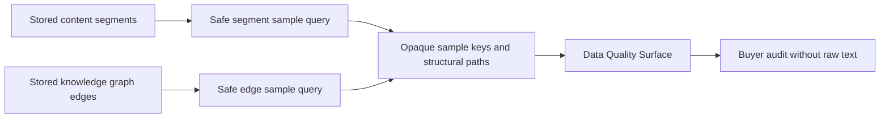

# Content Graph Safe Evidence Samples Implementation Plan

> **For agentic workers:** REQUIRED SUB-SKILL: Use superpowers:subagent-driven-development (recommended) or superpowers:executing-plans to implement this plan task-by-task. Steps use checkbox (`- [ ]`) syntax for tracking.

**Goal:** Add buyer-auditable safe evidence samples for persisted DOM paragraph segments and knowledge graph edges without exposing raw email bodies, raw HTML, attachment bytes, message IDs, attachment IDs, source record IDs, or stable database IDs.

**Architecture:** Extend the existing `/api/data/quality-surface` contract with two small sample arrays. Samples are read-only, scoped by the signed email scope, capped at 8 rows each, sorted deterministically, and limited to source/segment/edge kind, structural path, word count, endpoint status, and opaque hashed sample keys. Sample arrays intentionally omit evidence column names and provider write flags. Keep the implementation in `backend/api/data.py` and the existing Data UI quality tab; no migration, dependency, submodule, or package split is needed.

**Tech Stack:** Python 3.14, FastAPI/Pydantic, SQLAlchemy async ORM, React/TypeScript, pytest, Vitest, ruff, Figma/FigJam. No Figma Code Connect.

## Global Constraints

- Preserve unrelated `.Jules/*` worktree changes by staging only Phase 9 files.
- Do not expose raw segment text, raw HTML, unsupported binary bytes, message IDs, attachment IDs, source record IDs, provider credentials, or full bodies through user-facing APIs.
- Do not expose `heading_path`; it can contain heading text.
- Do not add entity extraction, evidence viewer routes, new dependencies, migrations, submodules, or package splits in this phase.
- Review process and pending CI are not blockers; failed CI is actionable.
- Figma board updates are documentation/design artifacts only, not Code Connect metadata.

---

### Task 1: Backend Contract Test

**Files:**
- Modify: `backend/tests/test_data_api.py`

**Interfaces:**
- Expects: `content_graph_evidence_samples: list[DataContentGraphEvidenceSample]`
- Expects: `knowledge_graph_evidence_samples: list[DataKnowledgeGraphEvidenceSample]`

- [x] **Step 1: Add failing mock sample rows**

After the topology breakdown mock rows, add:

```python
[
    (
        "cseg_email_paragraph_1",
        "email_body",
        "paragraph",
        "/document[1]/paragraph[1]",
        12,
    ),
    (
        "cseg_attachment_heading_1",
        "attachment",
        "heading",
        "/document[1]/h1[1]",
        3,
    ),
],  # content graph evidence samples
[
    (
        "kgedge_email_node_segment_1",
        "email_body",
        "node_has_segment",
        "/document[1]/paragraph[1]/has/segment[1]",
        None,
        12,
        44,
        None,
    ),
    (
        "kgedge_attachment_node_only_1",
        "attachment",
        "node_contains_node",
        "/document[1]/contains/h1[1]",
        None,
        None,
        55,
        56,
    ),
],  # knowledge graph evidence samples
```

- [x] **Step 2: Assert safe response objects**

Add a small local helper in the test:

```python
def _expected_sample_key(prefix: str, value: str) -> str:
    return f"{prefix}_{hashlib.sha256(value.encode('utf-8')).hexdigest()[:16]}"
```

Assert:

```python
assert data["content_graph_evidence_samples"] == [
    {
        "sample_key": _expected_sample_key("segment", "cseg_email_paragraph_1"),
        "source_kind": "email_body",
        "segment_kind": "paragraph",
        "segment_path": "/document[1]/paragraph[1]",
        "word_count": 12,
    },
    {
        "sample_key": _expected_sample_key("segment", "cseg_attachment_heading_1"),
        "source_kind": "attachment",
        "segment_kind": "heading",
        "segment_path": "/document[1]/h1[1]",
        "word_count": 3,
    },
]
assert data["knowledge_graph_evidence_samples"] == [
    {
        "sample_key": _expected_sample_key("edge", "kgedge_email_node_segment_1"),
        "source_kind": "email_body",
        "edge_kind": "node_has_segment",
        "edge_path": "/document[1]/paragraph[1]/has/segment[1]",
        "endpoint_status": "segment_backed",
    },
    {
        "sample_key": _expected_sample_key("edge", "kgedge_attachment_node_only_1"),
        "source_kind": "attachment",
        "edge_kind": "node_contains_node",
        "edge_path": "/document[1]/contains/h1[1]",
        "endpoint_status": "node_only",
    },
]
```

Keep the serialized response forbidden-value check for raw body text and stable source identifiers.

- [x] **Step 3: Verify failure**

Run:

```bash
cd backend
python -m pytest -q tests/test_data_api.py::test_data_quality_surface_returns_source_backed_counts_without_secrets
```

Expected: FAIL until the response models and sample queries exist.

### Task 2: Backend Sample Models and Queries

**Files:**
- Modify: `backend/api/data.py`
- Test: `backend/tests/test_data_api.py`

**Interfaces:**
- Produces: `DataContentGraphEvidenceSample`
- Produces: `DataKnowledgeGraphEvidenceSample`
- Produces: `_get_content_graph_evidence_samples(...)`
- Produces: `_get_knowledge_graph_evidence_samples(...)`

- [x] **Step 1: Add constants and Pydantic models**

Add:

```python
EndpointStatus = Literal["segment_backed", "node_only", "missing_endpoint"]
```

Add `DataContentGraphEvidenceSample` and `DataKnowledgeGraphEvidenceSample` models, then extend `DataQualitySurfaceResponse`.

- [x] **Step 2: Add safe row builders**

Add `_opaque_graph_sample_key`, `_safe_graph_path`, `_content_graph_evidence_sample_row`, and `_knowledge_graph_evidence_sample_row`. The edge row builder must return:

- `segment_backed` when either segment endpoint is present.
- `node_only` when no segment endpoint exists but at least one node endpoint exists.
- `missing_endpoint` when neither node nor segment endpoint exists.

- [x] **Step 3: Add scoped sample queries**

Add:

```python
async def _get_content_graph_evidence_samples(
    db: AsyncSession,
    email_scope: EmailScopeFilter,
) -> list[DataContentGraphEvidenceSample]:
    ...
```

Select `content_segment_uid`, `source_kind`, `segment_kind`, `segment_path`, and `word_count`, join `Email`, scope by `email_scope`, order by `source_kind`, `source_record_uid`, `ordinal_index`, `segment_path`, and limit 8.

Add:

```python
async def _get_knowledge_graph_evidence_samples(
    db: AsyncSession,
    email_scope: EmailScopeFilter,
) -> list[DataKnowledgeGraphEvidenceSample]:
    ...
```

Select `edge_uid`, `source_kind`, `edge_kind`, `edge_path`, `source_segment_id`, `target_segment_id`, `source_node_id`, `target_node_id`, join `Email`, scope by `email_scope`, order by `source_kind`, `source_record_uid`, `ordinal_index`, `edge_path`, and limit 8.

- [x] **Step 4: Wire endpoint response**

Fetch both sample arrays inside `get_data_quality_surface` after the topology breakdown queries and include them in `DataQualitySurfaceResponse`.

- [x] **Step 5: Verify backend pass**

Run:

```bash
cd backend
python -m pytest -q tests/test_data_api.py
ruff check api/data.py tests/test_data_api.py
```

Expected: PASS.

### Task 3: Frontend Quality Tab Samples

**Files:**
- Modify: `frontend/src/components/data-layout/types.ts`
- Modify: `frontend/src/components/data-layout/QualityCheckTab.tsx`
- Modify: `frontend/src/app/data/page.test.tsx`
- Modify: `frontend/tests/e2e/helpers.ts`

**Interfaces:**
- Consumes: `content_graph_evidence_samples`
- Consumes: `knowledge_graph_evidence_samples`

- [x] **Step 1: Extend TypeScript response types**

Add optional arrays for `content_graph_evidence_samples` and `knowledge_graph_evidence_samples` with exact fields from the backend models.

- [x] **Step 2: Extend fixtures**

Add one content sample and one KG sample to both the Vitest fixture and e2e helper fixture.

- [x] **Step 3: Render sample sections**

In `QualityCheckTab.tsx`, add:

- `문단 근거 샘플`
- `KG 근거 샘플`

Display only source kind, segment/edge kind, safe path, and word count or endpoint label. Use `sample_key` only as a React key, not visible text.

- [x] **Step 4: Assert visible and hidden values**

In `frontend/src/app/data/page.test.tsx`, assert the sample section titles, sample paths, and endpoint label are visible. Assert evidence column strings and sample keys are not visible.

- [x] **Step 5: Verify frontend pass**

Run:

```bash
cd frontend
pnpm test src/app/data/page.test.tsx
pnpm typecheck
```

Expected: PASS.

### Task 4: Figma/FigJam Safe Evidence Samples Flow

**Files/Artifacts:**
- Update existing FigJam board `zXkcwT2E2aBtNhMVznLT4l`
- Save screenshot outside git under `work/figjam-phase9-safe-evidence-samples.png`

- [x] **Step 1: Generate diagram without Code Connect**

Add a simple Phase 9 flow diagram:



- [x] **Step 2: Screenshot and inspect**

Use Figma screenshot tooling and local image inspection. Confirm no obvious overlap, clipping, or Code Connect metadata.

### Task 5: Ship

**Files:**
- Commit only Phase 9 files and plan document.

- [x] **Step 1: Diff hygiene**

Run:

```bash
git diff --check
git status --short
```

Expected: only intended Phase 9 files plus unrelated `.Jules/*` modifications in status.

- [x] **Step 2: Commit, push, and update PR**

Commit with:

```bash
git commit -m "feat: add content graph evidence samples"
git push origin HEAD:plan/email-dom-paragraph-kg-2026-07-02
```

Update PR #895 body with Phase 9 summary, validation, FigJam artifact, and current head SHA.

- [ ] **Step 3: Live PR verification**

Run:

```bash
gh pr view 895 --repo ContextualWisdomLab/naruon --json headRefOid,mergeable,mergeStateStatus,reviewDecision,statusCheckRollup,url
```

Report current head, local validation, and any live CI failures. Pending review or queued CI is not a blocker.
