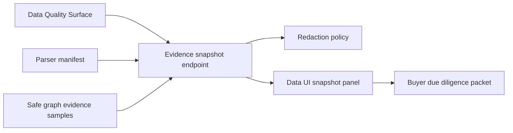

# Due Diligence Evidence Snapshot Implementation Plan

> **For agentic workers:** REQUIRED SUB-SKILL: Use superpowers:subagent-driven-development (recommended) or superpowers:executing-plans to implement this plan task-by-task. Steps use checkbox (`- [ ]`) syntax for tracking.

**Goal:** Add a buyer-auditable due-diligence evidence snapshot for persisted DOM paragraph segments, attachment parser coverage, and knowledge graph edges without exposing raw email bodies, raw HTML, attachment bytes, message IDs, attachment IDs, source record IDs, stable database IDs, provider credentials, or DB evidence column strings.

**Architecture:** Reuse the existing `/api/data/quality-surface` aggregation as the authoritative source and wrap it in a smaller shareable snapshot endpoint. Keep implementation inside the existing Data API and Data UI quality tab; no migration, dependency, package split, submodule, or Figma Code Connect is needed.

**Tech Stack:** Python 3.14, FastAPI/Pydantic, SQLAlchemy async ORM, React/TypeScript, pytest, Vitest, ruff, Figma/FigJam.

## Global Constraints

- Preserve unrelated `.Jules/*` worktree changes by staging only Phase 10 files.
- Do not expose raw segment text, raw email body, raw HTML, attachment bytes, message IDs, attachment IDs, source record IDs, stable database IDs, provider credentials, or DB evidence column strings in the snapshot endpoint or UI.
- `heading_path` stays out of buyer-facing snapshots because it can contain heading text.
- Do not add migrations, dependencies, submodules, package splits, entity extraction, evidence viewer routes, or raw-content export in this phase.
- Review process and pending CI are not blockers; failed CI is actionable.
- Figma board updates are documentation/design artifacts only, not Code Connect metadata.

---

### Task 1: Backend Snapshot Contract Test

**Files:**
- Modify: `backend/tests/test_data_api.py`

**Interfaces:**
- Expects: `GET /api/data/quality-surface/evidence-snapshot`
- Expects: `DataEvidenceSnapshotResponse`

- [x] **Step 1: Add failing snapshot endpoint test**

Add `test_data_quality_evidence_snapshot_returns_shareable_redacted_surface` after the existing quality surface test. Use the same signed auth helper and assert:

```python
response = client.get("/api/data/quality-surface/evidence-snapshot")
assert response.status_code == 200, response.text
snapshot = response.json()
assert snapshot["snapshot_version"] == "data_quality_evidence_snapshot.v1"
assert snapshot["audit_event"] == "data.quality_surface.evidence_snapshot.viewed"
assert snapshot["scope_label"] == "signed_workspace_scope"
assert snapshot["privacy_redaction_policy"]["raw_content_exposed"] is False
assert snapshot["privacy_redaction_policy"]["stable_identifiers_exposed"] is False
assert snapshot["validation_status"] == {
    "status_code": "needs_attention",
    "checks_passed": 2,
    "checks_with_issues": 8,
    "total_checks": 10,
}
assert snapshot["parser_manifest_summary"][0] == {
    "parser_key": "plain_text",
    "display_name": "Plain text attachments",
    "parse_status": "parsed",
    "content_types": ["text/plain"],
    "extensions": [".txt", ".text"],
}
assert snapshot["content_graph_topology_counts"] == [
    {"source_kind": "email_body", "segment_kind": "paragraph", "object_count": 6},
    {"source_kind": "attachment", "segment_kind": "heading", "object_count": 2},
]
assert snapshot["knowledge_graph_topology_counts"] == [
    {"source_kind": "email_body", "edge_kind": "node_has_segment", "object_count": 8},
    {"source_kind": "attachment", "edge_kind": "heading_contains_segment", "object_count": 2},
]
assert snapshot["content_graph_evidence_samples"][0]["segment_path"] == "/document[1]/paragraph[1]"
assert snapshot["knowledge_graph_evidence_samples"][0]["endpoint_status"] == "segment_backed"
```

Also assert forbidden serialized values:

```python
for forbidden in (
    "source email body",
    "extracted attachment text",
    "content_segments.source_kind",
    "knowledge_graph_edges.source_kind",
    "email_attachments.content_type",
    "cseg_email_paragraph_1",
    "kgedge_email_node_segment_1",
    "<asset-ready@example.com>",
    "thread-ready",
    "credentials_encrypted",
):
    assert forbidden not in response.text
```

- [x] **Step 2: Verify failure**

Run:

```bash
cd backend
python -m pytest -q tests/test_data_api.py::test_data_quality_evidence_snapshot_returns_shareable_redacted_surface
```

Expected: FAIL with 404 or missing model until the endpoint exists.

### Task 2: Backend Snapshot Endpoint

**Files:**
- Modify: `backend/api/data.py`
- Test: `backend/tests/test_data_api.py`

**Interfaces:**
- Produces: `DataEvidenceSnapshotResponse`
- Produces: `GET /api/data/quality-surface/evidence-snapshot`

- [x] **Step 1: Add snapshot Pydantic models**

Add models near `DataQualitySurfaceResponse`:

```python
class DataEvidenceSnapshotParserSummary(BaseModel):
    parser_key: str
    display_name: str
    parse_status: str
    content_types: list[str]
    extensions: list[str]


class DataEvidenceSnapshotPrivacyPolicy(BaseModel):
    raw_content_exposed: bool
    stable_identifiers_exposed: bool
    provider_credentials_exposed: bool
    redacted_fields: list[str]
    allowed_sample_fields: list[str]


class DataEvidenceSnapshotValidationStatus(BaseModel):
    status_code: QualityStatus
    checks_passed: int
    checks_with_issues: int
    total_checks: int


class DataEvidenceSnapshotContentTopologyCount(BaseModel):
    source_kind: str
    segment_kind: str
    object_count: int


class DataEvidenceSnapshotKnowledgeTopologyCount(BaseModel):
    source_kind: str
    edge_kind: str
    object_count: int


class DataEvidenceSnapshotResponse(BaseModel):
    snapshot_version: str
    generated_at: str
    audit_event: str
    scope_label: str
    privacy_redaction_policy: DataEvidenceSnapshotPrivacyPolicy
    validation_status: DataEvidenceSnapshotValidationStatus
    parser_manifest_summary: list[DataEvidenceSnapshotParserSummary]
    quality_checks: list[DataEvidenceSnapshotQualityCheck]
    content_graph_topology_counts: list[DataEvidenceSnapshotContentTopologyCount]
    knowledge_graph_topology_counts: list[DataEvidenceSnapshotKnowledgeTopologyCount]
    content_graph_evidence_samples: list[DataContentGraphEvidenceSample]
    knowledge_graph_evidence_samples: list[DataKnowledgeGraphEvidenceSample]
```

Add `DataEvidenceSnapshotQualityCheck` with only `check_key`, `display_name`, `status_code`, `issue_count`, `total_count`, and `detail_text`.

- [x] **Step 2: Add safe snapshot builders**

Add helpers:

```python
SNAPSHOT_VERSION = "data_quality_evidence_snapshot.v1"


def _snapshot_parser_manifest_summary() -> list[DataEvidenceSnapshotParserSummary]:
    return [
        DataEvidenceSnapshotParserSummary(
            parser_key=descriptor.parser_key,
            display_name=descriptor.display_name,
            parse_status=descriptor.parse_status,
            content_types=list(descriptor.content_types),
            extensions=list(descriptor.extensions),
        )
        for descriptor in get_attachment_parser_manifest()
    ]
```

Add `_snapshot_privacy_policy()`, `_snapshot_validation_status(surface)`, and `_evidence_snapshot_from_surface(surface)` that copy only safe fields from `DataQualitySurfaceResponse`.

- [x] **Step 3: Add endpoint**

Add:

```python
@router.get(
    "/quality-surface/evidence-snapshot",
    response_model=DataEvidenceSnapshotResponse,
)
async def get_data_quality_evidence_snapshot(
    auth_context: AuthContext = Depends(get_auth_context),
    db: AsyncSession = Depends(get_db),
) -> DataEvidenceSnapshotResponse:
    surface = await get_data_quality_surface(auth_context=auth_context, db=db)
    return _evidence_snapshot_from_surface(surface)
```

- [x] **Step 4: Verify backend pass**

Run:

```bash
cd backend
python -m pytest -q tests/test_data_api.py
ruff check api/data.py tests/test_data_api.py
```

Expected: PASS.

### Task 3: Frontend Snapshot Summary and Copy Action

**Files:**
- Modify: `frontend/src/components/data-layout/types.ts`
- Modify: `frontend/src/components/data-layout/QualityCheckTab.tsx`
- Modify: `frontend/src/app/data/page.test.tsx`
- No change needed: `frontend/tests/e2e/helpers.ts`

**Interfaces:**
- Consumes: `DataQualitySurfaceResponse`
- Produces: buyer-facing `실사 스냅샷` section

- [x] **Step 1: Add frontend snapshot helper types**

In `types.ts`, add `DataEvidenceSnapshotResponse` matching the backend safe response. Keep sample keys in the type for copy/export payloads, but never render them.

- [x] **Step 2: Add snapshot builder in QualityCheckTab**

Add `buildEvidenceSnapshot(dataQualitySurface)` inside `QualityCheckTab.tsx` or a small local helper. It must include:

- `snapshot_version`
- `validation_status`
- parser/topology/sample counts
- `privacy_redaction_policy`
- safe samples copied from the surface

Do not include `evidence_source` strings or raw identifiers.

- [x] **Step 3: Render compact snapshot section**

At the top of the quality tab, render `실사 스냅샷` with:

- validation label
- parser family count
- content sample count
- KG sample count
- redaction statement
- button text `실사 스냅샷 JSON 복사`

The visible UI must not render sample keys, evidence column strings, or raw identifiers.

- [x] **Step 4: Extend fixtures and tests**

Update the existing Vitest fixture if needed and assert:

```ts
expect(container.textContent).toContain("실사 스냅샷");
expect(container.textContent).toContain("실사 스냅샷 JSON 복사");
expect(container.textContent).toContain("raw 본문/첨부 원문 제외");
expect(container.textContent).not.toContain("segment_hidden_1");
expect(container.textContent).not.toContain("edge_hidden_1");
expect(container.textContent).not.toContain("content_segments.segment_path");
expect(container.textContent).not.toContain("knowledge_graph_edges.edge_path");
```

- [x] **Step 5: Verify frontend pass**

Run:

```bash
cd frontend
pnpm test src/app/data/page.test.tsx
pnpm typecheck
```

Expected: PASS.

### Task 4: Figma/FigJam Phase 10 Snapshot Flow

**Artifacts:**
- Update existing FigJam board `zXkcwT2E2aBtNhMVznLT4l`
- Save screenshot outside git under `work/figjam-phase10-due-diligence-snapshot.png`

- [x] **Step 1: Generate diagram without Code Connect**

Add a simple Phase 10 flow diagram:



- [x] **Step 2: Screenshot and inspect**

Use Figma screenshot tooling and local image inspection. Confirm no obvious overlap, clipping, or Code Connect metadata.

### Task 5: Ship

**Files:**
- Commit only Phase 10 files and plan document.

- [ ] **Step 1: Diff hygiene**

Run:

```bash
git diff --check
git status --short
```

Expected: only intended Phase 10 files plus unrelated `.Jules/*` modifications in status.

- [ ] **Step 2: Commit, push, and update PR**

Commit with:

```bash
git commit -m "feat: add due diligence evidence snapshot"
git push origin HEAD:plan/email-dom-paragraph-kg-2026-07-02
```

Update PR #895 body with Phase 10 summary, validation, FigJam artifact, and current head SHA.

- [ ] **Step 3: Live PR verification**

Run:

```bash
gh pr view 895 --repo ContextualWisdomLab/naruon --json headRefOid,mergeable,mergeStateStatus,reviewDecision,statusCheckRollup,url
gh pr checks 895 --repo ContextualWisdomLab/naruon
```

Report current head, local validation, and any live CI failures. Pending review or queued CI is not a blocker.
