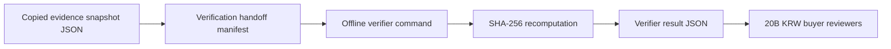

# Evidence Snapshot Verification Handoff Implementation Plan

> **For agentic workers:** REQUIRED SUB-SKILL: Use superpowers:subagent-driven-development (recommended) or superpowers:executing-plans to implement this plan task-by-task. Steps use checkbox (`- [ ]`) syntax for tracking.

**Goal:** Add a safe buyer handoff manifest that tells due-diligence reviewers how to verify copied evidence snapshot JSON with the existing offline verifier.

**Architecture:** Keep the handoff metadata inside the existing evidence snapshot response because it describes that exact artifact. Reuse `backend/scripts/verify_evidence_snapshot.py` and the existing digest constants; do not introduce a new package, submodule, verifier service, signing key, or dependency.

**Tech Stack:** FastAPI, Pydantic, Python stdlib verifier, React/TypeScript, Vitest, pytest, ruff, FigJam.

## Global Constraints

- Preserve unrelated `.Jules/*` worktree changes by staging only Phase 20 files.
- Do not add dependencies, migrations, package splits, submodules, key management, HMAC secrets, provider writes, LLM calls, raw-content export, public CI mail-corpus flows, or Figma Code Connect.
- The handoff must expose only safe verifier metadata: verifier key, command, accepted input shape, digest algorithm, digest-excluded fields, success/failure exit codes, handoff copy, and provider-write boundary.
- The handoff must not expose raw sender emails, raw message IDs, raw thread IDs, body text, attachment bytes, stable database IDs, provider credentials, DB evidence-source column strings, source paths, provider names, or raw sample identifiers.
- Review process and queued/pending CI are not blockers; failed CI is actionable.

---

### Task 1: Backend Evidence-Snapshot Contract

**Files:**
- Modify: `backend/api/data.py`
- Modify: `backend/tests/test_data_api.py`

**Interfaces:**
- Produces `DataEvidenceSnapshotVerificationHandoff`
- Produces `DataEvidenceSnapshotResponse.verification_handoff`

- [x] **Step 1: Add expected handoff helper**

Add `_expected_snapshot_verification_handoff()` to `backend/tests/test_data_api.py`:

```python
def _expected_snapshot_verification_handoff():
    return {
        "verifier_key": "offline_evidence_snapshot_verifier",
        "verifier_command": "python scripts/verify_evidence_snapshot.py <snapshot.json>",
        "accepted_input": "file_path_or_stdin",
        "digest_algorithm": "sha256",
        "excluded_digest_fields": [
            "canonical_payload_fields",
            "digest_algorithm",
            "snapshot_digest",
        ],
        "success_exit_code": 0,
        "failure_exit_codes": {
            "invalid_json": 1,
            "missing_snapshot_digest": 2,
            "unsupported_digest_algorithm": 3,
            "digest_mismatch": 4,
        },
        "handoff_text": (
            "Save the copied evidence snapshot JSON and verify it with the offline "
            "verifier before sharing diligence materials."
        ),
        "provider_write_executed": False,
    }
```

- [x] **Step 2: Extend snapshot assertions**

In `test_data_quality_evidence_snapshot_returns_shareable_redacted_surface`, assert:

```python
assert snapshot["verification_handoff"] == _expected_snapshot_verification_handoff()
assert "verification_handoff" in snapshot["canonical_payload_fields"]
```

Keep existing forbidden-field assertions unchanged.

- [x] **Step 3: Run backend test to verify failure**

Run:

```bash
cd backend
python -m pytest -q tests/test_data_api.py::test_data_quality_evidence_snapshot_returns_shareable_redacted_surface
```

Expected: FAIL because `verification_handoff` is not implemented yet.

- [x] **Step 4: Add backend model and helper**

In `backend/api/data.py`, add:

```python
class DataEvidenceSnapshotVerificationHandoff(BaseModel):
    verifier_key: str
    verifier_command: str
    accepted_input: str
    digest_algorithm: Literal["sha256"]
    excluded_digest_fields: list[str]
    success_exit_code: int
    failure_exit_codes: dict[str, int]
    handoff_text: str
    provider_write_executed: bool
```

Add `verification_handoff: DataEvidenceSnapshotVerificationHandoff` to `DataEvidenceSnapshotResponse`.

Add:

```python
def _snapshot_verification_handoff() -> DataEvidenceSnapshotVerificationHandoff:
    return DataEvidenceSnapshotVerificationHandoff(
        verifier_key="offline_evidence_snapshot_verifier",
        verifier_command="python scripts/verify_evidence_snapshot.py <snapshot.json>",
        accepted_input="file_path_or_stdin",
        digest_algorithm="sha256",
        excluded_digest_fields=sorted(SNAPSHOT_DIGEST_EXCLUDED_FIELDS),
        success_exit_code=0,
        failure_exit_codes={
            "invalid_json": 1,
            "missing_snapshot_digest": 2,
            "unsupported_digest_algorithm": 3,
            "digest_mismatch": 4,
        },
        handoff_text=(
            "Save the copied evidence snapshot JSON and verify it with the offline "
            "verifier before sharing diligence materials."
        ),
        provider_write_executed=False,
    )
```

Pass `verification_handoff=_snapshot_verification_handoff()` when building `DataEvidenceSnapshotResponse`.

- [x] **Step 5: Run backend validation**

Run:

```bash
cd backend
python -m pytest -q tests/test_data_api.py::test_data_quality_evidence_snapshot_returns_shareable_redacted_surface tests/test_evidence_snapshot_verifier.py
python -m ruff check api/data.py tests/test_data_api.py scripts/verify_evidence_snapshot.py tests/test_evidence_snapshot_verifier.py
```

Expected: PASS.

### Task 2: Frontend Handoff Rendering

**Files:**
- Modify: `frontend/src/components/data-layout/types.ts`
- Modify: `frontend/src/components/data-layout/QualityCheckTab.tsx`
- Modify: `frontend/src/app/data/page.test.tsx`

**Interfaces:**
- Consumes `DataEvidenceSnapshotResponse.verification_handoff`
- Produces visible verification handoff block in the evidence snapshot card

- [x] **Step 1: Add TypeScript type and fixture**

Add `verification_handoff` to `DataEvidenceSnapshotResponse` with the same field names as the backend model. Add the expected fixture object to `dataEvidenceSnapshot`.

- [x] **Step 2: Render verifier handoff**

In `QualityCheckTab.tsx`, render a bordered block under the snapshot summary `<dl>`:

```tsx
<div className="border-t border-border p-5">
  <p className="text-xs font-black text-muted-foreground">Snapshot verification handoff</p>
  <p className="mt-2 text-sm font-semibold text-muted-foreground">{toSafeReactText(evidenceSnapshot.verification_handoff.handoff_text)}</p>
  <dl className="mt-3 grid gap-3 text-xs sm:grid-cols-3">
    ...
  </dl>
</div>
```

Show verifier command, accepted input, excluded digest fields, success exit code, failure exit codes, and provider-write boundary.

- [x] **Step 3: Extend frontend tests**

In `frontend/src/app/data/page.test.tsx`, assert visible text:

```ts
expect(container.textContent).toContain("Snapshot verification handoff");
expect(container.textContent).toContain("python scripts/verify_evidence_snapshot.py <snapshot.json>");
expect(container.textContent).toContain("file_path_or_stdin");
expect(container.textContent).toContain("digest_mismatch");
```

After copying the snapshot JSON, assert:

```ts
expect(copiedSnapshot.verification_handoff.verifier_key).toBe("offline_evidence_snapshot_verifier");
expect(copiedSnapshot.verification_handoff.failure_exit_codes.digest_mismatch).toBe(4);
```

- [x] **Step 4: Run frontend validation**

Run:

```bash
cd frontend
npx vitest run src/app/data/page.test.tsx
```

Expected: PASS.

### Task 3: FigJam Evidence

**Files:**
- Produce screenshot evidence under `work/figjam-phase20-evidence-snapshot-verification-handoff.png`

**Interfaces:**
- Produces FigJam group named `Phase 20 Evidence Snapshot Verification Handoff Group`

- [x] **Step 1: Generate Phase 20 diagram**

Use the Figma plugin, not Figma Code Connect. Generate a FigJam flowchart in board `zXkcwT2E2aBtNhMVznLT4l`:



- [x] **Step 2: Group and screenshot**

Group generated nodes as `Phase 20 Evidence Snapshot Verification Handoff Group` and save:

```text
/Users/seonghobae/Documents/Codex/2026-07-02/https-github-com-contextualwisdomlab-noema-figma-2/work/figjam-phase20-evidence-snapshot-verification-handoff.png
```

### Task 4: Ship

**Files:**
- Modify: `docs/superpowers/plans/2026-07-02-evidence-snapshot-verification-handoff.md`
- Modify: PR body via `gh pr edit`

- [x] **Step 1: Run final validation**

Run:

```bash
cd backend
python -m pytest -q tests/test_data_api.py::test_data_quality_evidence_snapshot_returns_shareable_redacted_surface tests/test_evidence_snapshot_verifier.py
python -m ruff check api/data.py tests/test_data_api.py scripts/verify_evidence_snapshot.py tests/test_evidence_snapshot_verifier.py
cd ../frontend
npx vitest run src/app/data/page.test.tsx
cd ..
git diff --check
```

Expected: PASS/no output.

- [x] **Step 2: Commit implementation and completed plan**

Stage only Phase 20 files and commit:

```bash
git add backend/api/data.py backend/tests/test_data_api.py frontend/src/components/data-layout/types.ts frontend/src/components/data-layout/QualityCheckTab.tsx frontend/src/app/data/page.test.tsx docs/superpowers/plans/2026-07-02-evidence-snapshot-verification-handoff.md
git commit -m "feat: add evidence snapshot verification handoff"
git commit -m "docs: mark phase 20 plan complete"
```

- [x] **Step 3: Push and update PR #895**

Run:

```bash
git push origin HEAD:plan/email-dom-paragraph-kg-2026-07-02
gh pr edit 895 --repo ContextualWisdomLab/naruon --body-file -
gh pr view 895 --repo ContextualWisdomLab/naruon --json url,headRefOid,mergeable,mergeStateStatus,statusCheckRollup,reviewDecision
```

Expected: branch pushed, PR body includes Phase 20 validation and screenshot evidence, unresolved review threads remain zero unless a new reviewer comment appears.

## Completion Evidence

- Backend evidence snapshot response now includes `verification_handoff` with the existing offline verifier command, accepted input shape, digest algorithm, excluded digest metadata fields, success/failure exit codes, handoff copy, and `provider_write_executed=false`.
- Data Quality UI renders `Snapshot verification handoff` inside the `실사 스냅샷` card and copied snapshot JSON includes the same handoff manifest.
- FigJam evidence: `Phase 20 Evidence Snapshot Verification Handoff Group` (`47:855`) in `zXkcwT2E2aBtNhMVznLT4l`.
- Screenshot evidence: `/Users/seonghobae/Documents/Codex/2026-07-02/https-github-com-contextualwisdomlab-noema-figma-2/work/figjam-phase20-evidence-snapshot-verification-handoff.png`.
- Validation passed:
  - `python -m pytest -q tests/test_data_api.py::test_data_quality_evidence_snapshot_returns_shareable_redacted_surface tests/test_evidence_snapshot_verifier.py`
  - `python -m ruff check api/data.py tests/test_data_api.py scripts/verify_evidence_snapshot.py tests/test_evidence_snapshot_verifier.py`
  - `npx vitest run src/app/data/page.test.tsx`
  - `git diff --check`
