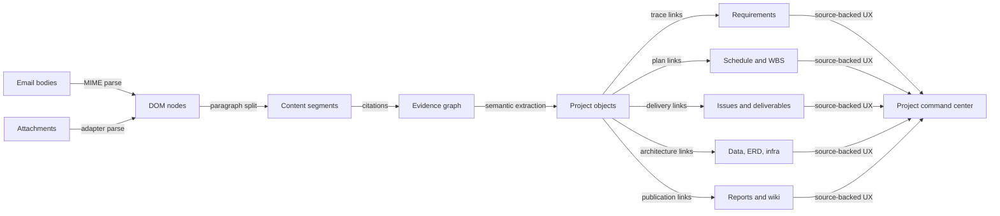

# Project Semantic Knowledge Graph 제품화 설계

작성일: 2026-07-02
기준 브랜치: `origin/develop` after PR #895 merge
대상: 이메일 본문과 첨부파일의 DOM/문단 지식그래프를 프로젝트 관리 자동화 제품으로 확장
가격 기준: 20억 원 판매 가능 수준의 엔터프라이즈 패키지
Figma 산출물: [Naruon Project Semantic KG FigJam](https://www.figma.com/board/ayoR2im9q2xNCxR4hNK2nN)
Figma Code Connect: 제외

## 현재 기반

PR #895는 Naruon에 판매 가능한 "증거 기반 AI"의 하위 기반을 만들었다. 현재 develop에는 다음 축이 이미 존재한다.

- `backend/services/content_graph/`: 이메일 본문과 텍스트 계열 첨부를 DOM 유사 노드와 문단 세그먼트로 분해한다.
- `backend/services/email_import_service.py`: 세그먼트 저장과 deterministic knowledge graph edge 생성을 import 흐름에 붙인다.
- `backend/db/models.py`: `ContentSegmentRecord`, `KnowledgeGraphEdgeRecord` 모델로 source-backed evidence를 저장한다.
- `backend/api/data.py`: attachment parse, content graph, knowledge graph coverage와 evidence sample을 Data workspace에 노출한다.
- `frontend/src/components/data-layout/types.ts`: parser/graph/data quality 지표가 프론트 계약에 포함되어 있다.

따라서 다음 제품화 단계는 파서를 다시 크게 바꾸는 것이 아니라, content segment와 graph edge를 프로젝트 관리 도메인 객체로 투영하는 `project_graph` 계층을 추가하는 것이다.

## 외부 시장 근거

- Gartner는 2026년 말까지 enterprise application의 40%가 task-specific AI agent를 포함할 것으로 전망했다. Naruon의 방향은 "메일을 읽는 도구"가 아니라 "프로젝트 업무 agent가 근거를 추적하며 일하는 시스템"이어야 한다.
  - https://www.gartner.com/en/newsroom/press-releases/2025-08-26-gartner-predicts-40-percent-of-enterprise-apps-will-feature-task-specific-ai-agents-by-2026-up-from-less-than-5-percent-in-2025
- Gartner는 agentic AI 프로젝트의 40% 이상이 2027년 말까지 비용, 불명확한 가치, 위험 통제 부족으로 취소될 수 있다고 경고했다. 따라서 Naruon은 "자동 생성"보다 "출처, 교정, 감사를 갖춘 자동화"를 판매 기준으로 삼아야 한다.
  - https://www.gartner.com/en/newsroom/press-releases/2025-06-25-gartner-predicts-over-40-percent-of-agentic-ai-projects-will-be-canceled-by-end-of-2027
- PMI의 2025 Pulse 자료는 프로젝트 전문가가 전술 실행을 넘어 의사결정, 이해관계자 조율, 위험 완화를 포함한 business acumen을 요구받는다는 점을 보여준다. Naruon의 프로젝트 그래프는 단순 일정표가 아니라 의사결정과 가치 전달의 근거망이어야 한다.
  - https://www.pmi.org/-/media/pmi/documents/public/pdf/learning/thought-leadership/pulse/pulse_of_the_profession_2025-1.pdf
- Fortune Business Insights는 AI in project management 시장을 2026년 USD 4.14B에서 2034년 USD 13.29B로 성장하는 범주로 제시한다. Naruon은 범용 PM 툴이 아니라 "메일/첨부 원본에서 자동 생성되는 source-backed project intelligence"로 포지셔닝한다.
  - https://www.fortunebusinessinsights.com/ai-in-project-management-market-114216

## 제품 정의

Naruon Project Semantic KG는 이메일 본문과 첨부파일의 모든 내부 내용을 DOM 구조와 문단 단위로 분해한 뒤, 각 문단을 프로젝트 관리 도메인 객체와 연결하는 지식그래프다. 사용자는 결과 화면에서 요구사항, 일정, 이슈, WBS, 산출물, 데이터 요건, ERD, 인프라 요건, 주간/일일 보고, 프로젝트 위키를 볼 수 있어야 하며, 모든 항목은 원본 세그먼트 citation으로 되돌아갈 수 있어야 한다.

20억 원 판매 가능 기준은 다음이다.

- 1,000개 이상의 실제 업무 메일/첨부 private corpus를 가져와도 120초 안에 프로젝트 후보와 핵심 traceability를 보여준다.
- 자동 생성된 모든 프로젝트 객체는 source segment UID, source path, confidence, extractor version, correction trail을 가진다.
- 고객 실사자가 샘플 요구사항 하나를 클릭하면 최초 이메일 문단, 첨부파일 문단, 관련 일정, WBS, 이슈, 산출물, 보고서 문단까지 따라갈 수 있다.
- 자동화 결과가 틀렸을 때 삭제가 아니라 "반박 evidence"와 "human correction"으로 그래프가 갱신된다.
- 고객 데이터는 public CI로 가지 않고 local/private runner evidence로 검증된다.

## 아키텍처

계층은 네 개로 나눈다.

1. Content evidence layer
   - 이미 존재하는 `content_graph`가 책임진다.
   - 역할: safe text, DOM path, paragraph segment, source hash, parser status, graph edge.

2. Project semantic extraction layer
   - 새 내부 패키지 `backend/services/project_graph/`로 둔다.
   - 역할: segment를 project candidate, requirement, issue, milestone, work item, data requirement, ERD candidate, infra requirement, deliverable, report delta로 분류한다.

3. Project projection layer
   - DB migration과 read API로 둔다.
   - 역할: queryable project object, traceability edge, correction state, extractor audit를 저장한다.

4. Product UX layer
   - 기존 Mail, Data, Search, AI Hub 패턴을 확장한다.
   - 역할: Project Command Center, Traceability Map, WBS board, Report/Wiki generator, Evidence Inspector를 제공한다.

## 도메인 객체

| 객체 | 생성 근거 | 핵심 필드 | 필수 엣지 |
| --- | --- | --- | --- |
| `project_candidate` | 메일 thread, 제목, 고객명, 산출물/일정 언급 | name, workspace, status, confidence | source segment, participant |
| `project_requirement` | 요구, 필수, should, must, 요청, 정책, 제약 문단 | type, priority, owner, status | source segment, decision, work item |
| `project_feature` | 기능, user story, acceptance criteria, 화면 정의 | capability, scenario, acceptance | requirement, wireframe, issue |
| `project_issue` | blocker, defect, delay, risk, question, approval-needed | severity, status, assignee, due date | source segment, requirement, milestone |
| `project_milestone` | 날짜, 회의 결과, 릴리즈, 납기, 승인 일정 | planned date, actual date, confidence | source segment, WBS item |
| `project_wbs_item` | 산출물, 작업, phase, sprint, backlog 언급 | method, phase, epic, story, task | requirement, deliverable, issue |
| `project_deliverable` | SRS, PRD, ERD, wireframe, report, test result | artifact type, completion state | WBS item, source file, evidence |
| `project_participant` | 발신자, 수신자, 멘션, 역할 문구 | person, org, role, authority | thread, project, decision |
| `data_requirement` | entity, attribute, source, privacy, retention, quality rule | entity, field, policy, quality rule | source segment, requirement, ERD entity |
| `erd_candidate` | 테이블, 관계, 컬럼, 식별자 문단 | entity, relationship, cardinality | data requirement, source segment |
| `infra_requirement` | 환경, 네트워크, runner, secret, backup, SLO | environment, control, policy | requirement, issue, deliverable |
| `project_report_snapshot` | graph delta와 period | daily/weekly, changes, unresolved gaps | source segment, every cited object |
| `wiki_page_projection` | graph projection view | page slug, sections, freshness | source segment, source objects, report snapshot |

## 추적 엣지

프로젝트 관리 제품으로 팔려면 edge가 "있다"가 아니라 "업무 결정을 설명한다"까지 가야 한다.

- `segment_evidences_project_object`
- `requirement_refines_requirement`
- `requirement_realized_by_feature`
- `requirement_blocked_by_issue`
- `requirement_requires_data_requirement`
- `data_requirement_maps_to_erd_entity`
- `infra_requirement_constrains_requirement`
- `work_item_implements_requirement`
- `work_item_belongs_to_waterfall_phase`
- `work_item_belongs_to_agile_epic`
- `milestone_schedules_work_item`
- `deliverable_evidences_work_item`
- `wireframe_defines_feature`
- `participant_owns_project_object`
- `report_snapshot_summarizes_delta`
- `wiki_page_projects_graph_state`

## 자동화 범위

요구사항 분석과 추적:

- 문단을 business, functional, non-functional, data, infrastructure, security, integration requirement로 분류한다.
- requirement마다 source segment, confidence, extractor version, human correction 상태를 가진다.
- 요구사항 변경은 overwrite하지 않고 supersedes/refines edge로 버전 관리한다.

일정, 이슈, 기능정의 추적:

- 날짜/기간/마일스톤/지연 신호를 milestone과 schedule risk로 만든다.
- blocker, defect, question, decision-needed 문단을 issue candidate로 만든다.
- 기능정의는 capability, user story, acceptance criteria, rule, out-of-scope로 나눈다.

Wireframe과 범위 추적:

- Figma frame URL, mockup 파일명, 첨부 이미지, 화면 요구사항 문단을 `wireframe_artifact`로 연결한다.
- Figma Code Connect는 사용하지 않는다.
- scope in/out, change request, approval 문단을 scope ledger로 유지한다.

프로젝트 자동 등록과 상태/인물 업데이트:

- 새 프로젝트 후보는 thread cluster, 고객명, 산출물명, 일정 언급, participant density로 생성한다.
- 상태는 graph delta로만 바뀐다. 예: "승인 완료" 문단이 있어야 `approved`가 된다.
- 인물은 sender/recipient만으로 확정하지 않고 role phrase와 decision authority 문구를 함께 본다.

WBS 자동 관리:

- Waterfall projection: phase, work package, deliverable, owner, planned date, actual date, dependency, sign-off.
- Agile projection: epic, story, task, acceptance criteria, sprint candidate, blocker, done evidence.
- 하나의 source segment가 양쪽 projection에 모두 연결될 수 있다.

산출물, 보고, 위키:

- 산출물은 파일 존재가 아니라 completion evidence와 approval evidence를 가진다.
- 일일/주간 보고는 graph delta를 period 기준으로 요약한다.
- wiki page는 별도 truth source가 아니라 graph projection이다. 모든 문단은 source object와 source segment를 인용한다.

데이터 요건, ERD, 인프라:

- entity, attribute, retention, privacy, quality rule, reporting requirement를 추출한다.
- ERD는 candidate와 approved를 분리한다.
- infra requirement는 environment, network, host, runner, storage, backup, SLO, deployment, compliance control을 추출한다.

## 제품 디자인 기준

Product Design 저장 컨텍스트는 현재 존재하지 않았다. 따라서 UI 방향은 현재 Naruon의 Mail, Data, Search, AI Hub 흐름과 기존 design system을 먼저 재사용하는 것으로 둔다.

첫 화면은 landing page가 아니라 Project Command Center여야 한다.

- 좌측: project list, source health, unread graph deltas.
- 중앙: traceability map과 WBS/issue/milestone tabs.
- 우측: Evidence Inspector. 선택 항목의 source segment, DOM path, attachment path, confidence, correction history를 표시한다.
- 상단: daily/weekly report generate, wiki regenerate, export diligence packet actions.

피해야 할 UI:

- 마케팅형 hero.
- 카드 안에 카드가 반복되는 대시보드.
- 출처 없는 AI 요약.
- 문서 전체를 복사한 wiki 페이지.

## KPI Framework

North Star:

- `source_backed_project_decision_rate`: 사용자에게 노출되는 프로젝트 의사결정, 요구사항, 일정, 이슈, 보고 문단 중 source segment citation을 가진 비율.

Activation:

- `project_auto_registration_success_rate`: import된 corpus에서 프로젝트 후보가 생성되고 사람이 10분 안에 확인 가능한 비율.
- `first_traceability_path_time_seconds`: 메일 import 후 requirement -> WBS -> issue/report path가 처음 노출되기까지 걸린 시간.

Coverage:

- `requirement_extraction_coverage_rate`
- `wbs_projection_coverage_rate`
- `issue_candidate_coverage_rate`
- `deliverable_trace_coverage_rate`
- `data_requirement_trace_coverage_rate`
- `infra_requirement_trace_coverage_rate`

Quality:

- `semantic_extractor_precision_sample`
- `semantic_extractor_recall_sample`
- `citation_click_success_rate`
- `human_correction_acceptance_rate`
- `stale_project_object_rate`

Guardrails:

- `cross_workspace_leak_count` must be zero.
- `raw_markup_exposure_count` must be zero.
- `real_mail_public_ci_count` must be zero.
- `unsupported_parser_false_success_count` must be zero.
- `uncited_generated_report_paragraph_count` must be zero.

Economics:

- `cost_per_thousand_segments`
- `cost_per_project_projection`
- `p95_import_to_project_ready_seconds`
- `pilot_corpus_setup_hours`
- `buyer_evidence_packet_completion_rate`

## Ponytail 판단

별도 라이브러리 또는 submodule 분리는 지금 하지 않는다.

판단 근거:

- 첫 소비자는 아직 Naruon backend 하나다.
- schema, UX, correction workflow가 아직 pilot corpus로 고정되지 않았다.
- 별도 package는 semver, release, migration compatibility, customer support surface를 늘린다.
- 현재는 `backend/services/content_graph/`와 새 `backend/services/project_graph/` 내부 경계가 변경 비용이 가장 낮다.

분리 조건:

- 두 번째 runtime consumer가 생긴다. 예: CLI importer, customer SDK, self-hosted worker.
- 고객 계약에서 parser/project graph만 독립 배포해야 한다.
- ingestion worker와 app backend가 서로 다른 release cadence를 갖는다.
- 보안 심사에서 parsing sandbox를 별도 process/package로 분리해야 한다.

금지 조건:

- "나중에 좋아 보인다"는 이유로 submodule을 만들지 않는다.
- 범용 workflow engine, 범용 ontology framework, 대형 parser framework를 먼저 넣지 않는다.
- PDF/DOCX/HWP deep parser는 pilot corpus와 보안 검토가 통과될 때 adapter로 추가한다.

## 실행 원칙

- Review process와 GitHub checks queued 상태는 blocker가 아니다. 실패한 current-head check만 patch/test/push 대상으로 본다.
- 모든 자동화는 source segment citation이 없으면 사용자에게 확정 결과로 노출하지 않는다.
- private real mail smoke는 local/private runner에서만 한다.
- CodeGraph는 구조 탐색과 영향도 판단에 사용한다.
- Figma는 FigJam 다이어그램과 제품 구조 시각화에 사용한다. Code Connect 관련 도구는 사용하지 않는다.
