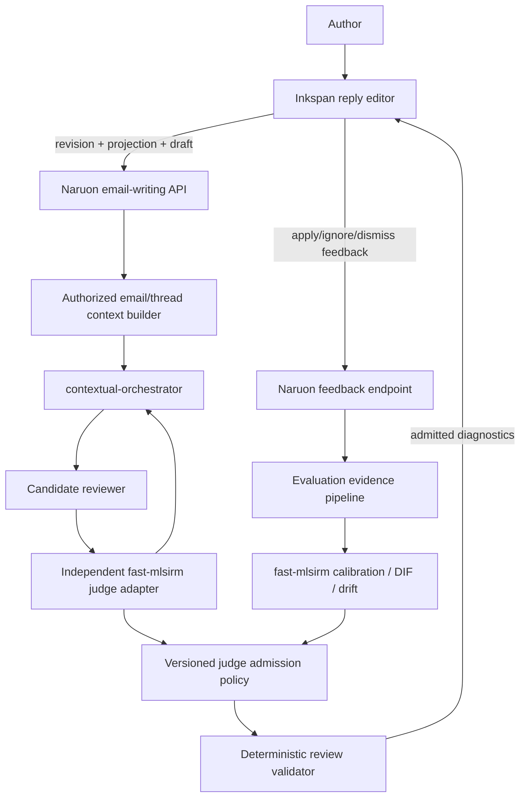

# Inkspan-Based LLM Email Writing Guidance Design

**Date:** 2026-08-12  
**Status:** Proposed design; no shipped feature is claimed  
**Repositories:** `ContextualWisdomLab/naruon`, `ContextualWisdomLab/inkspan`, `ContextualWisdomLab/fast-mlsirm`, and `ContextualWisdomLab/contextual-orchestrator`

## Objective

Replace Naruon's plain reply textarea and one-shot rewrite experience with a Grammarly-like, revision-safe authoring workflow:

- the user writes directly in Inkspan;
- Naruon reviews the current reply against the authorized source email, complete relevant thread, recipients, reply purpose, and tenant policy;
- an LLM produces passage-level candidate diagnostics;
- an independent LLM-as-a-Judge evaluates each candidate under a versioned rubric;
- deterministic code admits only exact-schema, current-revision, selector-valid results;
- Inkspan displays, navigates, applies, ignores, and dismisses suggestions;
- fast-mlsirm calibrates judge behavior and publishes versioned admission evidence;
- no keyword, regex, phrase dictionary, sender domain, recipient-count rule, language-name rule, or positional repair acts as a semantic fallback.

The feature is writing guidance, not a send-risk score or mandatory gate.

## User experience

### Continuous authoring

The reply composer is an Inkspan editor in email-compatible HTML mode. The user can type, paste safe rich content, format, undo, and send even when semantic review is unavailable.

### Incremental review

After a bounded debounce, Naruon reviews the changed paragraph or selection plus enough authorized thread context to interpret it. The semantic decision is model-based. No local trigger-word detector assigns a category before or after the model call.

### Deep review

The author can request `전체 메일 검토`. Deep review examines the complete draft for cross-sentence structure, repetition, actor ambiguity, request completeness, audience pragmatics, technical precision, and intent preservation. contextual-orchestrator may use separate reviewer, critic, judge, and adjudicator roles.

### Suggestions

Each admitted diagnostic shows:

- affected passage;
- category and concise title;
- evidence-based explanation;
- optional replacement;
- bounded confidence and admission provenance appropriate for the UI;
- Apply, Ignore, Dismiss, and Explain actions.

Apply changes only the bound passage. Ignore and Dismiss do not alter the document. New asynchronous results do not steal focus. Stale results are visibly invalidated and cannot apply.

### Whole-document guidance

Issues without one safe replacement range may be returned as non-mutating document guidance:

- inferred purpose summary;
- likely reader interpretation;
- unclear actor or missing deliverable;
- missing deadline or response channel;
- structural reordering suggestion;
- unresolved factual or technical verification question.

Document guidance never mutates the editor without a separate explicit author action.

## Architecture



## Component boundaries

### `email_writing_api`

Owns authenticated HTTP contracts, tenant/workspace scope, rate limits, payload bounds, idempotency, and privacy-safe error mapping.

### `email_writing_context_service`

Re-reads the source email and relevant thread by server-authorized identifiers. It creates a bounded context bundle containing the subject, selected source message, relevant prior messages, sender/recipient metadata, explicit reply objective, and current draft. Client-provided thread text or recipient roles are never authoritative.

### `email_writing_review_service`

Builds untrusted-data-delimited prompts, calls contextual-orchestrator, validates the candidate response, invokes the independent judge, applies the published admission policy, and returns a structured result.

### `writing_review_judge_port`

Defines Naruon's interface to a judge. The preferred adapter consumes a released, hash-locked fast-mlsirm package and delegates every model call through contextual-orchestrator. The port prevents API routers from depending on fast-mlsirm internals.

### `writing_diagnostic_validator`

Performs deterministic structural, authorization-adjacent, revision, projection, Unicode, grapheme, selector, overlap, and safety validation. It does not infer semantics.

### `InkspanReplyEditor`

A small Naruon `'use client'` boundary around the released Inkspan editor. It owns editor refs, revision capture, diagnostic props, current-review state, feedback callbacks, email serialization, focus, and send integration.

### `judge_policy_registry`

Provides integrity-bound policy artifacts: rubric version, category anchors, accepted model/provider set, calibration scope, language profiles, admission rules, expiry, and rollback version. Runtime consumes a published policy; it does not fit a model.

## API contracts

### `POST /api/email-writing/reviews`

Creates a bounded review for one exact editor revision.

```json
{
  "source_email_id": 184,
  "document_revision": "\"sha256-BASE64URL\"",
  "projection_name": "inkspan-prosemirror-text",
  "projection_version": 1,
  "draft_plain_text": "안녕하세요. ...",
  "language_tag": "ko",
  "review_mode": "incremental",
  "changed_selector": {
    "type": "TextPositionSelector",
    "start": 0,
    "end": 42
  },
  "reply_objective": "자료 범위와 회신 일정을 명확히 확인"
}
```

Rules:

- `source_email_id` is scoped and re-read server-side;
- revision, projection, and draft describe one exact Inkspan snapshot;
- `changed_selector` is required in incremental mode and omitted in deep mode;
- `reply_objective` is untrusted user guidance, not a policy override;
- unexpected fields are rejected;
- raw email or thread content is not accepted from the browser as authoritative context.

Response:

```json
{
  "review_session_id": "email_review_01J...",
  "document_revision": "\"sha256-BASE64URL\"",
  "projection_name": "inkspan-prosemirror-text",
  "projection_version": 1,
  "review_status": "completed",
  "diagnostics": [
    {
      "diagnostic_id": "writing_diagnostic_01J...",
      "document_revision": "\"sha256-BASE64URL\"",
      "projection_name": "inkspan-prosemirror-text",
      "projection_version": 1,
      "selector": {
        "type": "TextPositionSelector",
        "start": 12,
        "end": 35
      },
      "category_code": "audience_pragmatics",
      "priority": "important",
      "title": "질문의 목적을 먼저 제시하는 편이 명확합니다",
      "explanation": "현재 표현은 확인 요청보다 상대 답변의 타당성을 평가하는 반문으로 읽힐 수 있습니다.",
      "suggested_replacement": "말씀하신 작업이 기존 범위에 포함되는지와 수행 주체를 확인 부탁드립니다.",
      "confidence": 0.86,
      "provenance": {
        "workflow_id": "email_writing_review",
        "workflow_version": "1",
        "judge_policy_version": "email_writing_judge_v1",
        "orchestration_mode": "conduct"
      }
    }
  ],
  "document_guidance": {
    "purpose_summary": "자료 범위와 일정 확인",
    "reader_interpretation": "여러 확인 질문과 전문성 방어가 섞여 핵심 요청이 흐려질 수 있음",
    "missing_requests": ["수행 주체", "회신 가능 예정일"],
    "structure_suggestion": "목적, 확인 항목, 요청 산출물, 일정 순으로 정리"
  },
  "provenance": {
    "provider_name": "approved-provider",
    "model_name": "approved-model",
    "rubric_version": "email_writing_rubric_v1",
    "judge_policy_version": "email_writing_judge_v1",
    "prompt_hash": "sha256:..."
  }
}
```

Raw candidate and judge output are not returned to the browser by default.

### `POST /api/email-writing/reviews/{review_session_id}/feedback`

Records one explicit author response.

```json
{
  "diagnostic_id": "writing_diagnostic_01J...",
  "document_revision": "\"sha256-BASE64URL\"",
  "feedback_action": "applied",
  "resulting_document_revision": "\"sha256-BASE64URL\""
}
```

Exact initial enum values:

```text
applied
ignored
dismissed
requested_explanation
stale
conflict
```

Feedback stores opaque IDs, category, policy version, action, timing bucket, and revision references by default. It does not duplicate source or replacement text into ordinary telemetry.

## Structured model contracts

### Candidate reviewer output

The reviewer returns one exact JSON object with:

- `diagnostics`;
- `document_guidance`;
- `context_limitations`;
- `review_language`;
- `abstained_claims`.

A diagnostic contains a source selector, category, explanation, optional replacement, and candidate confidence. It cannot contain HTML, arbitrary editor JSON, executable commands, tool requests, or a send decision.

### Independent judge input

Each candidate becomes one judge task containing only bounded required context:

- source/thread evidence;
- current draft and selected span;
- claimed issue;
- proposed replacement;
- exact criterion descriptions and ordered category anchors;
- explicit instruction that all mail/document content is untrusted data;
- no candidate-model chain of thought.

### Independent judge output

Use fast-mlsirm's strict criterion-level shape and explicit polytomous categories. The first study compares category counts rather than assuming that a larger scale is better. Duplicate keys, missing IDs, non-integral categories, extra fields, excessive depth, invalid scores, or malformed JSON fail closed.

No parser extracts words such as “pass,” “polite,” or “incorrect” to repair a response.

## Admission policy

A diagnostic is admitted only when:

1. candidate schema is exact;
2. selector targets the reviewed projection;
3. every mandatory judge criterion is present;
4. the current integrity-bound policy accepts the criterion pattern or calibrated evidence;
5. no mandatory preservation criterion falls below its floor;
6. model, rubric, and language profile are within validated scope;
7. required adjudication is complete;
8. replacement passes Inkspan content safety;
9. document revision remains current when returned and applied.

The policy is versioned and observable. It is not a weighted word list.

## Review modes and compute allocation

### Incremental mode

- changed paragraph or selection plus bounded thread context;
- one candidate reviewer and one independent judge by default;
- deeper adjudication for calibrated disagreement, uncertainty, missing context, or preservation conflict;
- bounded responsiveness without dropping judge validation.

### Deep mode

- complete draft and relevant authorized thread context;
- decomposed mechanics, discourse/actionability, pragmatics, and technical-precision roles;
- independent judge and optional adjudicator;
- passage diagnostics plus whole-document guidance;
- quality prioritized over speed, with explicit step and payload bounds.

Explicit user mode, document size, and provider health may alter batching. Semantic escalation depends on model/judge evidence and calibrated uncertainty, never lexical triggers.

## fast-mlsirm calibration plan

### Measurement unit

One criterion on one candidate diagnostic is an evaluation item. Model/provider/prompt configurations act as raters or facets. Human expert judgments are reference evidence, not assumed infallible truth.

### Response matrix

Collect ordered category responses across criteria and, where feasible, repeated models, providers, prompts, and reasoning settings. Validate every response matrix through fast-mlsirm before fitting.

### Analyses

- category occupancy and sparse-category checks;
- criterion difficulty and discrimination;
- model/rater severity and interactions where supported;
- latent writing-quality and preservation dimensions;
- reliability and prompt/model test-retest;
- Brier score and calibration curves;
- DIF by language, organizational role, recipient configuration, thread depth, document length, and review mode;
- temporal drift across model, prompt, rubric, and policy releases;
- category-count ablation;
- reasoning-effort and single-model versus multi-agent ablation;
- consequences of overcorrection and missed issues.

### Policy publication

A calibration run emits an integrity-bound `judge_policy_artifact` containing:

- version, creation time, expiry, and rollback version;
- compatible fast-mlsirm, Naruon, Inkspan, and orchestrator contract versions;
- approved model/provider/rubric/language profiles;
- category anchors and admission rules;
- calibration and DIF summary;
- dataset and source hashes;
- a pre-registered `protocol_id` and `protocol_hash`;
- `calibration_split_hash`, `development_split_hash`, and
  `locked_holdout_hash`, with the locked holdout reserved for the final
  publish/no-publish decision;
- a fixed `minimum_slice_sample_size` of 30 labeled cases per prespecified
  slice;
- literal publication thresholds for holdout macro-F1, mandatory preservation,
  unsupported-claim rate, expected calibration error, and prespecified slice
  performance;
- a `publish_decision` of `publish` or `withhold`;
- known limitations.

Naruon runtime consumes the artifact but does not refit it, and admits it for
user-facing diagnostics only when `publish_decision == "publish"`. `withhold`
and `evaluation_only` artifacts remain audit/pipeline evidence and cannot
produce user-facing output. Changing a split, threshold, protocol, or holdout
requires a new protocol version and a new artifact. Thresholds are frozen before
locked-holdout labels are accessed; tuning against that holdout invalidates the
run for publication and requires a new locked holdout.

## Benchmark design

### Long-lived data boundary

Use consented, de-identified, or synthetic reconstruction cases. Do not persist real confidential mail bodies merely because Naruon can read them.

### Required domains

- internal status and deadline requests;
- vendor/client scope disputes;
- responsibility and deliverable clarification;
- incident reporting;
- meeting coordination;
- technical review;
- executive updates;
- apology and correction;
- Korean, English, mixed-language, and code-switched mail.

### Contrast sets proving semantic behavior

1. identical words in quotation, neutral transcript, and direct rebuke;
2. the same issue paraphrased without trigger words;
3. apparent misspellings used as product names, identifiers, URLs, file paths, quotations, or code;
4. identical draft under peer, executive-CC, and external-customer contexts;
5. a firm legitimate deadline request that must not be weakened;
6. polite but technically unsuitable metric or method requests;
7. terse acceptable operational messages that must not be expanded gratuitously.

### Metrics

- issue/category precision, recall, macro-F1;
- selector exactness, smallest-sufficient-span rate, and span intersection-over-union;
- replacement correctness;
- intent, fact, actor, deadline, request-strength, and technical-claim preservation;
- unsupported-claim and hallucinated-fact rate;
- accepted-suggestion precision and ignore rate;
- human inter-rater agreement;
- Brier score, expected calibration error, and reliability curves;
- category occupancy, DIF, and drift;
- latency, token, step, and cost distributions;
- stale/conflict rates;
- accessibility task success.

No scalar “email risk score” is a release criterion.

## Data model

Phase 1 may keep review state ephemeral. Persistent objects, if later required, use two-or-more-word `snake_case` names:

```text
email_review_session
writing_diagnostic_record
diagnostic_feedback_event
judge_policy_artifact
judge_calibration_run
review_model_profile
review_rubric_version
review_evaluation_case
```

Raw source email or draft text is not duplicated by default. Persisted diagnostic content requires encryption, retention, access, and deletion policy and never becomes canonical email content.

## Privacy and PII controls

Naruon does not blindly mask names, roles, organizations, dates, quantities, or relationships required to judge pragmatics and actionability. It uses compensating controls:

- tenant policy and explicit provider approval;
- encrypted transport and credential registry;
- region/provider/model restrictions;
- contractual no-training/no-secondary-use controls;
- short-lived review context and no ordinary raw-content logging;
- opaque IDs and privacy-minimized feedback telemetry;
- synthetic or de-identified long-lived evaluation corpora;
- access-controlled export and deletion;
- audit outcomes without copied mail text.

A tenant may disable remote review or require an approved local provider. If no allowed model exists, semantic review is unavailable; no lexical fallback runs.

## Prompt-injection boundary

Source email, quoted thread, draft, display names, signatures, attachment-derived text, and reply objective are untrusted data. Prompts use delimited JSON/data blocks. Content cannot change the rubric, tool access, output schema, provider policy, or system instruction.

Candidate and judge roles receive minimum required context and no arbitrary tool access. Parsers reject duplicate keys, extra fields, unsupported identifiers, excessive nesting, and unbounded strings.

## Error contract

```text
review_completed
review_abstained
review_unavailable
review_stale
review_rejected
context_insufficient
policy_unavailable
provider_unavailable
judge_disagreement
```

External responses omit raw provider errors, prompts, credentials, server URLs, and email text. Logs retain typed codes and trace IDs, not source content.

## Observability

Allowed ordinary metrics:

- review status and mode;
- document/range length bucket;
- diagnostic/category counts;
- policy/rubric/model profile IDs;
- latency, token, step, retry, and cost buckets;
- admission, abstention, disagreement, feedback, stale, and conflict counts;
- provider health.

Disallowed by default:

- email or draft text;
- selected span or replacement;
- full explanation;
- prompts or raw responses;
- participant identities;
- document envelopes;
- secrets.

## Accessibility

The integration preserves Inkspan's accessible diagnostic contract:

- keyboard navigation;
- accessible category, count, passage, and explanation;
- non-color-only range indication;
- predictable focus after open/apply/ignore/close;
- polite completion and stale-status announcements;
- no asynchronous focus theft;
- screen-reader equivalence to pointer behavior;
- touch targets suitable for mobile use.

## Security and threat cases

Tests include:

- source content instructing the model to ignore policy or approve everything;
- quoted JSON pretending to be judge output;
- duplicate-key, deep-nesting, oversized, and hostile-Unicode output;
- cross-tenant source IDs and forged feedback IDs;
- stale revision and selector reuse;
- unsafe HTML/link/image replacements;
- provider URL SSRF and DNS-rebinding under existing Naruon controls;
- raw-content leakage through logs, metrics, errors, or traces;
- judge self-preference and candidate/judge same-model ablations;
- credential-exfiltration attempts.

## Testing layers

### Backend

- exact schemas and extra-field rejection;
- auth and source re-read;
- prompt/data delimiting;
- strict candidate and judge parsing;
- no keyword or positional repair;
- policy admission and abstention;
- provider failure and stale result;
- privacy-safe telemetry.

### fast-mlsirm integration

- immutable released adapter and version compatibility;
- criterion/category contract;
- `to_irt_row()` and response-matrix validation;
- policy artifact parsing;
- offline calibration fixtures and deterministic seeds;
- scheduled live evaluation with `NVIDIA_NIM_API_KEY`.

### Frontend and Inkspan

- real Inkspan component instead of textarea;
- revision capture and review request;
- diagnostic rendering and callbacks;
- invalidation after editing;
- Apply, Ignore, Dismiss, Explain, and undo;
- focus, SSR, accessibility, email serialization, and sending;
- review outage does not disable editing or sending.

### End to end

- import/read a test email fixture;
- author a response;
- receive controlled model-backed diagnostics;
- apply one and ignore another;
- verify outgoing serialization and thread headers;
- assert no raw content in captured logs/metrics;
- run live-model evidence separately from deterministic CI.

## Release sequence

1. accept Inkspan design/ADR;
2. write and execute Inkspan TDD plan;
3. release Inkspan diagnostic contract;
4. release the compatible strict fast-mlsirm judge/IRT contract;
5. implement Naruon backend adapter, benchmark, and policy artifact;
6. migrate Naruon reply composer to released Inkspan;
7. obtain exact-head CI, security, coverage, accessibility, package, and review evidence;
8. update CHANGELOG/version and evaluate release.

No mutable branch or source archive becomes a production dependency.

## Rollback

- disable semantic review by tenant/product configuration;
- preserve Inkspan authoring, drafts, and sending;
- stop review requests;
- retain only policy-required bounded audit evidence;
- optionally retain the separately described one-shot drafting path without claiming contextual inline review;
- require no canonical email or database migration to remove ephemeral state.

## Documentation and traceability required during implementation

- ADR index and architecture;
- API contract;
- threat model;
- test strategy;
- operability and retention;
- product-event dictionary;
- Inkspan version contract;
- fast-mlsirm calibration traceability;
- contextual-orchestrator workflow/role contract;
- APA 7th doctoring;
- CHANGELOG and release evidence.

## Approval boundary

Approval of this design authorizes only a detailed implementation plan. It does not claim the feature, model accuracy, language coverage, privacy controls, or cross-repository integration are shipped. Those claims require protected-branch implementation and exact-head evidence in every affected repository.
