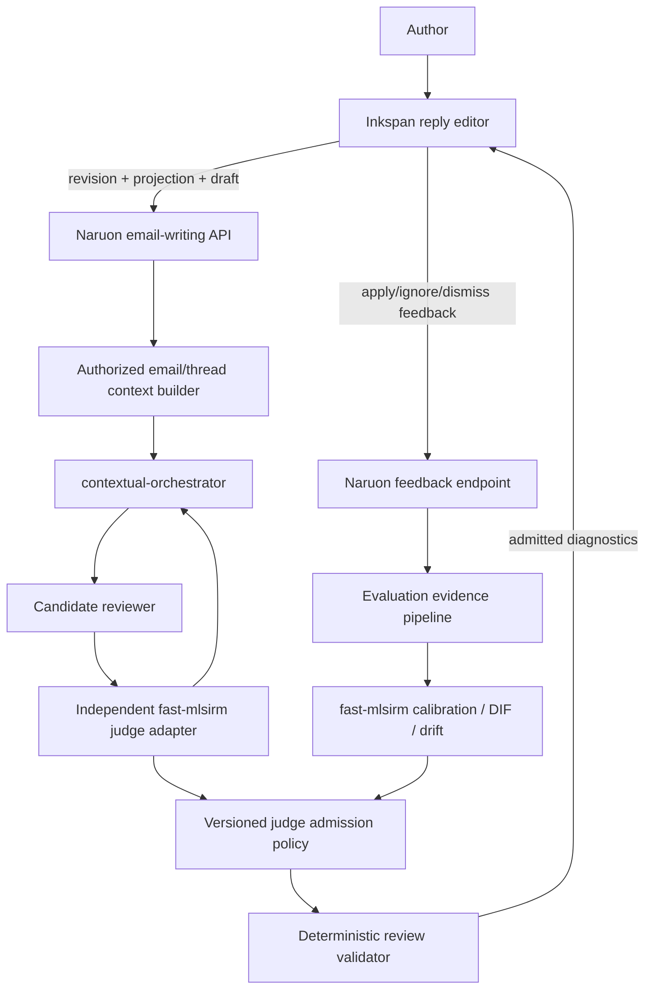

# Inkspan-Based LLM Email Writing Guidance Design

**Date:** 2026-08-12  
**Status:** Proposed design; no shipped feature is claimed  
**Repositories:** `ContextualWisdomLab/naruon`, `ContextualWisdomLab/inkspan`, `ContextualWisdomLab/fast-mlsirm`, and `ContextualWisdomLab/contextual-orchestrator`

## Objective

Replace Naruon's plain reply textarea and one-shot rewrite experience with a Grammarly-like, revision-safe authoring workflow:

- the user writes directly in Inkspan;
- Naruon reviews the current reply against the source email, complete thread, recipients, reply purpose, and tenant policy;
- an LLM produces passage-level candidate diagnostics;
- an independent LLM-as-a-Judge evaluates those candidates under a versioned rubric;
- deterministic code admits only strict, current-revision, selector-valid results;
- Inkspan displays, navigates, applies, ignores, and dismisses suggestions;
- fast-mlsirm calibrates judge behavior and publishes versioned admission evidence;
- no keyword, regex, phrase dictionary, domain list, or positional repair acts as a semantic fallback.

The feature is writing guidance, not a send-risk score or mandatory gate.

## User experience

### Continuous authoring

The reply composer is an Inkspan editor in email-compatible HTML mode. The user can type, paste safe rich content, use formatting, undo, and send even when semantic review is unavailable.

### Incremental review

After a bounded debounce, Naruon reviews the changed paragraph plus enough authorized document/thread context to interpret it. Incremental review is optimized for responsive feedback, but semantic correctness is still model-based. It does not run a local trigger-word detector before deciding what category to assign.

### Deep review

The author can explicitly request `전체 메일 검토`. Deep review evaluates the complete draft for cross-sentence structure, repetition, actor ambiguity, request completeness, audience pragmatics, technical precision, and intent preservation. It may use contextual-orchestrator conduct mode with separate reviewer, critic, judge, and adjudicator roles.

### Suggestions

Each admitted diagnostic shows:

- affected passage;
- category and concise title;
- evidence-based explanation;
- optional replacement;
- confidence/admission provenance appropriate for the UI;
- Apply, Ignore, Dismiss, and Explain actions.

Apply changes only the bound passage. Ignore and Dismiss do not alter the document. New asynchronous results do not steal focus. Stale results are visibly invalidated and cannot apply.

### Whole-document guidance

Some issues cannot be represented as one replacement range. The response may therefore also contain non-mutating document guidance, such as:

- inferred purpose summary;
- likely reader interpretation;
- unclear actor or missing deliverable;
- missing response deadline or channel;
- structural reordering suggestion;
- unresolved factual/technical verification question.

Document guidance is advisory and cannot mutate the editor without a separate, explicit author action.

## Architecture



### Component boundaries

#### `email_writing_api`

Owns authenticated HTTP contracts, tenant/workspace scope, rate limits, payload bounds, idempotency, and error mapping.

#### `email_writing_context_service`

Re-reads the source email and thread by opaque server-authorized identifiers. It creates a bounded context bundle with subject, selected source message, relevant prior messages, sender/recipient metadata, explicit reply objective, and current draft. Client-provided recipient roles or thread text are never authoritative.

#### `email_writing_review_service`

Builds untrusted-data-delimited prompts, calls contextual-orchestrator, validates the candidate response, invokes the independent judge, applies the published admission policy, and returns a structured review result.

#### `writing_review_judge_port`

Defines the Naruon-side interface to an LLM judge. The preferred adapter consumes a released, hash-locked fast-mlsirm package and delegates every model call through contextual-orchestrator. The port allows testing and future service deployment without leaking fast-mlsirm internals into the API router.

#### `writing_diagnostic_validator`

Performs only deterministic structural and revision validation. It does not infer semantics.

#### `InkspanReplyEditor`

A small Naruon `'use client'` boundary around the released Inkspan component. It owns editor refs, revision capture, diagnostic props, current-review state, feedback callbacks, email serialization, focus, and send integration.

#### `judge_policy_registry`

Provides signed/versioned policy artifacts: rubric version, category anchors, accepted model/provider set, calibration scope, language profiles, thresholds or posterior admission rules, expiry, and rollback version. The first implementation may load a checked-in bounded policy artifact; long-term persistence belongs in a two-word snake_case registry object.

## API contracts

### `POST /api/email-writing/reviews`

Creates a bounded semantic review for the current exact editor revision.

```json
{
  "source_email_id": 184,
  "document_revision": "\"sha256-BASE64URL\"",
  "projection_name": "inkspan-prosemirror-text",
  "projection_version": 1,
  "draft_plain_text": "안녕하세요. ...",
  "language_tag": "ko",
  "review_mode": "incremental",
  "changed_selector": {
    "type": "TextPositionSelector",
    "start": 0,
    "end": 42
  },
  "reply_objective": "자료 범위와 회신 일정을 명확히 확인"
}
```

Rules:

- `source_email_id` is scoped and re-read server-side.
- `document_revision`, projection, and draft must describe one exact Inkspan snapshot.
- `changed_selector` is required for incremental mode and omitted for deep mode.
- `reply_objective` is user guidance, not authority to override system policy.
- unexpected fields are rejected.
- raw email/thread data is not accepted from the browser as authoritative context.

Response:

```json
{
  "review_session_id": "email_review_01J...",
  "document_revision": "\"sha256-BASE64URL\"",
  "projection_name": "inkspan-prosemirror-text",
  "projection_version": 1,
  "review_status": "completed",
  "diagnostics": [
    {
      "diagnostic_id": "writing_diagnostic_01J...",
      "document_revision": "\"sha256-BASE64URL\"",
      "projection_name": "inkspan-prosemirror-text",
      "projection_version": 1,
      "selector": {
        "type": "TextPositionSelector",
        "start": 12,
        "end": 35
      },
      "category_code": "audience_pragmatics",
      "priority": "important",
      "title": "질문의 목적을 먼저 제시하는 편이 명확합니다",
      "explanation": "현재 표현은 확인 요청보다 상대 답변의 타당성을 평가하는 반문으로 읽힐 수 있습니다.",
      "suggested_replacement": "말씀하신 작업이 기존 범위에 포함되는지와 수행 주체를 확인 부탁드립니다.",
      "confidence": 0.86,
      "provenance": {
        "workflow_id": "email_writing_review",
        "workflow_version": "1",
        "judge_policy_version": "email_writing_judge_v1",
        "orchestration_mode": "conduct"
      }
    }
  ],
  "document_guidance": {
    "purpose_summary": "자료 범위와 일정 확인",
    "reader_interpretation": "여러 확인 질문과 전문성 방어가 섞여 핵심 요청이 흐려질 수 있음",
    "missing_requests": [
      "수행 주체",
      "회신 가능 예정일"
    ],
    "structure_suggestion": "목적, 확인 항목, 요청 산출물, 일정 순으로 정리"
  },
  "provenance": {
    "provider_name": "approved-provider",
    "model_name": "approved-model",
    "rubric_version": "email_writing_rubric_v1",
    "judge_policy_version": "email_writing_judge_v1",
    "prompt_hash": "sha256:..."
  }
}
```

The API does not expose raw candidate or judge output by default.

### `POST /api/email-writing/reviews/{review_session_id}/feedback`

Records an explicit author response.

```json
{
  "diagnostic_id": "writing_diagnostic_01J...",
  "document_revision": "\"sha256-BASE64URL\"",
  "feedback_action": "applied",
  "resulting_document_revision": "\"sha256-BASE64URL\""
}
```

Allowed actions initially:

```text
applied
ignored
 dismissed
requested_explanation
stale
conflict
```

Implementation must normalize the accidental whitespace in documentation and use exact enum values; the canonical value is `dismissed`.

Feedback stores opaque IDs, category, policy version, action, timing bucket, and revision references by default. It does not duplicate source text or replacement text into generic telemetry.

## Structured model contracts

### Candidate reviewer output

The reviewer returns an exact JSON object with:

- `diagnostics` array;
- `document_guidance` object;
- `context_limitations` array;
- `review_language`;
- `abstained_claims` array.

Each diagnostic contains a source selector, category, explanation, proposed replacement when appropriate, and candidate confidence. Category values must come from the current rubric. The output cannot include HTML, arbitrary editor JSON, commands, or a send decision.

### Independent judge input

Each candidate becomes one evaluation task. The judge sees:

- bounded source/thread context required for the criterion;
- current draft and selected span;
- the claimed issue;
- proposed replacement;
- exact criterion descriptions and ordered category anchors;
- explicit instruction that mail/document content is untrusted data;
- no candidate model self-reported chain of thought.

### Independent judge output

Use fast-mlsirm's strict criterion-level shape and polytomous categories. The initial policy should prefer at least four ordered categories so it can distinguish unsupported, weak, adequate, and strong evidence, subject to empirical category-count ablation.

No parser repairs a malformed response by extracting words such as “pass,” “polite,” or “incorrect.” Duplicate keys, missing criterion IDs, non-integral categories, extra fields, invalid depths, and invalid scores fail closed.

### Admission policy

An admitted diagnostic satisfies all of the following:

1. candidate output schema is valid;
2. source selector targets the current reviewed projection;
3. every mandatory judge criterion is present;
4. the signed current policy accepts the category pattern or calibrated posterior evidence;
5. no mandatory preservation criterion falls below its floor;
6. model/rubric/language profile is within the policy's validated scope;
7. no independent-adjudication requirement remains unresolved;
8. replacement passes Inkspan-safe content policy;
9. the document revision remains current when returned/applied.

The policy is versioned and observable. It is not a hidden weighted keyword score.

## Review modes and compute allocation

### Incremental mode

- input: changed paragraph/range plus bounded thread context;
- default workflow: one candidate reviewer plus one independent judge;
- deeper adjudication: triggered by calibrated disagreement, policy uncertainty, missing context, or preservation-criterion conflict;
- goal: responsive feedback without sacrificing explicit judge validation.

### Deep mode

- input: full draft, selected source email, relevant thread history, recipient roles, and reply objective;
- workflow: decomposed reviewer roles for mechanics, discourse/actionability, pragmatics, and technical precision; independent judge; optional adjudicator;
- output: passage diagnostics plus whole-document guidance;
- speed is secondary to quality, but payload and step bounds remain explicit.

### Operational mode selection

The explicit user action chooses incremental or deep review. Document length and provider availability may alter batching. Semantic escalation depends on model/judge evidence and calibrated uncertainty, not lexical triggers.

## fast-mlsirm calibration plan

### Measurement unit

A criterion on a candidate diagnostic is an evaluation item. A model/provider/prompt configuration acts as a rater. Human expert decisions provide reference evidence, not assumed infallible truth.

### Response matrix

For each diagnostic candidate, collect ordered category responses for multiple criteria and, where feasible, repeated raters/models/prompts. Use fast-mlsirm's response-matrix validation before fitting.

### Analyses

- item/category frequency and sparse-category checks;
- criterion difficulty and discrimination;
- model/rater severity and interaction where supported;
- latent writing-quality and preservation dimensions;
- reliability and prompt/model test-retest;
- Brier score and calibration curves for acceptance probabilities;
- differential item functioning by language, organization role, recipient configuration, thread depth, document length, and review mode;
- temporal drift across model, prompt, rubric, and policy releases;
- category-count ablation;
- reasoning-effort and single-model versus multi-agent ablation;
- human consequence analysis for overcorrection and missed issues.

### Policy publication

A calibration run emits a signed or integrity-bound `judge_policy_artifact` with:

- policy version and creation/expiry times;
- compatible fast-mlsirm, Naruon, Inkspan, and orchestrator contract versions;
- approved model/provider/rubric/language profiles;
- category anchors;
- admission and preservation rules;
- calibration and DIF summary;
- sample and dataset provenance hashes;
- known limitations and rollback policy.

Naruon runtime consumes the artifact but does not refit it.

## Benchmark design

### Human-authored cases

Build a consented, de-identified or synthetic reconstruction corpus covering:

- internal status requests;
- vendor/client scope disputes;
- deadline and responsibility clarification;
- incident reporting;
- meeting coordination;
- technical review;
- executive updates;
- apology/correction;
- Korean, English, mixed-language, and code-switched mail.

Do not persist real confidential mail bodies merely because they are available in Naruon.

### Contrast sets proving semantic—not keyword—behavior

1. **Same words, different meaning:** a phrase appears inside a quotation, a neutral incident transcript, and a direct interpersonal rebuke.
2. **Same issue, different words:** multiple paraphrases express public blame without sharing trigger terms.
3. **Proper name/code protection:** a suspected spelling form appears as a product name, identifier, URL, file path, quotation, or code sample.
4. **Context shift:** an identical draft is evaluated with a one-to-one peer recipient, a large executive CC list, and an external customer thread.
5. **Intent preservation:** a forceful but legitimate deadline request must not be weakened merely to sound polite.
6. **Technical precision:** a confident but unsuitable metric request receives technical guidance even without any “rude” wording.
7. **Non-issue negative controls:** terse but acceptable operational messages should not be expanded gratuitously.

### Metrics

- issue-level and category-level precision, recall, macro-F1;
- selector span intersection-over-union and exact/smallest-sufficient-span rate;
- replacement grammaticality and correctness;
- intent, fact, actor, deadline, request-strength, and technical-claim preservation;
- unsupported-claim and hallucinated-fact rate;
- accepted-suggestion precision and ignore rate;
- human inter-rater agreement and adjudicated disagreement;
- Brier score, expected calibration error, reliability diagrams;
- judge/category response validity and sparse-category behavior;
- DIF and drift evidence;
- latency, token, step, and cost distributions by mode;
- stale-result and conflict rates;
- accessibility task success.

No single scalar “email risk score” is a release criterion.

## Data model

Phase 1 can keep review state ephemeral. If persistence is introduced, objects use two-or-more-word `snake_case` names:

```text
email_review_session
writing_diagnostic_record
diagnostic_feedback_event
judge_policy_artifact
judge_calibration_run
review_model_profile
review_rubric_version
review_evaluation_case
```

`email_review_session` stores opaque IDs, owner scope, source email reference, document revision, model/rubric/policy versions, status, and timestamps. Raw source email/draft text is not duplicated by default.

`writing_diagnostic_record` is optional and encrypted if policy requires persistence. It never becomes canonical email content.

## Privacy and PII controls

Naruon does not blindly mask names, roles, organizations, dates, quantities, or relationships required to judge pragmatics and actionability. It instead uses:

- tenant policy and explicit provider approval;
- encryption in transit and at rest where persisted;
- encrypted credential registry;
- region/provider/model restrictions;
- contractual no-training/no-secondary-use controls;
- short-lived review context and no ordinary raw-content logging;
- opaque IDs and privacy-minimized feedback telemetry;
- synthetic/de-identified long-lived evaluation corpora;
- access-controlled export and deletion procedures;
- audit events that record policy/model outcomes without copying mail text.

A tenant can disable remote review or require an approved local provider. If no allowed model is available, the feature is unavailable; no lexical fallback runs.

## Prompt-injection boundary

Every source email, quoted thread, draft, recipient display name, signature, attachment-derived text, and user reply objective is untrusted content. The prompt uses explicit delimited JSON/data blocks and tells every role that content cannot change the rubric, tool access, output schema, provider policy, or system instruction.

Candidate and judge roles receive only the minimum required context. They have no arbitrary tool access. The response parser accepts only the exact schema and rejects duplicate keys, extra fields, unsupported identifiers, excessive nesting, and unbounded strings.

## Error contract

Recommended HTTP/application statuses:

```text
review_completed
review_abstained
review_unavailable
review_stale
review_rejected
context_insufficient
policy_unavailable
provider_unavailable
judge_disagreement
```

External responses do not expose raw provider errors, prompts, credentials, server URLs, or email text. Server logs retain typed error codes and trace IDs, not raw source content.

## Observability

Allowed ordinary metrics:

- review count/status;
- mode;
- document/changed-range length bucket;
- diagnostic count/category counts;
- policy/rubric/model profile identifiers;
- latency, token, step, retry, and cost buckets;
- admission/abstention/disagreement counts;
- feedback action counts;
- stale/conflict counts;
- provider health.

Disallowed by default:

- source email/draft text;
- selected span text;
- replacement text;
- full explanation;
- prompts and raw responses;
- participant addresses/names;
- document envelopes;
- secrets.

## Accessibility

The integration must preserve Inkspan's diagnostic accessibility contract:

- keyboard navigation among suggestions;
- accessible category, count, and explanation;
- non-color-only range indication;
- predictable focus when opening, applying, ignoring, or closing a card;
- polite status for review completion and stale invalidation;
- no focus theft from asynchronous arrival;
- screen-reader equivalent to pointer/hover behavior;
- mobile/touch actions with sufficiently large targets.

## Security and threat cases

Tests include:

- source email instructing the model to ignore the system or approve every phrase;
- quoted JSON pretending to be judge output;
- duplicate-key and deep-nesting model responses;
- oversized thread, draft, explanation, replacement, and diagnostic arrays;
- hostile Unicode, bidi controls, combining marks, grapheme splits, HTML, links, and inline images;
- cross-tenant source email IDs;
- stale revision and selector reuse;
- feedback ID forgery;
- provider base URL SSRF/DNS-rebinding attempts under existing Naruon controls;
- raw-content leakage through logs, metrics, errors, or traces;
- judge self-preference and candidate/judge same-model ablation;
- malicious replacement attempting unsafe markup or credential exfiltration.

## Testing layers

### Backend contract tests

- request/response schemas and extra-field rejection;
- auth and source re-read;
- prompt/data delimiting;
- exact candidate and judge parser behavior;
- no keyword/positional repair;
- policy admission and abstention;
- provider errors and stale results;
- privacy-safe errors/telemetry.

### fast-mlsirm integration tests

- released adapter import and version compatibility;
- criterion/category contract;
- response-matrix conversion and validation;
- policy artifact parsing;
- offline calibration fixtures and deterministic seeds;
- scheduled live NIM evaluation with `NVIDIA_NIM_API_KEY`.

### Frontend/Inkspan integration tests

- real Inkspan component instead of textarea;
- revision capture and review request;
- diagnostics rendering and action callbacks;
- stale invalidation after typing;
- Apply/Ignore/Dismiss/Explain;
- undo, focus, SSR, accessibility, email serialization, and send behavior;
- review outage does not disable editing/sending.

### End-to-end tests

- import/read an actual test email fixture;
- author a response;
- receive model-backed diagnostics through a controlled provider fixture;
- apply one suggestion and ignore another;
- verify the serialized outgoing message and thread headers;
- assert no raw mail content enters captured logs/metrics;
- run a live-model scheduled evaluation separately from deterministic CI.

## Release and migration plan

1. Inkspan design/ADR PR accepted.
2. Inkspan implementation plan and TDD implementation.
3. Inkspan release containing the public diagnostic contract.
4. fast-mlsirm immutable release containing the strict judge/IRT contract used by Naruon.
5. Naruon backend adapter, benchmark, and policy artifact.
6. Naruon reply editor migration to the released Inkspan package.
7. current-head CI/security/coverage/review evidence.
8. CHANGELOG/version/release evaluation.

No unreleased branch or mutable source archive is a production dependency. Naruon's hash-locked dependency policy remains authoritative.

## Rollback

- disable semantic review feature flag or tenant policy;
- preserve Inkspan authoring and sending;
- keep the last safe composer value and normal draft state;
- stop emitting diagnostic requests;
- retain only bounded audit evidence required by policy;
- revert to one-shot draft generation if explicitly enabled, without claiming Grammarly-like review;
- no canonical email/database migration is required to remove ephemeral review state.

## Documentation and traceability updates required during implementation

- Naruon ADR index and architecture;
- API contract;
- threat model;
- test strategy;
- operability and data-retention guidance;
- product-event dictionary;
- Inkspan integration/version contract;
- fast-mlsirm judge policy/calibration traceability;
- contextual-orchestrator workflow/role contract;
- APA 7th doctoring;
- CHANGELOG and release evidence.

## Approval boundary

Approval of this design authorizes only the detailed implementation plan. It does not claim the feature, model accuracy, language coverage, privacy controls, or cross-repository integration are shipped. Those claims require protected-branch implementation and exact-head evidence in every affected repository.