# Tenant Provenance Round-Trip Design

**Status:** Accepted design for the first GA-1 portability slice.
**Decision:** [ADR-0005](../../adr/0005-tenant-provenance-portability.md)

## Outcome

A signed user can download a deterministic ZIP evidence bundle for the current
workspace's project-graph closure and import it into an authorized target scope.
A round trip preserves stable source, graph, citation, and correction identities
while allocating fresh database keys.

This is not full tenant portability. Mail without workspace-grounded project
evidence, credentials, connector state, embeddings, and binary document objects
remain outside v1.

## Contract

```text
bagit.txt
bag-info.txt
manifest-sha512.txt
tagmanifest-sha512.txt
ro-crate-metadata.json
data/records.json
```

`data/records.json` carries the profile, schema version, opaque bundle UID,
source scope, export activity, and ordered arrays for emails, attachments,
content nodes, content segments, structural edges, project objects, project
edges, and corrections. Relationships use stable UIDs, never integer keys.
RO-Crate metadata describes the root Dataset, payload File, export Activity, and
software Agent using RO-Crate 1.3 and PROV terms.

ZIP entries use fixed timestamps, mode, compression, and sorted names. SHA-512
manifests cover exact bytes. Import validates archive structure, paths, byte
limits, manifests, JSON profile, scope closure, uniqueness, and every reference
before adding any ORM object.

## Data flow

```mermaid
flowchart LR
  A[Signed AuthContext] --> B[Exact workspace project rows]
  B --> C[Cited segment UIDs]
  C --> D[Email provenance closure]
  D --> E[Canonical records JSON]
  E --> F[RO-Crate and BagIt manifests]
  F --> G[Deterministic ZIP]
  G --> H[Validate bytes and references]
  H --> I[Remap stable UIDs to fresh DB keys]
  I --> J[One transaction and scoped receipt]
```



## Scope and security invariants

- Source reads match signed user and organization; project records additionally
  match the signed workspace.
- The exported email closure is the set referenced by exact-workspace project
  objects. Descendants are included only when owned by those emails.
- Import rewrites owner/workspace scope from the verified target session.
- Attachment content is accepted only for parser-confirmed textual media.
- Archive total, entry count, entry size, compression ratio, and JSON depth are
  bounded (64 MiB archive/total uncompressed bytes, 64 entries, 32 MiB per
  entry, and 100:1 compression ratio). No symlink, network fetch, external
  context retrieval, or extraction.
- Errors use fixed codes and never echo record content or attacker paths.

## Import behavior

Import order is Email, Attachment, ContentNode, ContentSegment,
KnowledgeGraphEdge, ProjectGraphObject, ProjectGraphEdge, Correction. Each stage
maps stable identities to new keys. Dangling references or differing existing
identities abort the transaction. Exact duplicates are skipped. Absence never
deletes target data.

Email and Attachment rows are owner-and-organization sources without workspace
scope, so a same-owner transfer reuses identical rows. If the source graph still
exists in the same database, the importer records a scoped portable-to-database
identity mapping and deterministically remaps every graph UID and typed graph
reference, including recognized UID keys nested in object and correction
metadata. Arbitrary strings are never value-matched or rewritten. Export
reverses that mapping, preserving the portable archive bytes.
If native records or multiple imported origins coexist, export instead emits a
single target-scoped closure with the target database UIDs so every record stays
exportable without pretending that the mixed archive has one original source.
The source-user component stored in the archive is a one-way digest rather than
an account identifier and must be exactly a lowercase SHA-256 hex digest.
Concurrent imports of the same source-to-target scope are serialized with a
PostgreSQL transaction advisory lock; other scopes remain independent.

## API

- `GET /api/data/provenance-bundle` returns `application/zip`.
- `POST /api/data/provenance-bundle/import` accepts bounded raw ZIP bytes and
  returns created/skipped counts plus a verified manifest digest.
- Both routes use the existing signed authentication dependency and reject the
  HMAC fallback verifier because it is not authoritative workspace-membership
  evidence. Only OIDC-verified contexts are accepted; dependency override is
  test-only evidence.

## Verification

A real PostgreSQL test seeds the eight-model closure, exports it, imports into a
clean target scope, and compares stable UIDs, hashes, citations, and correction
history. Unit tests cover deterministic bytes, tampering, unsafe paths, dangling
references, cross-scope exclusion, secret/embedding absence, idempotent retry,
and rollback. API tests cover signed-session and target-scope enforcement.
