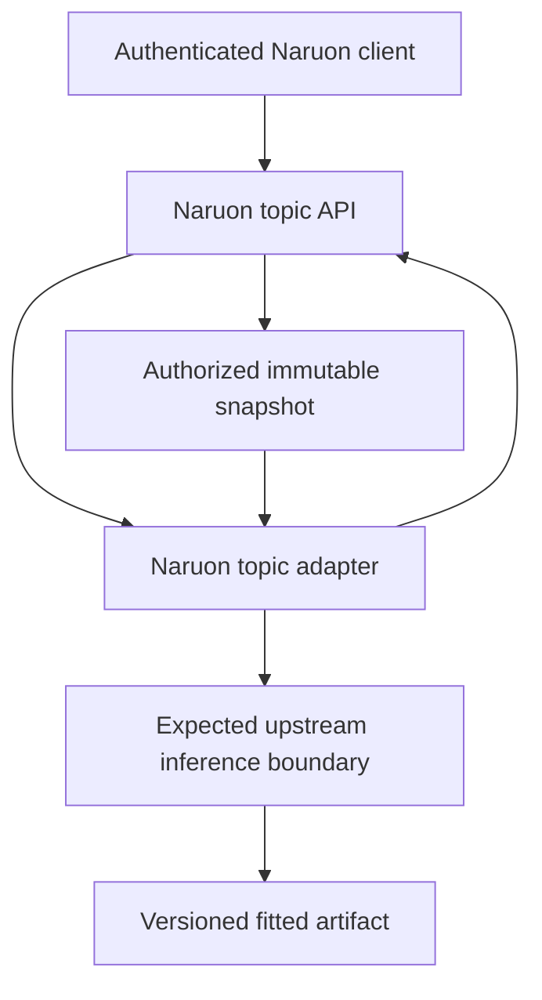
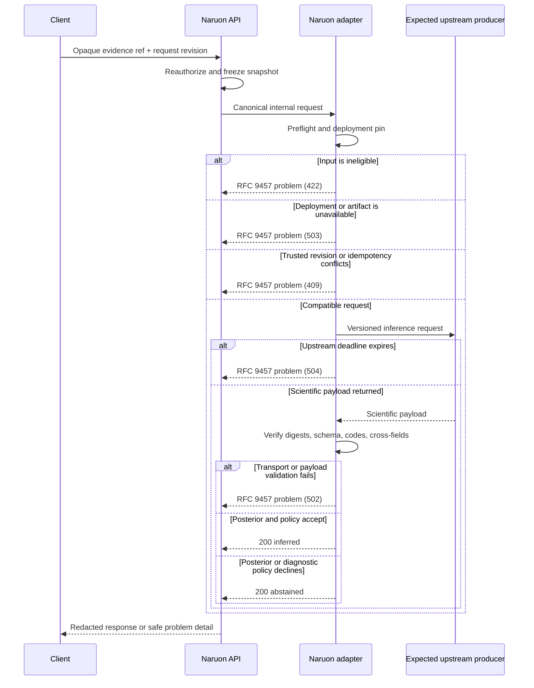

# Topic intelligence architecture

- **Capability maturity:** `BLOCKED-UPSTREAM`
- **Document status:** `PRESENT-CURRENT`
- **Contract revision:** `2026-08-09.1`

This is a proposed target profile governed by Naruon's accepted local policy for
a future topic-intelligence adapter. It is not a description of a shipped route,
active TEPP deployment, or published TEPP production contract. Naruon currently
has no fitted topic model to call and therefore exposes no topic-inference
fallback.

The governing local decision is
[`ADR-0001`](../adr/0001-topic-measurement-authority.md). The adapter remains
blocked until TEPP independently publishes a compatible, versioned fitted-model
artifact and inference contract with its own acceptance evidence.

## Authority and ownership

The integration deliberately separates the product envelope from scientific
authority. `TEPP` below is an expected upstream producer, not a present owner or
commitment: that responsibility exists only if TEPP independently publishes a
compatible production contract, artifact, and acceptance evidence.

| Boundary | Owner | Responsibilities | Must not do |
|---|---|---|---|
| Authenticated product request | Naruon | Reauthorize the tenant/workspace-scoped source, resolve an immutable snapshot, enforce purpose/consent policy, and run preflight checks | Accept a browser-supplied body, tenant identifier, path, URL, or model label as authoritative |
| Adapter envelope | Naruon | Pin schema revision/digest, assign opaque request identity, map failures, validate the upstream payload, redact public projections, and enforce acceptance policy | Refit a model, synthesize a posterior, or reinterpret a label as numeric topic identity |
| Scientific payload | Expected upstream producer; TEPP only after independent publication | Identify the fitted artifact and frozen preprocessing/vocabulary/design, perform new-document inference, and return mixed-membership estimates, uncertainty, provenance, and diagnostics | Depend on Naruon's UI labels or agenda templates as model inputs, or treat this Naruon acceptance profile as an assigned TEPP obligation |
| Presentation labels | Naruon, from versioned evidence | Attach evidence-backed human-readable labels after inference | Mutate topic identifiers, proportions, intervals, or diagnostic outcomes |
| Agenda/action generation | A separate future contract | Consume an authorized source snapshot and an accepted posterior | Infer topics from raw keywords or run when topic inference abstained |

The JSON Schema in
[`schema/topic-inference-result-v1.schema.json`](schema/topic-inference-result-v1.schema.json)
defines Naruon's **internal adapter envelope** and the scientific payload shape
that Naruon would require before consumption. It does not claim that TEPP has
adopted that schema. A public Naruon API may expose only a redacted projection;
canonical digests and scope-binding evidence are internal validation material.
That projection still carries the opaque model ID/version plus analysis unit,
estimand, coarse covariate level, and causal/non-causal designation needed to
prevent ecological or causal over-interpretation.

## Planned components

- The client supplies only opaque source and evidence references plus a bounded
  request revision. It never selects a model by display label.
- The Naruon API reauthorizes the evidence reference on every request and
  resolves the current server-authoritative snapshot.
- The adapter pins the accepted schema, deployment, model artifact,
  preprocessing, vocabulary, design, temporal policy, and validation policy.
- The independently accepted upstream producer would perform inference against
  an already fitted artifact. Training or per-request refitting is outside this
  request path.
- Naruon validates contract and scientific invariants before producing either
  `inferred` or the narrowly defined `abstained` result.

No component reads another service's private database. The future integration
must use a versioned typed boundary and an explicitly deployed artifact.

## Request and result flow

`200 abstained` is not a generic failure bucket. It is permitted only after the
request, language, snapshot, model deployment, artifact, temporal inputs, and
covariates are compatible and an attempted posterior or its diagnostic policy
does not meet the declared acceptance criteria. Preflight failures never appear
as abstentions.

## Trust boundaries and fail-closed behavior

| Condition | Boundary that detects it | Contract result |
|---|---|---|
| Missing/expired/wrong-audience evidence reference | Naruon authorization | Authentication/authorization failure; no upstream call |
| Purpose, consent, region, tenant, or workspace denial | Naruon authorization | `403` RFC 9457 problem; existence remains undisclosed |
| Tenant/workspace quota or rate policy exceeded | Naruon edge/adapter | `429` RFC 9457 problem; no upstream call |
| Unsupported language, insufficient retained tokens, excessive OOV, invalid temporal context, or invalid covariates | Naruon/expected-upstream preflight | `422` RFC 9457 problem with stable `error_code` |
| No active deployment, missing artifact, or failed artifact-integrity validation | Naruon adapter | `503` RFC 9457 problem |
| Snapshot revision, request revision, schema pin, or idempotency conflict | Naruon adapter | `409` RFC 9457 problem |
| Upstream transport fails or a schema, digest, format, code-registry, or cross-field result cannot be validated | Naruon adapter | `502` problem; never an abstention or fabricated posterior |
| Upstream deadline expires | Naruon adapter | `504` RFC 9457 problem; bounded cancellation and no result |
| Client cancels or disconnects | Naruon edge/adapter | Cancel work and record only a stable internal cancellation outcome; no HTTP result may be deliverable |
| Compatible inference produces a posterior rejected by declared diagnostic/acceptance policy | Naruon adapter | `200`, `status=abstained`, no usable topic components |
| Valid posterior satisfies the pinned policy | Naruon adapter | `200`, `status=inferred` |

There is no keyword, embedding, zero-shot, LLM-label, default-topic, or template-
agenda fallback under this contract.

## Scientific invariants

The adapter must enforce invariants that JSON Schema alone cannot express:

1. Topic identifiers are non-negative JSON integers. For `inferred`,
   `fitted_topic_count`, `topic_count`, `observed_topic_count`, and the number of
   components are equal; topic IDs and ranks are independently unique. For
   `abstained`, the latter three counts are zero while `fitted_topic_count`
   remains the active artifact's topic count.
2. Every proportion and credible-interval bound is finite and in `[0, 1]`.
3. Each estimate lies within its own interval.
4. For an `inferred` result, component proportions sum to one within the pinned
   `normalization_tolerance`; the diagnostic `posterior_sum` agrees with the
   recomputed value.
5. `credible_level`, `interval_method`, and
   `uncertainty_scope=conditional_on_fitted_artifact` apply to every component.
   They do not claim to include model-selection, corpus-selection, or label
   uncertainty.
6. `inferred` requires accepted diagnostics, a non-empty component vector, and
   no abstention reasons. Its posterior diagnostics include a stable
   `convergence_code`, `numerical_status=valid`, and bounded stable
   `quality_codes`. `abstained` requires rejected diagnostics, at least one
   posterior/policy reason, and an empty component vector.
7. The declared fitted topic count, design row, membership structure, temporal
   policy, and preprocessing/vocabulary identities match the active deployment.
8. Any multilevel, multiple-membership, cross-classified, temporal, prevalence,
   or content extension names its estimator, analysis unit, estimand, formulas,
   contrasts, membership-weight normalization, unseen-level policy, and
   validation profile. `causal_design` remains `non_causal` unless a separate
   causal design is approved and documented.
9. Multiple-membership structures require weights that sum to one per analysis
   unit. A structure without multiple membership requires
   `membership_weight_normalization=not_applicable`. Covariate schema version,
   level, and typed missingness policy must match the retained covariate snapshot
   and model card; missing values are never silently assigned to a default level.
10. The evidence reference snapshot and scope bindings equal the enclosing
    request bindings, and use-time reauthorization resolves the same current
    tenant, workspace, purpose, consent, region, and authorization context.
11. Validators assert RFC 3339 `date-time` formats, recompute
    `availability_time <= knowledge_cutoff_time`, and enforce the pinned temporal
    missingness policy. A producer's `availability_at_knowledge_cutoff=true`
    assertion is evidence to verify, not a substitute for that check.
12. The inference-method copy and every diagnostic or reason code agree with the
    exact pinned immutable code registries. An unknown registry version or code
    is a `502` protocol error, never an abstention.

## Canonical provenance and reproduction

All contract digest fields are SHA-256 over an RFC 8785 canonical JSON
descriptor with domain separation:

`SHA-256(UTF8(domain) || 0x00 || UTF8(RFC8785(value)))`

RFC 8785 does not normalize Unicode. Producers must apply the frozen
preprocessing contract before constructing a value to digest; consumers must
not add an undocumented normalization pass.

For a model with no covariates, the canonical empty values are:

- covariate snapshot:
  `{"covariates":[],"memberships":[]}` with domain
  `naruon.topic-inference.covariate-snapshot.v1`;
- design row: `{"columns":[],"values":[]}` with domain
  `tepp.topic-measurement.design-row.v1`.

Digests prove equality with retained material; they do not make deleted or
unavailable material reproducible. Reproduction additionally requires an
authorized, resolvable retained source snapshot, model artifact, manifests,
vocabulary, preprocessing/design specifications, temporal evidence, and
covariate/design-row material.

Every content-, evidence-, covariate-, membership-, temporal-, design-, and
label-derived digest is sensitive pseudonymous linkage data. It is for internal
validation only and must never be
placed in a public response, ordinary audit event, application log, metric, or
trace. Restricted audit records may hold a tenant-keyed opaque reference to a
protected validation record, subject to retention and deletion policy.

## Deployment and operability gates

A deployment may become active only when all of the following are pinned and
verified as one compatible set. The complete canonical-digest inventory is the
schema, source snapshot, nested scientific payload, artifact descriptor,
artifact manifest, vocabulary, preprocessing, design, lineage, model card,
validation report, evidence-time manifest, covariate snapshot, and design row:

- immutable schema ID, revision, and externally configured schema digest;
- independently accepted upstream service and scientific contract version;
- model artifact, artifact manifest, vocabulary, preprocessing, design,
  lineage, model-card, and validation-report digests;
- temporal policy, temporal missingness rule, evidence-time manifest digest,
  and asserted/recomputed availability-at-cutoff ordering;
- covariate-schema version, typed level/missingness policy, covariate-snapshot
  digest, design-row digest, and scope-binding policy;
- estimator, analysis unit, estimand, formulas/contrasts, membership and unseen-
  level policy, plus the validation profile;
- language, retained-token, OOV, posterior-normalization, uncertainty,
  diagnostic acceptance thresholds, immutable diagnostic/reason-code registry
  versions, and a validator with `date-time` format assertion enabled; and
- tenant/workspace purpose, consent, retention, deletion, evidence-reference,
  log-redaction, and restricted-audit controls.

Activation, rollback, artifact revocation, validation drift, latency/error SLOs,
and incident playbooks belong to the operability contract. Until those gates
and the independently published upstream capability exist, the runtime maturity
remains `BLOCKED-UPSTREAM`.

## Related records

- [Product requirements](PRD.md)
- [Technical requirements](TRD.md)
- [API contract](API_CONTRACT.md)
- [UML views](UML.md)
- [Conceptual data model](DATA_MODEL.md)
- [Requirements traceability](TRACEABILITY.md)
- [ADR-0001](../adr/0001-topic-measurement-authority.md)
