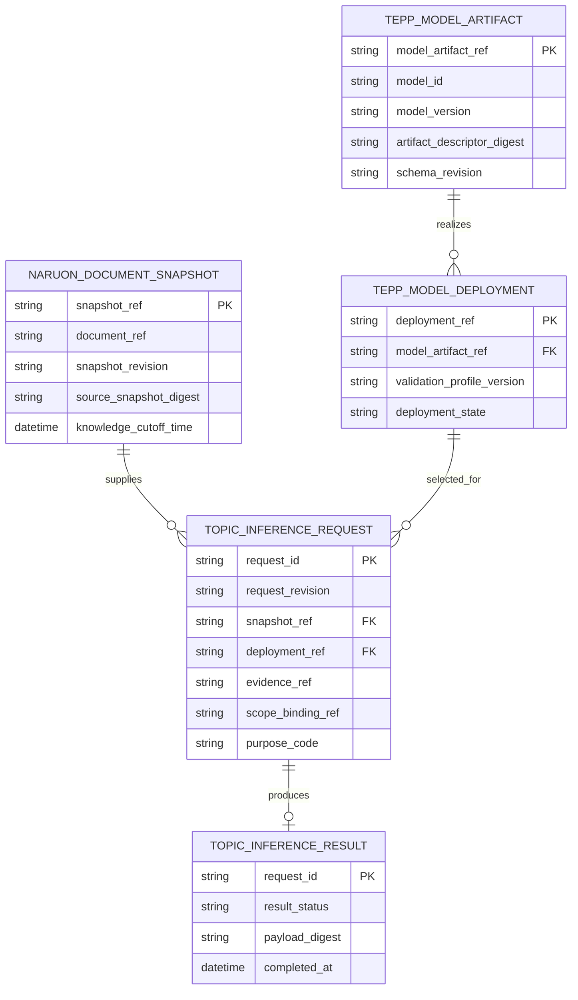
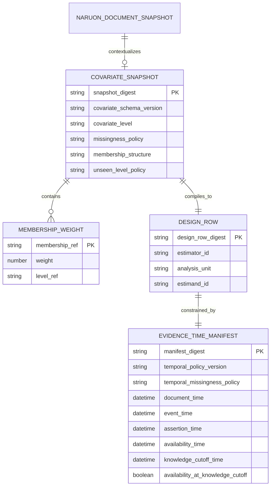

# Topic intelligence conceptual data model

- **Capability maturity:** `BLOCKED-UPSTREAM`
- **Document status:** `PRESENT-CURRENT`
- **Persistence status:** `NOT-APPLICABLE`

This document is a conceptual integration model, not a physical database model.
There is no current Naruon table or persistence authorized for any entity below.
The names describe messages, immutable artifacts, and bounded references needed
to reason about the planned adapter.

Names prefixed `TEPP_` denote the expected shape of independently published
upstream evidence. They do not assign present ownership to TEPP; TEPP becomes the
producer only if it separately publishes and accepts a compatible production
contract and artifact.

Any future persistence requires a separate accepted ADR, threat model, retention
and deletion design, tenant/workspace row-level authorization, migration, rollback
plan, and database tests. A diagram here must never be used as permission to add
tables or columns.

## Integration entities

These relationships express authority, not storage foreign keys:

- `NARUON_DOCUMENT_SNAPSHOT` is a server-authoritative immutable view. Its
  opaque `snapshot_ref` binds the exact document reference, snapshot revision,
  and source-snapshot digest resolved after owner, organization, workspace,
  purpose, and consent checks.
- `TOPIC_INFERENCE_REQUEST` binds exactly one snapshot revision to one active
  deployment and one idempotent request revision.
- `TEPP_MODEL_ARTIFACT` is a conditional expected-upstream evidence role. Naruon
  may consume it only after independent publication and compatibility review; it
  does not currently assign TEPP an obligation or own/mutate such an artifact.
  Its opaque `model_artifact_ref` binds the exact model ID, model version,
  artifact-descriptor digest, and schema revision.
- `TEPP_MODEL_DEPLOYMENT` is Naruon's compatibility/activation record for a
  particular immutable upstream evidence set. A mutable display tag is not an
  identity.
- `TOPIC_INFERENCE_RESULT` exists only for HTTP `200` outcomes (`inferred` or
  narrowly defined `abstained`). RFC 9457 problems are errors, not result rows.

## Scientific result entities

```mermaid
erDiagram
    TOPIC_INFERENCE_RESULT ||--o{ TOPIC_POSTERIOR_COMPONENT : contains
    TOPIC_INFERENCE_RESULT ||--|| SCIENTIFIC_PROVENANCE : validates_with
    TOPIC_INFERENCE_RESULT ||--|| DIAGNOSTIC_BUNDLE : qualifies
    TOPIC_POSTERIOR_COMPONENT ||--o{ TOPIC_LABEL_EVIDENCE : may_present_as

    TOPIC_INFERENCE_RESULT {
        string request_id PK
        string model_id
        string model_version
        string result_status
        string scientific_payload_digest
    }
    TOPIC_POSTERIOR_COMPONENT {
        string component_ref PK
        string request_id FK
        string model_id
        string model_version
        int topic_id
        int rank
        number proportion
        number interval_lower
        number interval_upper
    }
    SCIENTIFIC_PROVENANCE {
        string artifact_descriptor_digest
        string artifact_manifest_digest
        string vocabulary_digest
        string preprocessing_digest
        string design_digest
        string lineage_digest
        string model_card_digest
        string validation_report_digest
        string evidence_time_manifest_digest
        string covariate_snapshot_digest
        string design_row_digest
        string analysis_unit
        string estimand_id
        string causal_design
    }
    DIAGNOSTIC_BUNDLE {
        string diagnostic_status
        string diagnostic_code_registry_version
        string reason_code_registry_version
        number posterior_sum
        boolean policy_accepted
        string policy_version
    }
    TOPIC_LABEL_EVIDENCE {
        string label_evidence_ref PK
        string component_ref FK
        string model_id
        string model_version
        int topic_id
        string label_id
        string label_version
        string opaque_evidence_refs
        string review_method
    }
```

The `PK` and `FK` labels above are conceptual message identities, not proposed
SQL columns or additions to the public wire contract. Each opaque reference is
immutable and resolves only when every bound scope value agrees:

| Entity | Required immutable identity binding | Forbidden unscoped shortcut |
|---|---|---|
| Document snapshot | `snapshot_ref` -> (`document_ref`, `snapshot_revision`, `source_snapshot_digest`) | `document_ref` alone |
| Model artifact | `model_artifact_ref` -> (`model_id`, `model_version`, `artifact_descriptor_digest`, `schema_revision`) | `model_id` or a display tag alone |
| Posterior component | `component_ref` -> (`request_id`, `model_id`, `model_version`, `topic_id`) | `topic_id`, rank, or label alone |
| Label evidence | `label_evidence_ref` -> (`model_id`, `model_version`, `topic_id`, `label_id`, `label_version`, `opaque_evidence_refs`) | `topic_id`, `label_id`, or label text alone |

A resolver must fail closed when an opaque reference and its supplied scope tuple
disagree. Numeric topic identity is reusable only within its exact model ID and
model version; a result component adds request/result scope, and presentation
evidence additionally adds label ID and label version.

An `abstained` result has zero `TOPIC_POSTERIOR_COMPONENT` instances, rejected
diagnostics, and one or more posterior/diagnostic-policy reason codes. Input,
language, temporal, covariate, deployment, artifact, revision, and protocol
failures are not represented as abstained results.

For `inferred`, the fitted artifact count, declared inference count, observed
diagnostic count, and number of components are equal. For `abstained`, the latter
three are zero while the fitted artifact count remains unchanged. Numeric topic
identity is a non-negative JSON integer scoped by model ID and model version;
joins to a result also require its request/result scope.

`TOPIC_LABEL_EVIDENCE` is presentation metadata owned by Naruon. Its relationship
to a component is referential only: the model ID, model version, numeric topic
ID, label ID, and label version must all agree, and labels cannot become the
topic identifier or alter any estimate. Agenda generation is not an entity in
this model because it belongs to a separate downstream authorized contract.

## Covariate and temporal evidence

Membership weights must obey the model's pinned normalization rule. New or
unknown levels follow only the declared unseen-level policy; they are never
silently mapped to a familiar group. The design row must be reproducible from
the retained authorized covariate snapshot and pinned design specification.
`multiple_membership` and `cross_classified_multiple_membership` require weights
that sum to one per analysis unit; all other structures require the explicit
`not_applicable` normalization value. Covariates carry a versioned typed level
and missingness policy, and missing state is never inferred from an absent field.

The adapter enables RFC 3339 `date-time` format assertion and independently
checks `availability_time <= knowledge_cutoff_time`. Only `document_time` and
`event_time` may be null under revision `2026-08-09.1`; the pinned temporal
missingness policy governs their interpretation.

For a model with no covariates, the entities still have deterministic canonical
empty values rather than missing or implementation-specific sentinels:

| Concept | RFC 8785 value | Digest domain |
|---|---|---|
| Covariate snapshot | `{"covariates":[],"memberships":[]}` | `naruon.topic-inference.covariate-snapshot.v1` |
| Design row | `{"columns":[],"values":[]}` | `tepp.topic-measurement.design-row.v1` |

The digest input is
`UTF8(domain) || 0x00 || UTF8(RFC8785(value))`, hashed with SHA-256 and encoded
as lowercase hexadecimal.

## Concept glossary and ownership

| Concept | Authority | Identity and lifecycle |
|---|---|---|
| Document snapshot | Naruon source boundary | Opaque document reference plus immutable snapshot revision and canonical digest; resolvable only under current authorization |
| Evidence reference | Naruon authorization boundary | Opaque, tenant/snapshot/audience-bound, expiring, and reauthorized on every use; never a URL or filesystem path |
| Model artifact | Expected upstream producer; TEPP only after independent publication | Immutable fitted artifact with independently published version, manifest, scientific validation, and digest evidence |
| Deployment | Naruon adapter | Compatibility and activation decision binding one exact upstream artifact/contract set to one Naruon validation profile |
| Scientific payload | Expected upstream producer; TEPP only after independent publication | Mixed-membership estimate, uncertainty, scientific provenance, and diagnostics returned from the fitted artifact |
| Adapter envelope | Naruon | Request identity, schema pin, payload digest, result status, acceptance decision, and safe error mapping |
| Presentation label | Naruon from versioned evidence | Human-readable aid with separate version and evidence references; never numeric topic identity |

The request and evidence reference each carry the same opaque scope-binding and
snapshot revision. Equality is a runtime invariant; use-time reauthorization
must resolve that binding to the current tenant, workspace, purpose, consent,
region, and authorization context. Neither the binding nor its protected record
is a public identifier.

The complete internal digest inventory is: schema, source snapshot, scientific
payload, artifact descriptor, artifact manifest, vocabulary, preprocessing,
design, lineage, model card, validation report, evidence-time manifest,
covariate snapshot, and design row. Every item uses its schema-defined domain.
The public projection omits those digests but retains opaque model ID/version,
analysis unit, estimand, coarse covariate level, and causal/non-causal status so
consumers cannot silently reinterpret a group-level or non-causal estimand.

## Privacy classification

Source text is not part of this data model and must not be copied into request
logs, metrics, traces, errors, or unrestricted audit events. Every content-,
evidence-, covariate-, membership-, temporal-, design-, and label-derived digest
is sensitive pseudonymous linkage data even though it is one-way. Such digests
are internal validation material only.

Where auditability is required, an audit event may contain a tenant-keyed opaque
reference to a restricted validation record. Resolution must re-check owner,
organization, workspace, purpose, consent, retention, and deletion policy. The
public API and UI receive a redacted projection without canonical digests,
tenant bindings, raw covariates, membership identifiers, or arbitrary evidence
locations.

## Non-persistence decision

At revision `2026-08-09.1`:

- no Alembic migration is authorized;
- none of these conceptual names is a SQL table or ORM model;
- no posterior, label, covariate row, or digest is retained by default;
- a request may be processed transiently only after the upstream and runtime
  gates in [Architecture](ARCHITECTURE.md) are satisfied; and
- a future persistence proposal must prove why transient processing and a
  restricted audit reference are insufficient before adding durable storage.
