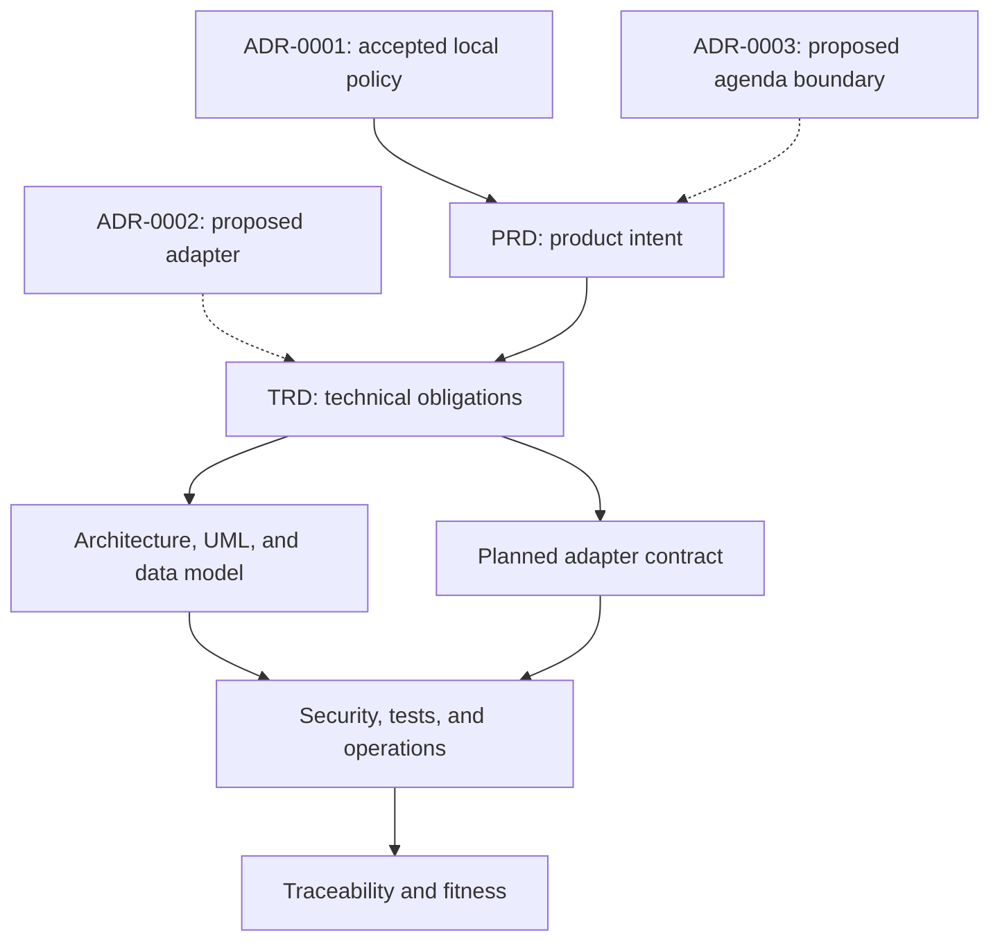

# Topic intelligence decision package

- **Snapshot:** 2026-08-09
- **Change candidate:** [PR #1297](https://github.com/ContextualWisdomLab/naruon/pull/1297)
- **Protected-base evidence:** `develop@5425ce4f55b2cf16b2c82a4fd661c9d0bd0660c7`
- **Scope owner:** Naruon maintainers

This directory is Naruon's authority graph for removing lexical pseudo-topic
tools and for evaluating any later structural-topic-model (STM) integration. It
does not govern TEPP, assign scientific authority to TEPP, record TEPP acceptance,
or claim that an upstream production contract exists.

The package is design-sufficient for the deletion review and for future contract
discovery. It is intentionally partial for runtime implementation and is not
evidence that STM is available in Naruon.

## Maturity vocabulary

| Term | Meaning |
| --- | --- |
| `IMPLEMENTED-ON-PROTECTED-DEVELOP` | Observable behavior on the pinned protected-base snapshot |
| `ACTIVE-PR` | Implemented only on PR #1297's candidate branch |
| `ACCEPTED-NARUON-POLICY` | An accepted Naruon-local architecture/product rule; not runtime evidence or upstream acceptance |
| `PLANNED` | Designed or required, but not implemented |
| `BLOCKED-UPSTREAM` | Naruon work cannot start until an independently published, versioned upstream production contract and acceptance evidence exist |
| `OUT-OF-SCOPE` | Deliberately excluded from this change |

Documentation fitness uses a separate vocabulary:
`PRESENT-CURRENT`, `PRESENT-STALE`, `PARTIAL`, `MISSING`, `NOT-APPLICABLE`,
and `SUPERSEDED`.

ADR status is separate again. [ADR-0001](../adr/0001-topic-measurement-authority.md)
is the accepted Naruon-local policy. [ADR-0002](../adr/0002-fitted-topic-artifact-consumption.md)
and [ADR-0003](../adr/0003-separate-topic-measurement-from-agenda-generation.md)
are proposed target decisions, not accepted architecture or runtime evidence.
`PLANNED` may describe their design work, but it never overrides the runtime
capability gate `BLOCKED-UPSTREAM`.

## Current truth

| Concern | Maturity | Evidence-backed statement |
| --- | --- | --- |
| Protected `develop` behavior at the pinned base | `IMPLEMENTED-ON-PROTECTED-DEVELOP` | `email_categorizer` and `meeting_agenda_generator` are registered lexical heuristics. |
| Candidate behavior | `ACTIVE-PR` | PR #1297 removes both tools and retains `keyword_extractor` only as an explicitly lexical utility. |
| Naruon consumption rule | `ACCEPTED-NARUON-POLICY` | Naruon does not present keywords, embeddings, clustering, zero-shot output, or LLM labels as an STM posterior. The ADR becomes protected-branch authority only when the candidate is accepted and merged. |
| Upstream fitted-model dependency | `BLOCKED-UPSTREAM` | TEPP architecture provides direction, but Naruon has no independently published TEPP production topic artifact/API/contract or TEPP acceptance evidence to consume. |
| Proposed Naruon STM target profile | `PLANNED`; capability `BLOCKED-UPSTREAM` | The acceptance profile is design material. No production handler, endpoint, table, model artifact, migration, or UI exists, and runtime work cannot start without the independently published upstream dependency. |
| Agenda generation from topic evidence | `PLANNED` | It is a separate downstream decision/generation capability, never part of topic measurement. |

## Authority graph

Solid arrows descend from the accepted local policy. Dotted arrows identify
proposed Naruon decisions whose acceptance triggers have not been satisfied.

When documents conflict, the accepted [Naruon-local
ADR](../adr/0001-topic-measurement-authority.md) governs Naruon's decision, the
PRD governs product intent, and the TRD governs proposed implementation
obligations. Runtime code and deployed OpenAPI remain the authority for shipped
behavior. A checked planned schema is not a deployed API and cannot stand in for
the future upstream contract.

## Document map

| Document | Purpose |
| --- | --- |
| [PRD](PRD.md) | Product problem, users, requirements, non-goals, and release gates |
| [TRD](TRD.md) | Technical ownership, artifact, result, failure, security, and implementation obligations |
| [Documentation fitness](DOCUMENTATION_FITNESS.md) | Before/after completeness assessment and intentional gaps |
| [ADR index](../adr/README.md) | Status and change rules for all Naruon architecture decisions |
| [Naruon ADR-0001](../adr/0001-topic-measurement-authority.md) | Accepted local consumption policy and upstream non-authority boundary |
| [Proposed ADR-0002](../adr/0002-fitted-topic-artifact-consumption.md) | Conditional fitted-artifact consumption and fail-closed adapter decision |
| [Proposed ADR-0003](../adr/0003-separate-topic-measurement-from-agenda-generation.md) | Conditional downstream agenda-generation separation decision |
| [Architecture](ARCHITECTURE.md) | Current and target components, trust boundaries, and failure architecture |
| [UML](UML.md) | Conceptual component, class, sequence, state, and deployment views |
| [Conceptual ERD](DATA_MODEL.md) | Contract relationships without inventing physical persistence |
| [Planned adapter contract](API_CONTRACT.md) | Closed-version envelope, errors, abstention, and compatibility semantics |
| [Security](SECURITY.md) | Data protection and control requirements |
| [Threat model](THREAT_MODEL.md) | Design-time misuse cases, mitigations, and residual decisions |
| [Test strategy](TEST_STRATEGY.md) | Naruon integration evidence separated from upstream scientific validation |
| [Operability](OPERABILITY.md) | Promotion, monitoring, incident, rollback, and recovery gates |
| [Traceability](TRACEABILITY.md) | Requirement-to-decision-to-contract-to-evidence mapping |
| [References](REFERENCES.md) | Scientific, standards, and repository evidence |

## Canonical digest inventory

Revision `2026-08-09.1` has exactly 14 canonical digest fields. This table is the
single cross-document inventory; the planned
[JSON Schema](schema/topic-inference-result-v1.schema.json) is the machine-readable
definition, and the [API contract](API_CONTRACT.md#digest-contract) defines the
canonicalization formula. The Naruon-authored field name `tepp_payload_digest`
is part of the local acceptance profile and does not assert that an upstream
publisher adopted the name or assigned ownership to TEPP.

| Scope | Exact field | Bound evidence |
| --- | --- | --- |
| Envelope | `schema_digest` | Complete parsed immutable schema JSON value named by the pinned `$id`; its sole construction is defined in the API contract |
| Envelope | `source_snapshot_digest` | Authorized immutable source-snapshot descriptor |
| Envelope | `tepp_payload_digest` | Complete nested scientific-payload descriptor |
| Scientific provenance | `artifact_digest` | Canonical fitted-artifact descriptor, not raw artifact bytes |
| Scientific provenance | `manifest_digest` | Canonical artifact manifest, including any separately declared optional raw-byte hash record |
| Scientific provenance | `vocabulary_digest` | Frozen vocabulary |
| Scientific provenance | `preprocessing_digest` | Frozen preprocessing contract |
| Scientific provenance | `design_digest` | Statistical design specification |
| Scientific provenance | `lineage_digest` | Training and build lineage descriptor |
| Scientific provenance | `model_card_digest` | Model card |
| Scientific provenance | `validation_report_digest` | Scientific validation report |
| Scientific provenance | `evidence_time_manifest_digest` | Evidence-time manifest |
| Scientific provenance | `covariate_snapshot_digest` | Authorized covariate and membership snapshot |
| Scientific provenance | `design_row_digest` | Compiled design row |

Aliases and shortened subsets are not contract-equivalent. Any field addition,
removal, rename, canonicalization change, or domain-separator change requires a
new immutable schema revision and synchronized updates to requirements,
decisions, tests, traceability, and this inventory.

These 14 fields verify equality with exact canonical JSON values under the API
formula. They do not by themselves verify descriptor truth or completeness,
evidence availability, authorization, or raw fitted-artifact bytes. Raw-byte
integrity exists only when an independently published manifest carries a
distinct optional hash record that declares both its algorithm and the exact
byte serialization or package covered. That record is not `artifact_digest`
and does not add a canonical digest field to this inventory.

## Non-negotiable behavior

No keyword table, term-frequency score, embedding cluster, zero-shot label, or
LLM-generated label may be represented as an STM posterior. New-document STM
inference requires an independently published, compatible fitted artifact with
frozen preprocessing and vocabulary, declared input/covariate semantics,
uncertainty, diagnostics, provenance, and validation evidence.

Model or service unavailability, incompatibility, integrity failure, unsupported
language, insufficient retained tokens, excessive out-of-vocabulary input,
invalid temporal/covariate input, authorization denial, and timeout are explicit
errors. `abstained` is reserved for a compatible active model that accepted the
input contract but withheld a posterior under a declared diagnostic or posterior
acceptance rule. Neither path may invoke a lexical, embedding, LLM, default-label,
or agenda fallback.

Canonical contract digests verify equality with retained canonical JSON values;
they do not establish the truth of those values, prove raw-byte equality, or
reconstruct source content. Every content-, evidence-, covariate-, membership-,
temporal-, design-, and label-derived digest is sensitive pseudonymous linkage
data. Later reproducibility requires a separately approved, resolvable immutable
snapshot/evidence reference and retention contract. Raw fitted-artifact bytes
also require the separate manifest-owned byte hash described above.
