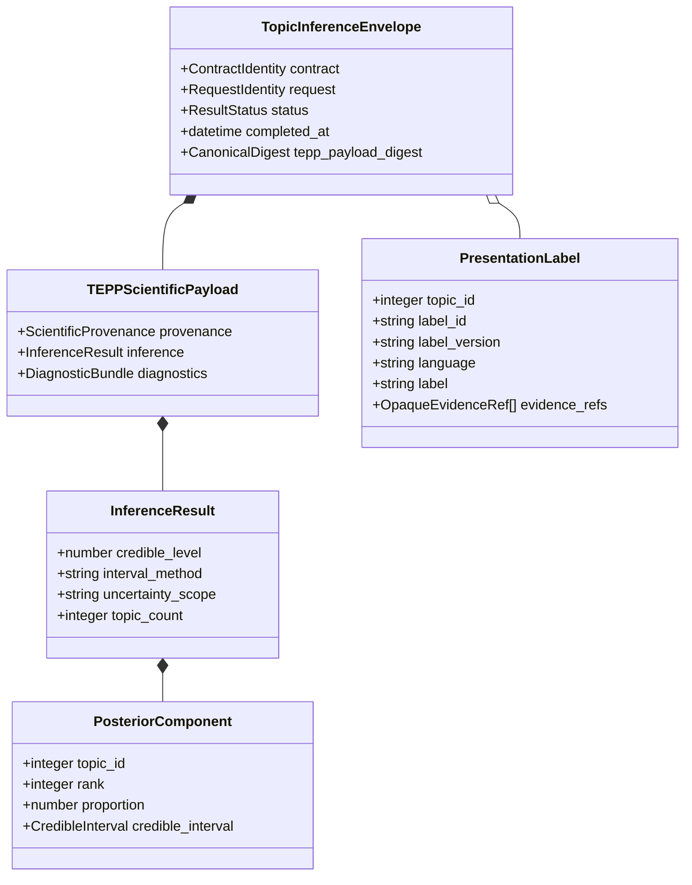
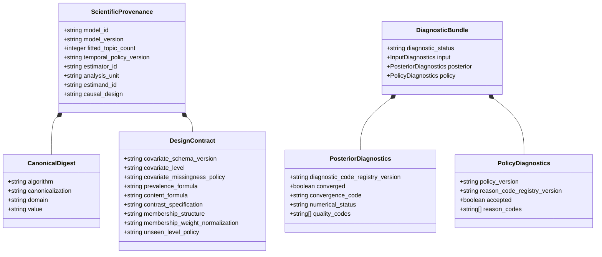
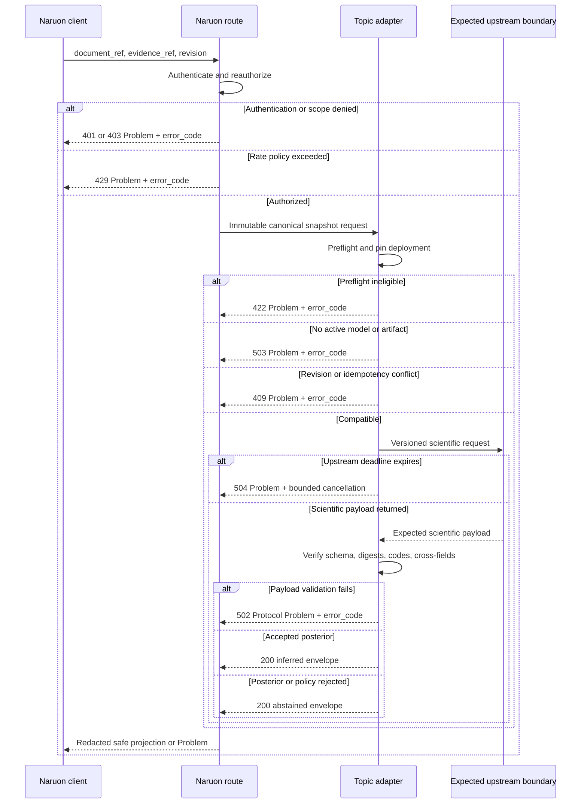
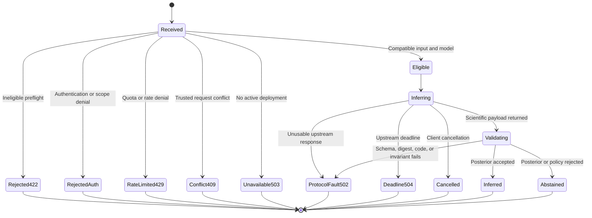
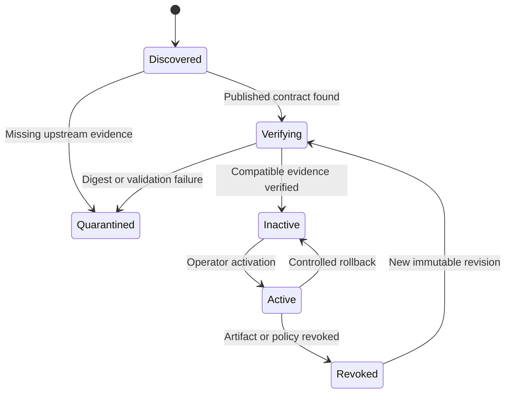

# Topic intelligence UML views

- **Capability maturity:** `BLOCKED-UPSTREAM`
- **Document status:** `PRESENT-CURRENT`
- **Contract revision:** `2026-08-09.1`

These diagrams describe a planned integration boundary. They do not represent
deployed classes, routes, tables, or an accepted TEPP production API. TEPP is
only the expected upstream producer if it independently publishes a compatible
production contract, fitted artifact, and acceptance evidence.

## Contract structure

The Naruon-owned envelope controls authorization, revisioning, validation, and
safe projection. The nested scientific payload carries fitted-model evidence
and estimates; presentation labels stay outside that payload.

`PresentationLabel.topic_id` may reference a posterior component but cannot
change its identifier, rank, proportion, interval, or diagnostic outcome.
The public projection preserves opaque model ID/version, analysis unit,
estimand, coarse covariate level, and causal/non-causal designation while
redacting canonical digests, scope bindings, raw covariates, and group values.

## Provenance and diagnostics

The single `CanonicalDigest` association represents the required schema,
snapshot, scientific payload, artifact descriptor, artifact manifest, vocabulary,
preprocessing, design, lineage, model-card, validation-report, evidence-time,
covariate-snapshot, and design-row digests. Each use has its own fixed domain
separator.

## Planned request sequence

An expired, wrong-audience, wrong-snapshot, or wrong-tenant evidence reference
is rejected before the adapter call. The route must resolve the reference
server-side; it must never dereference an arbitrary client URL or path.

## Result state model

The state model intentionally has no fallback transition from an error or
abstention to a default topic, lexical classifier, embedding cluster, LLM label,
or agenda template.

## Deployment compatibility state

Only `Active` can serve inference. A display name, mutable tag, or previously
seen model ID is not sufficient deployment evidence.

## Cross-field validation obligations

The schema validates local types, bounds, and status-dependent shape. The
adapter must additionally validate:

- non-negative integer topic IDs, rank uniqueness, and, for `inferred`, equality
  of fitted, declared, observed, and actual component counts;
- component sum within the pinned tolerance;
- estimate containment within each credible interval;
- equality between recomputed and reported diagnostic counts/sums;
- status, diagnostic acceptance, and reason-code consistency;
- request/evidence snapshot equality, scope-binding equality, expiry, and current
  tenant/workspace/purpose/consent/region reauthorization;
- RFC 3339 format assertion, availability-at-knowledge-cutoff ordering, and the
  pinned temporal missingness rule;
- exact diagnostic/reason-code registry versions and known-code membership, with
  unknown versions or codes mapped to `502`;
- deployment identity and every pinned provenance digest;
- design formula/contrast, estimator, analysis-unit, estimand, covariate schema,
  level/missingness, membership structure/normalization coupling, unseen-level,
  temporal, and validation-profile compatibility; and
- reauthorization of each opaque evidence reference at the time of use.

See [API contract](API_CONTRACT.md) for HTTP semantics and
[conceptual data model](DATA_MODEL.md) for ownership relationships.
